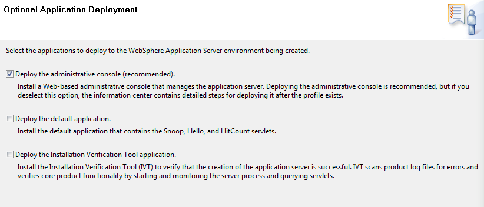
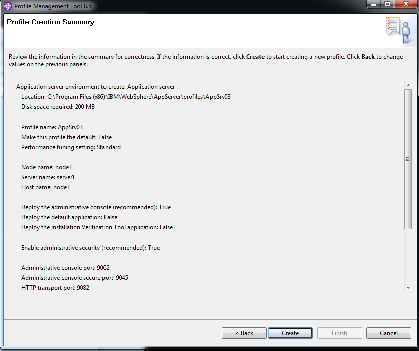
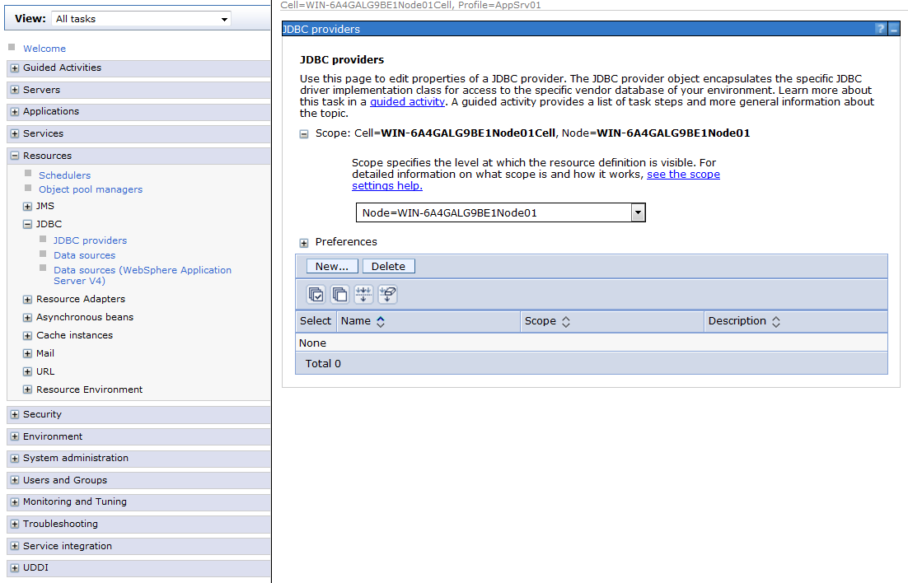
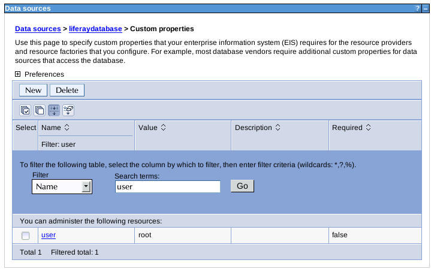
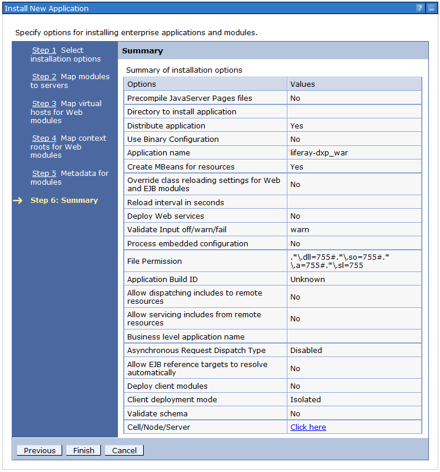

# WebSphereへの@product@のインストール

IBM &reg; WebSphere &regは、International Business Machines Corporationの商標であり、世界中の多くの国で登録されています。

+$$$

**アドバイス:**：このインストールおよび設定プロセスを通して、WebSphereから *[Save]*をクリックしてマスターコンフィグレーションに変更を適用するように求められます。変更を保存するために断続的に[Save]をクリックしてください。

$$$

@product@を正しく機能させるには、WebSphere 8.5.5フィックスパック11以降またはWebSphere 9（フィックスパック7が最新）をインストールする必要があります。フィックスパックについての詳しい情報は[here](http://www-01.ibm.com/support/docview.wss?uid=swg24043005)を参照してください。

また、@product@はWebSphere Application Liberty Profileをサポートしていません。

以下の@product@の一般的なインストール手順について書かれている記事にも目を通しておいてください。

- [Preparing for Instal](/discover/deployment/-/knowledge_base/7-1/preparing-for-install)
- [Installing @product@](/discover/deployment/-/knowledge_base/7-1/installing-liferay)

[Liferay Home*の*フォルダ](/discover/deployment/-/knowledge_base/7-1/installing-liferay#liferay-home)は@product@のオペレーションにとって大切です。Liferay Homeでは、@product@が実行するために必要な特定のファイルとフォルダを作成します。WebSphereでは、Liferay Homeは一般的に`[Install Location]/WebSphere/AppServer/profiles/your-profile/liferay`です。

まずはじめに、[liferay.com](https://web.liferay.com/group/customer/dxp/downloads/7-1)のカスタマーポータルから@product@のWARファイルと依存関係をダウンロードしてください。
以下のファイルが必要です：

- `liferay-dxp-digital-enterprise-[version].war`

- `liferay-dxp-digital-enterprise-dependencies-[version].zip`

- `liferay-dxp-digital-enterprise-osgi-[version].zip`

では早速WebSphereに@product@をインストールしましょう！

## @product@のためのWebSphereの準備

アプリケーションサーバーバイナリがインストールされたら、 *[Profile
Management Tool]*を起動して@product@に適したプロファイルを作成します。

1. *[Create...]*をクリックし、*[Application Server]*を選択して、*[Next]*をクリックします。

2.  *Advanced* プロファイル作成オプションをクリックしてから、*[Next]*をクリックします。アドバンスドプロファイルは、プロファイルのロケーションやプロファイルの名前、ノードおよびホストなどの設定に独自の値を指定したり、独自のポートを割り当てたりするために必要です。また、管理コンソールとサンプル・アプリケーションをデプロイするかどうかを選択したり、IBM HTTP サーバー用のWebサーバー定義を追加したりするのにも必要です。これらのオプションについての詳細は、WebSphereの資料を参照してください。

   

3.  *Deploy the administrative console*ボックスをチェックします。これにより、アプリケーションサーバーを操作するためのWebベースのUIが得られます。デフォルトのアプリケーションはスキップしてください。これは開発用のマシンにインストールするだけです。*[Next]*をクリックしてください 。

4. プロファイル名とロケーションを設定します。プロダクションサーバーをインストールしているので、必ず*Development*以外のパフォーマンスチューニング設定を指定してください。パフォーマンスチューニング設定についての詳細は、WebSphereの資料を参照してください。*[Next]*をクリックしてください。

5. サーバーのノード、サーバー、およびホスト名を選択してください。これらは使用している環境に特有のものです。*[Next]*をクリックしてください。

6. WebSphereの管理セキュリティーは、誰が管理ツールにアクセスできるかを制限します。WebSphereサーバーを管理するにはユーザー名とパスワードが必要になるように、環境設定で有効にしておくことをおすすめします。詳しくは、WebSphereの資料を参照してください。*[Next]*をクリックしてください 。

7. 各プロファイルにはセキュリティ証明書も必要です。
証明書を持っていない場合は、個人証明書と署名証明書を生成するオプションを選択して、*[Next]*をクリックします。

8. 
証明書が生成されたら、キーストアのパスワードを設定します。*[Next]*をクリックしてください 。

9. これで、このサーバープロファイルが使用するポートをカスタマイズできます。その時、必ずマシンで開いているポートを選択してください。ポートを選択するときに、ウィザードは既存のWebSphereインストールを検出します。そこでアクティビティーを見つけた場合はポートを1つ増やします。

10. マシンの起動時にこのプロファイルを開始したいかどうかを選択してください。*[Next]*をクリックしてください 。

11. WebSphereはIBM HTTP Serverに同梱されています。これは以前のApacheと同じですが、現在はブランドが変更されています。このJVMがHTTPサーバーから転送された要求を受信するように、Webサーバー定義が必要かどうかを選択します。これについての詳細は、WebSphereの資料を参照してください。終了したら、*[Next]*をクリックします。

12. その後、ウィザードには選択した内容の概要が表示されます。ここで、選択内容のまま続行することができますし、変更点をを加えることもできます。表示されている内容でよければ、 *Next*をクリックします。

その後、WebSphereはプロファイルを作成し、プロファイルが正常に作成されたことを知らせるメッセージが表示されます。これでプロフィールは完成しました。しかしまだアプリケーションサーバーで設定しなければならないことがいくつかあります。

### WebSphere Application Serverの設定

このバージョンのWebSphereでは、サーブレットフィルタはWebアプリケーションの起動時に初期化されるのではなく、初回アクセス時に初期化されます。しかし、これは特定のアプリを@product@にデプロイするときに問題を引き起こす可能性があります。アプリケーションの起動時（つまりデプロイ時）に初期化するようにサーブレットフィルタを設定するには、以下の`webcontainer`プロパティをWebSphereアプリケーションサーバーで設定します。

    com.ibm.ws.webcontainer.initFilterBeforeInitServlet = true
    com.ibm.ws.webcontainer.invokeFilterInitAtStartup = true

`webcontainer`プロパティをWebSphereアプリケーションサーバーで設定するには、[here in WebSphere's documentation](http://www-01.ibm.com/support/docview.wss?rss=180&uid=swg21284395)に記載されている手順に従ってください。

### Liferay DXP用のJVMパラメータの設定

次に、@product@用に作成したWebSphereプロファイルに、@product@のJavaメモリー要件をサポートする引数を設定する必要があります。

以下のファイルを修正します：

    [Install Location]/WebSphere/AppServer/profiles/your-profile/config/cells/your-cell/nodes/your-node/servers/your-server/server.xml

`jvmEntries`タグの中に`maximumHeapSize="2048"`を追加します。例えば：

    <jvmEntries xmi:id="JavaVirtualMachine_1183122130078" ... maximumHeapSize="2048">

+$$$

**注：**ここで使用されているJVMパラメータは、本番システムの初期デプロイ用に意図されたデフォルトのものです。管理者は、特定の環境に最も適した値に設定をし直してください。

これらは必要に応じて調整しなければいけません。

$$$

管理者はUTF-8プロパティを`server.xml`ファイルで設定できます。この設定を行わないと、特殊文字が正しく解析されません。`jvmEntries`タグ内に以下を追加してください：

    <jvmEntries xmi:id="JavaVirtualMachine_1183122130078" ...genericJvmArguments="-Dfile.encoding=UTF-8">

あるいは、管理者はWebSphere管理コンソールからUTF-8プロパティを設定することもできます。（下記参照。）

### secureSessionCookieタグの削除

同じプロファイル上で、問題を引き起こす可能性がある`secureSessionCookie`タグを@product@から削除する必要があります。なぜなら、これにより立ち上げ時にエラーが発生するかもしれないからです。 しかしこれは単なるデフォルト設定です；@product@がインストールされたら、使用状況に基づいて適切に調整する必要があります。

`[Install Location]/WebSphere/AppServer/profiles/your-profile/config/cells/your-cell/cell.xml`から、`xmi:id="SecureSessionCookie_1`を含む`secureSessionCookie`タグを削除してください。

このタグが削除されていないと、以下と同様のエラーが発生する可能性があります：

    WSVR0501E: Error creating component com.ibm.ws.runtime.component.CompositionUnitMgrImpl@d74fa901
    com.ibm.ws.exception.RuntimeWarning: com.ibm.ws.webcontainer.exception.WebAppNotLoadedException: Failed to load webapp: Failed to load webapp: SRVE8111E: The application, LiferayEAR, is trying to modify a cookie which matches a pattern in the restricted programmatic session cookies list [domain=*, name=JSESSIONID, path=/].

## @product@の依存関係をインストールする

次に@product@の依存関係をインストールする必要があります。以前に以下の依存関係を含む2つのZIPファイルをダウンロードしました。今度は、それらのコンテンツをインストールしてください：

1. `liferay-dxp-digital-enterprise-dependencies-[version].zip`：このファイルを解凍し、その内容をWebSphereアプリケーションサーバーの`[Install Location]/WebSphere/AppServer/lib/ext`フォルダに入れてください。JDBCデータベースドライバ`JAR`がある場合は、それも同じロケーションにコピーします。

2. 同じアーカイブから、`portlet.jar`をWebSphere 8.5.5.11用に `[Install Location]/WebSphere/AppServer/java/java-[version]/jre/lib/ext`へコピーしてください。もしくは、`[Install Location]/WebSphere/AppServer/javaext`をWebSphere 9.0.0.x.用にコピーしてください。 WebSphereにはすでに古いバージョンの`portlet.jar`が含まれており、それは最も高いレベルのクラスローダーでオーバーライドする必要があります。新しい`portlet.jar`（バージョン3）は後方互換性を維持しています。

3. `liferay-dxp-digital-enterprise-osgi-[version].zip`：このファイルを解凍し、その内容を`[Liferay Home]/osgi`フォルダに入れてください（このフォルダがない場合は作成してください）。

これは通常`[Install Location]/WebSphere/AppServer/profiles/your-profile/liferay/osgi`です。

サーバーを起動する前に、以下のjarファイルがすべて正しいフォルダーにコピーされていることを確認してください。オプショナルのjarファイル（斜字体）を利用することもできます。これは、このフォルダに追加しなければいけないLiferayのパフォーマンスを最適化するために使用されています。
太字の必須のjarファイルは`liferay-digital-enterprise-dependencies-[version] zip`からのものです。以下のファイルが`lib/ext`（WebSphereアプリケーション）フォルダの中になければいけません。

The

1. `activation.jar`
2. `com.liferay.registry.api.jar`
3. `hsql.jar`
4. JDBCデータベースjar（例：MySQL、MariaDB、IBM DB2、Postgres for production）
5. `persistence.jar`
6. `portal-kernel.jar`
7. `portlet.jar`

`/liferay/osgi`フォルダの中に以下のフォルダがなければいけません：

1. `Configs`
2. `Core`
3. `Marketplace`
4. `Modules`
5. `Portal`
6. `Static`
7. `Test`
8. `War`

### @product@のportlet.jarが最初にロードされるようにする

`portlet.jar`を正しいフォルダーに入れることに加えて、`config.ini`ファイルが最初にロードされるように設定する必要があります。`/IBM/WebSphere/AppServer/configuration/config.ini`に移動します。

1. このプロパティを探してください：`com.ibm.CORBA,com.ibm`

2. `javax.portlet,javax.portlet.filter,javax.portlet.annotations`のプロパティを`com.ibm.CORBA`の後、そして`com.ibm`の前に入れてください。

3. ファイルを保存します。

これらの依存関係をインストールして`config.ini`ファイルを設定したら、@product@用に作成したサーバープロファイルを起動します。起動したら、データベースを設定する準備が整いました。

## データベースの設定方法 

WebSphereにデータベース接続を管理させたい場合は、以下の手順に従ってください。@product@のスタンダードデータベース設定を使用する予定であれば、この手順は必要ないので飛ばしてください。インストール後に@product@のセットアップウィザードでデータベース情報を設定します。

+$$$

**注：** @product@の組み込みデータベースは、テスト目的に使用する場合問題ありませんが、本番@product@インスタンスのためには使用**しない**でください。

$$$

1. WebSphereを起動します。

2. 管理コンソールを開いてログインします。

3. *[Resources] > [JDBC Providers]*をクリックします。

4. 範囲を選択して、*[New]*をクリックします。

5. データベースの種類、プロバイダの種類、およびインプリメンテーションの種類を選択します。
定義済みデータベースを選択した場合、ウィザードが名前と説明のフィールドを自動で入力してくれます。使用したいデータベースが表示されていない場合は、*Database type*のフィールドから*User-defined*を選択し、*Implementation Class Name*を入力します。例えば、MySQLを使用している場合は、*[Database
type]* > *[User-defined]*を選択し、*[Implementation Class Name]*に`com.mysql.jdbc.jdbc2.optional.MysqlConnectionPoolDataSource` を入力してください。これが完了したら、 *[Next]* をクリックします。

6. クラスパス設定内のテキストを消去します。サーバーのクラスパス上に、必要なJARがすでにコピーされています。*[Next]*をクリックしてください。

7. 設定を確認したら*[Finish]*をクリックします。最終的な設定は次のようになります：

   

8. 表に表示されたら、新しいプロバイダ設定をクリックし、*[Additional Properties]*にある*[Data Sources]*をクリックします。*[New]*をクリックします。

9. *[Data source name]*フィールドに*liferaydatabasesource* を入力し、*[JNDI name]*に`jdbc/LiferayPool`を入力します。*[Next]*をクリックします。

10. ウィザードの残りの画面で*[Next]*をクリックしてデフォルト値を受け入れてください。次に、変更内容を確認して *[Finish]*をクリックします。

11. 表にデータソースが表示されたらそれをクリックし、*[Custom
Properties]*をクリックします。*[Show Filter Function]*ボタンをクリックしてください。これは、*New*ボタンと*Delete*ボタンの下にある小さいアイコンの最後から2番目にあるボタンです。

12.  *user*を検索語に入力し、*Go*をクリックします。

   

13. *user*プロパティを選択し、それにデータベースのユーザー名の値を入力します。*[OK]* をクリックしてマスターコンフィグレーションに保存します。

14. *url*プロパティに対して別のフィルタ検索を実行します。このプロパティにデータベースを指す値を指定します。例えば、MySQLのURLは次のようになります：

       jdbc:mysql://localhost/lportal?useUnicode=true&characterEncoding=UTF-8&useFastDateParsing=false
   
   *[OK]*をクリックしてマスターコンフィグレーションに保存します。

15. *password*プロパティに対して別のフィルタ検索を実行します。このプロパティーの値として、以前に追加したユーザーIDのパスワードを入力してください。*[OK]*をクリックしてマスターコンフィグレーションに保存します。

16. ブレッドクラムトレイルをクリックして、データソースページに戻ります。
*[Test Connection]*ボタンをクリックします。正常に接続するはずです。

データベースが設定できたら、メールセッションを設定できるようになります。

## メール設定方法 

WebSphereにメールセッションを管理させたい場合は、以下の手順に従ってください。
@product@の組み込みメールセッションを使いたい場合は、このセクションを飛ばしてください。

### WebSphere管理メールセッションの作成（オプショナル）

1. *[Resources] > [Mail] > [Mail Providers]*をクリックしてください。

2. ご使用のノードとサーバー用の組み込みメールプロバイダーをクリックします。

3. *[Mail Sessions]*をクリックしてから、*[New]*ボタンをクリックします。

4. メールセッションに*liferaymail*という名前をつけて、JNDIには`mail/MailSession`という名前を付けます。*Outgoing Mail Properties*および*Incoming Mail Properties*のセクションに、メールサーバーの正しい情報を入力ししてください。*[OK]*をクリックしたら、マスターコンフィグレーションに保存します。

5. 表にメールセッションが表示されたらそれをクリックし、*[Additional Properties]*の下にある*[Custom
Properties]*を選択してください。プロトコル、ポート、SSLを使用するかどうかなど、メールサーバーに必要なその他のJavaMailプロパティを設定します。

5. *[Security] > [Global Security]* の順にクリックし、*[Use Java 2 security to
restrict application access to local resources]*が選択されている場合は、選択からはずしてください。*[Apply]*をクリックし ます。

メールサーバーからSSL証明書を取得し、それをWebSphereのトラストストアに追加する必要があるかもしれません。これについての説明は、WebSphereの資料を参照してください。

### WebSphere Mail Providerの確認

1)WARが展開されていて、2)サーバーが起動していて、3)ユーザーがシステム管理者としてサインインしていると、メールセッションが正しく設定されているかどうか確認するためのテストをいくつか行うことができます。簡単に確認できる方法の１つとして、新しいユーザーとその有効なメールあアカウントを作成するという方法があります。新しく作成されたユーザーにEメール通知が来るはずです。ログには、SMTPサーバーがリストされている正しいポート番号でピングされていることが表示されます。

## HTTPセッション用のCookieを有効にする

WebSphereはデフォルトでCookieをHTTPSセッションに制限しています。代わりにHTTPを使用している場合は、これによってユーザーが@product@にサインインできなくなり、コンソールに次のエラーが表示されます：

    20:07:14,021 WARN  [WebContainer : 1][SecurityPortletContainerWrapper:341]
    User 0 is not allowed to access URL http://localhost:9081/web/guest/home and
    portlet com_liferay_login_web_portlet_LoginPortlet

これは、HTTPを使用するときに@product@がHTTPS Cookieを使用できないために発生します。その結果、ページが更新されるたびに新しいセッションが作成されます。WebSphereでこの問題を解決するには、以下のステップに従ってくださ：

1. *[Application Servers]* > *[server1]* > *[Session Management]*
> [Enable Cookies]をクリックします。

2.  *Restrict cookies to HTTPS sessions*を選択からはずしてください。

3. *[Apply]*をクリックします。

4. *[Save]*をクリックします。

## [[UTF-8]](id=enable-utf-8)を有効にします。

`server.xml`に`-Dfile.encoding=UTF-8`プロパティを追加していない場合は、管理コンソールで追加することができます。

1. *[Application Servers]* > *[server1]* > *[Process definition]*をクリックします。

2. *[Additional Properties]*の下の *[Java Virtual Machine]*をクリックします。

3. `[Generic JVM arguments]`のフィールドに*-Dfile.encoding=UTF-8*を入力します。

4.  *[Apply]*をクリックしてマスターコンフィグレーションに*[Save]*します。

変更が保存されると、ローカライズされたコンテンツがある場合、@product@は特殊文字を解析できるようになります。

## @product@をデプロイする

これで、@product@をデプロイする準備が整いました。

1. WebSphereの管理コンソールで、*[Applications]* > *[New
Application]* > *[New Enterprise Application]*をクリックします。

2. @product@ の`.war`ファイルを選択して*[Next]*をクリックします。

3. *[Fast Path]*を選択したままにして、*[Next]*をクリックします。*[Distribute
Application]* がチェックされていることを確認して、もう一度*[Next]*をクリックします。

4. @product@をデプロイしたいWebSphereランタイムおよび/またはクラスターを選択してください。*[Next]*をクリックしてください。

5. @product@をデプロイする仮想ホストを選択して、*[Next]*をクリックします。

6. @product@をルートコンテキスト（/）にマッピングして、*Next*をクリックします。

7. 使用したい*metadata-complete attribute*設定を選択して、*[Next]*をクリックします。

8. すべて正しいものを選択したことを確認して、*[Finish]*をクリックしてください。@product@がインストールされたら、*[Save to Master Configuration]*をクリックします。

   

これで@product@がインストールされました。

## JSPをコンパイルするためのJDKバージョンの設定

@product@では、JSPがJava 8バイトコード形式にコンパイルされている必要があります。WebSphereが確実にこれを実行するようにするには、@product@`.war`ファイルをデプロイした後にWebSphereをシャットダウンしてください。`WEB_INF` フォルダに移動し、以下の設定を`ibm-web-ext.xml` 、または（ほとんどの場合）、`ibm-web-ext.xmi`ファイルに追加してください：

    <jsp-attribute name="jdkSourceLevel" value="18" />

`ibm-web-ext.xmi`ファイルへの正確なパスは、WebSphereのインストールのロケーションと@product@のバージョンによって異なりますが、例は以下の通りです：

    /opt/IBM/WebSphere/AppServer/profiles/AppSrv01/config/cells/localhostNode01Cell/applications/liferayXX.ear/deployments/liferayXX/liferayXX.war/WEB-INF/ibm-web-ext.xmi

@product@`.war`は`ibm-web-ext.xmi`ファイルと一緒にパッケージされています；このフォーマットは機能的に`.xml`と同じであり、WebSphereは両方のフォーマットを認識します。WebSphereがJSPをコンパイルする一般的な情報については、こちらのIBMの公式書類を参照してください：[WebSphere Application Server 8.5.5.x](https://www.ibm.com/support/knowledgecenter/en/SSAW57_8.5.5/com.ibm.websphere.nd.doc/ae/rweb_jspengine.html) または [WebSphere Application Server 9.0.0.x](https://www.ibm.com/support/knowledgecenter/en/SSEQTP_9.0.0/com.ibm.websphere.base.doc/ae/rweb_jspengine.html).

これでWebSphereを再起動してください。

## @product@を起動する

1. @product@のセットアップウィザードを使用する予定の場合は、その次の手順に進んでださい。WebSphereのデータソースとメールセッションを使用したい場合は、Liferay Homeフォルダに`portal-ext.properties`というファイルを作成してください。そのファイルに次の設定を入れます：

       jdbc.default.jndi.name=jdbc/LiferayPool
       mail.session.jndi.name=mail/MailSession
       setup.wizard.enabled=false
   
2. WebSphere管理コンソールでは、*[Enterprise
Applications]*に移動し、@product@アプリケーションを選択してから、*[Start]*をクリックしてください。@product@が起動している間、WebSphereは回転するグラフィックを表示します。

3. @product@のセットアップウィザードで、データベースの種類を選択して設定します。完了したら、*[Finish]* をクリックします。その後、@product@はデータベースに必要な表を作成します。

 これで@product@をWebSphereにインストールできました！

+$$$

@product@をデプロイした後、`PhaseOptimizer`を含む以下のような警告とログメッセージが表示される場合があります。これらの警告は無視してください。
必要ないログメッセージが頻繁に表示されないように、必ずアプリケーションサーバーのログレベルまたはログフィルターを調整してください。

    May 02, 2018 9:12:27 PM com.google.javascript.jscomp.PhaseOptimizer$NamedPass process
    WARNING: Skipping pass gatherExternProperties
    May 02, 2018 9:12:27 PM com.google.javascript.jscomp.PhaseOptimizer$NamedPass process
    WARNING: Skipping pass checkControlFlow
    May 02, 2018 9:12:27 PM com.google.javascript.jscomp.PhaseOptimizer$NamedPass process
    INFO: pass supports: [ES3 keywords as identifiers, getters, reserved words as properties, setters, string continuation, trailing comma, array pattern rest, arrow function, binary literal, block-scoped function declaration, class, computed property, const declaration, default parameter, destructuring, extended object literal, for-of loop, generator, let declaration, member declaration, new.target, octal literal, RegExp flag 'u', RegExp flag 'y', rest parameter, spread expression, super, template literal, modules, exponent operator (**), async function, trailing comma in param list]
    current AST contains: [ES3 keywords as identifiers, getters, reserved words as properties, setters, string continuation, trailing comma, array pattern rest, arrow function, binary literal, block-scoped function declaration, class, computed property, const declaration, default parameter, destructuring, extended object literal, for-of loop, generator, let declaration, member declaration, new.target, octal literal, RegExp flag 'u', RegExp flag 'y', rest parameter, spread expression, super, template literal, exponent operator (**), async function, trailing comma in param list, object literals with spread, object pattern rest]

$$$
