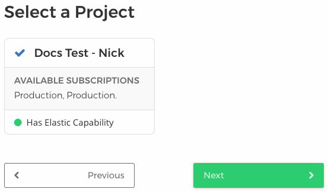
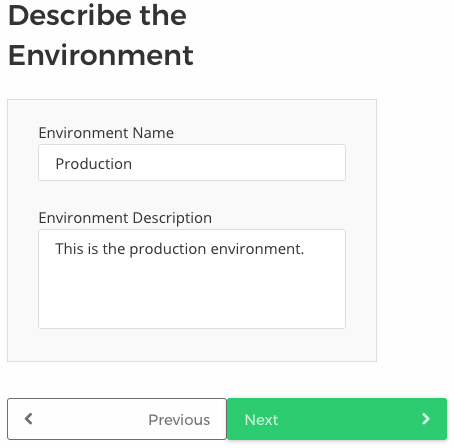
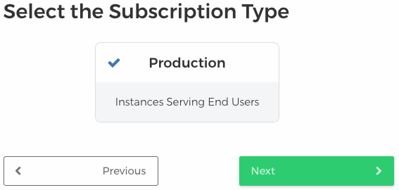
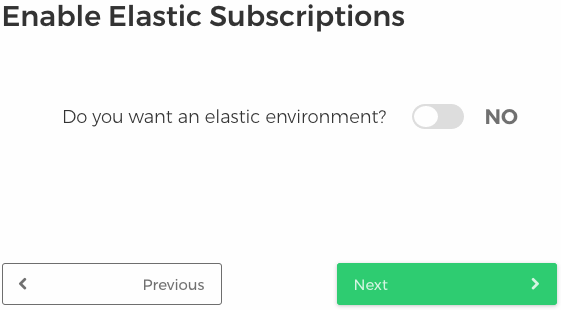
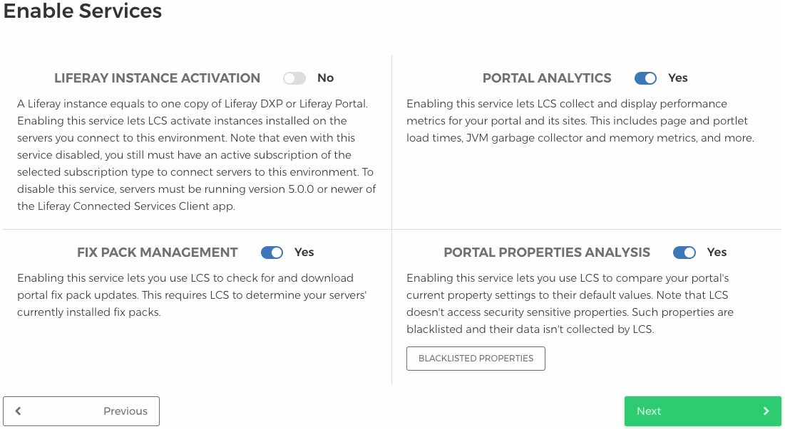
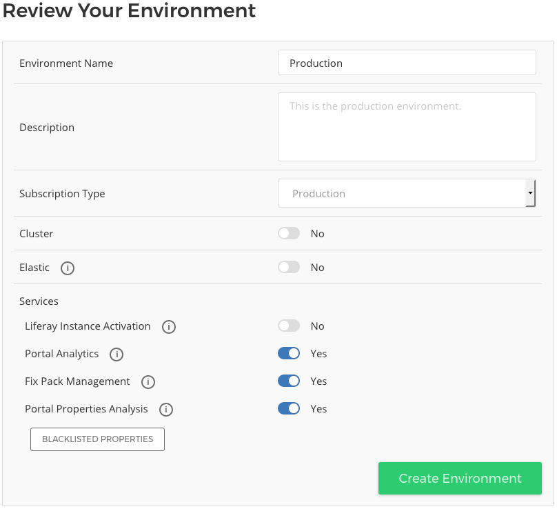

# まず初めに

LCSを使用するには、LCS環境にサーバーを登録する必要があります。LCS環境は、サーバーの物理的なクラスター、またはサーバーの仮想的または論理的な集合体を表します。各環境はLCSプロジェクトの一部です。LCSプロジェクトは、会社または組織に属するユーザーのグループを表します。たとえば、プロジェクトは、プロジェクトチームまたは事業単位のすべてのユーザーで構成することも、会社全体を含めることもできます。

LCSプロジェクトには最初は環境が含まれていません。そのため、LCSにサーバーを登録する前に作成する必要があります。初めて[lcs.liferay.com](https://lcs.liferay.com)にログインしたときに、LCSは環境の作成プロセスを案内するウィザードを提示します。始めるために*Get Started*をクリックしてください。

これらの各ステップは、ウィザードのステップに対応しています。

1. 新しい環境用のLCSプロジェクトを選択してください。利用可能なLCSプロジェクトをどれでも選択できます。各プロジェクトには、利用可能なサブスクリプションと、エラスティックサブスクリプションをサポートしているかどうかがリストされています。

   

2. 次に環境に名前を付けて説明事項を書き足します。名前は必須ですが、説明事項はオプショナルです。これらのフィールドには自由に書き足したいことを入力できますが、環境を正確に識別する名前と説明（たとえば、Development、Production、Testなど）を選択することをおすすめします。環境を作成した後でも入力した情報は変更できます。

   

3. プロジェクトの利用可能なサブスクリプションから環境のサブスクリプションタイプを選択します。この環境用に定義されたサーバーを、LCSを使用して有効化しないとしても、サブスクリプションタイプを選択する必要があります。また、環境を作成した後にこの選択を変更することはできません。

   

4. この環境に接続するサーバーがクラスターの一部であるかどうかを選択してください。LCSは、クラスターの管理に役立つ追加のツールをクラスター環境に提供します。例えば、クラスタ環境はクラスター固有のメトリクスを示し、フィックスパックはすべてのクラスターノードに適用されます。環境をクラスター化として設定する場合に留意すべきことがいくつかあります。

   - 環境を作成した後でこの設定を変更することはできません。

   - 各クラスター環境は、単一のクラスターに属するノードのみをサポートできます。別のクラスターのノードに接続するには、それらのノード専用に別のクラスタ環境を作成する必要があります。

   - クラスタ環境に接続するすべてのサーバーでportalプロパティー`cluster.link.enabled`を`true`に設定する必要があります。
   

5. 環境でエラスティックサブスクリプションを許可するかどうかを選択します。エラスティックサブスクリプションでは、無制限の数のサーバーを登録できます。これは、要求に応じてサーバーが自動的に作成および破棄されるオートスケーリングの状況において重要です。エラスティック環境は、事業継続計画など、他の目的で一時的に追加のサーバーをオンラインにするのにも役立ちます。詳細については、[the documentation on elastic subscriptions](/discover/deployment/-/knowledge_base/7-1/managing-liferay-dxp-subscriptions#elastic-subscriptions)を参照してください 。
環境を作成した後にこの選択を変更することができないので注意してください。

   

6. この環境に接続するサーバーで使用したいLCSサービスを有効にします。以下のサービスが利用可能です：

   - **Liferay Instance Activation:** これを有効にすると、LCSは環境に接続する@product@インスタンスを有効にできます。

このサービスを無効にすると、LiferayサポートからXMLファイルを介してアクティベートする必要があり、そのようなインスタンスはバージョン5.0.0以降のLCS​​クライアントアプリケーションを実行する必要があります。

      エラスティックサブスクリプションを有効にするためにはLCSを**必ず**使用する必要があります。
それ以外の場合は、有効化するためにLCSを使用する必要はありません。

   - **Portal Analytics:** これを有効にすると、LCSは環境に接続しているすべてのサーバーのパフォーマンスメトリクスを収集して表示できます。
これには、ページおよびポートレットのロード時間、JVMガーベージコレクター、メモリーメトリクスなどが含まれます。

   - **Fix Pack Management:** これを有効にすると、LCSを使用して@product@のフィックスパックを確認してインストールすることができます。これにより、LCSはインストール済みのフィックスパックを判別することもできます。

   - **Portal Properties Analysis:** これを有効にすると、LCSは現在のポータルプロパティ設定を、環境に接続するすべてのサーバーのデフォルト値と比較します。LCSは[security sensitive properties](/discover/deployment/-/knowledge_base/7-1/what-lcs-stores-about-your-liferay-dxp-servers)にはアクセスしません 。
 *Blacklisted Properties* をクリックすると、分析からブラックリストに登録されているその他のプロパティを表示および変更できます。
   

7. 記入済みのフォームに選択内容が表示されます。それらを確認して、必要な変更を加えます。確認、および変更し終わったら、*Create Environment*をクリックします。

   

環境を作成すると、ウィザードにLCSクライアントアプリケーションのダウンロード、環境のトークンファイルのダウンロード、およびLCSのプロジェクトのダッシュボードへの移動を可能にする画面が表示されます。ただし、新しい環境にサーバーを登録する前に 、そのサーバーの[preconfiguration steps](/discover/deployment/-/knowledge_base/7-1/lcs-preconfiguration)を完了する必要があります。
