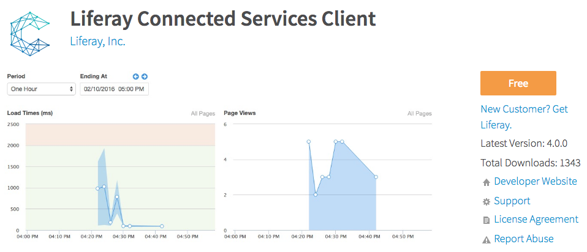
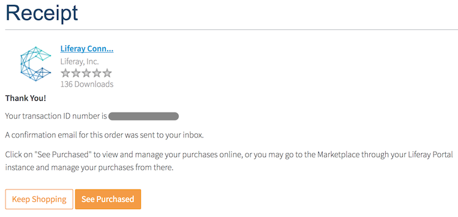
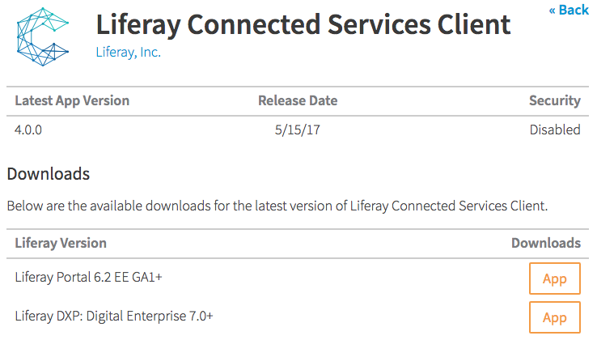

# LCS事前設定

Liferay DXPサーバーのアクティベートをし、 Liferay Connected Services (LCS)を最大限活用するには、まず以下の方法でサーバーをLCSに登録する必要がありますが、その前に設定する項目がいくつかあります。この資料はそれらの手順を説明しています。

1. [LCSクライアントアプリケーションをダウンロード](#downloading-the-lcs-client-app)
2. [プロキシを介したLCS接続の事前設定](#preconfiguring-lcs-to-connect-through-a-proxy)
3. [LCSのアクセス確保](#ensuring-access-to-lcs)
4. [NTPサーバー同期](#ntp-server-synchronization)

5. [パッチングツールの設定](#configuring-the-patching-tool)

6. [WebSphereの設定](#configuring-websphere): Liferay DXPをWebSphereで稼働させている場合のみこの手順が必要です。
7. [LCSクライアントアプリケーションのインストール](#installing-the-lcs-client-app)

[この記事の最後のセクション](#upgrading-the-lcs-client-app)で、Liferay DXPインスタンスの登録を行い、LCSをアクティベートした後の、LCSクライアントアプリケーションのアップグレード方法を説明しています。このアップグレードは最新版アプリケーションをリリースする際に、毎回行う必要があります。

+$$$

**注:**Elasticサブスクリプションを有効化するにはLCSを使用する必要があります。そうでなければ、アクティベーションにLCSを使う必要はありません。代わりにLiferayサポートからXMLアクティベーションキーをリクエストすることができます。

$$$

## [LCSクライアントアプリケーションをダウンロード](id=downloading-the-lcs-client-app)

LCS クライアントアプリケーションは@product@各バンドルに付属されており、バンドルを開始すると自動でデプロイされますが、付属のアプリケーションは最新版ではない可能性があります。 よってLCSクライアントアプリケーションの最新版をLiferayマーケットプレイスからダウンロード、インストールする必要があります。

+$$$

**注**:Liferayマーケットプレイス及びこの記事では*購入*と記載していますが、LCSクライアントアプリケーションは無料です。Liferayマーケットプレイスで無料アプリケーションを購入した場合、アプリケーションはLiferayプロジェクトに追加されます。これは、モバイルアプリケーションをご自身のアカウントに追加するのと同じです。

$$$

下記の手順で、アプリケーションの購入とダウンロードを行います。 (既に、アプリケーションを購入したことがあるお客様は、手順３のダウンロードへ進みます。)

1. [Liferayマーケットプレイス内のLCS クライアントアプリケーション](https://web.liferay.com/marketplace/-/mp/application/71774947)へ行きます。
 マーケットプレイスにサインインをして、LCSクライアントアプリケーションの*[無料]*ボタンをクリックします。

   

2. アプリケーションを使用するプロジェクトを選び、免責事項に同意して、画面左下にある*［購入］*をクリックします。領収書が表示されます。領収書が表示されます。

   

3. レシートに表示される*［購入済みを見る］*をクリックすると、LCSクライアント アプリケーションをダウンロードするページに行くことができます。ダウンロードする*アプリケーション*のバージョンの横にあるアプリケーションをクリックします。

   +$$$

   **注**: [アップグレード](#upgrading-the-lcs-client-app)時など、LCS クライアントアプリケーションを後でダウンロードする際は画面右上のユーザメニューにある *［購入されたアプリケーション］*を選択します。 購入済みアプリケーションが表示される画面で、 LCSクライアントアプリケーションを使うプロジェクトを選択し、アプリケーションを選択します。これで以下のスクリーンショットと同じダウンロードページへ行けます。これで以下のスクリーンショットと同じダウンロードページへ行けます。

   $$$

   

 これで、LCS クライアントアプリケーションのダウンロードが完了しました。次はインストールをする前に追加で行う事前準備について説明をします。

+$$$

**注**:プロキシ経由でサーバーがインターネットに接続されている場合は、Liferay DXPインスタンスにアプリケーションを、**デプロイする前に**、サーバー又はLCSクライアントアプリケーションのどちらかを設定しないといけません。次のセクションはその手順 です。プロキシ経由でサーバーを接続していない場合は、このセクションを飛ばして次のセクションに進んでください。

$$$

## [プロキシを介したLCS接続の事前設定](id=preconfiguring-lcs-to-connect-through-a-proxy)

プロキシ経由でサーバーを接続している場合は、Liferay DXPインスタンスにアプリケーションを**デプロイする前に**、サーバー又はLCSクライアントアプリケーションのプロパティの一部を設定する必要があります。設定方法は、サーバー又はLCSクライアントアプリケーションで設定するかによって決定します。

1. JVMアプリケーションサーバー アーギュメント内にこれらのプロパティを以下のように適切なプロキシ値に設定します。
これらのプロパティを、適切なプロキシ値に設定します：

       -Dhttp.proxyHost=
       -Dhttp.proxyPort=
       -Dhttp.proxyUser=
       -Dhttp.proxyPassword=
       -Dhttps.proxyHost=
       -Dhttps.proxyPort=
   
   プロキシの認証が必要な場合のみ、`user`、`password`、`https`プロパティーを使用します。

   +$$$

   **注**: 上記で説明しているように、 JVMアプリケーションサーバーの引数を利用場合は、同じプロキシ接続にするための、LCS クライアントアプリケーションの事前設定をする必要はありません。

   $$$

2. LCS クライアントアプリケーションのWARファイル 内のプロパティの設定は、WARファイルはLiferayマーケットプレイスからダウンロード済みのアプリケーションLPKG ファイルにあります。LPKG ファイルを開き、 クライアントのWARファイル`lcs-portlet-[version].war`に行きます。

   WARにある、`portlet-ext.properties`ファイルのプロパティを
そうするには以下の手順に従ってください：

   a. LCSクライアントのWARファイルに、`WEB-INF/classes/portlet-ext.properties`ファイルを作成 (ファイルが既にある場合は開く)する。

   b. `portlet-ext.properties`の末尾に下記プロパティを追加し、プロキシに合わせて適切な値にします：

       proxy.host.name=
       proxy.host.port=
   
   プロキシの認証が必要な場合は、下記のプロパティを追加し、プロキシに合わせた値にします。

       proxy.host.login=
       proxy.host.password=
   
   プロキシにNTLM認証が必要な場合は下記のプロパティを追加します。

       proxy.auth.type=ntlm
       proxy.domain=
       proxy.workstation=
   
   `proxy.domain`及び`proxy.workstation`をプロキシに合わせた適切な値にするのを忘れずに行ってください。`proxy.workstation`の部分は必要が無い場合は空欄にします。

   c.  変更を加えた`portlet-ext.properties`ファイルを含めて、LPKGファイルをLCSクライアントと一緒にrepackageします。RepackageしたLPKGファイルがLiferayマーケットプレイスからダウンロードしたLPKGファイルと同じ名前であることを確かめてください。

次の手順は、LCSクライアントをLCSに接続するアクセス確保の説明です。

## [LCSのアクセス確保](id=ensuring-access-to-lcs)

LCSクライアントアプリケーションが正常に動くには、下記のDNS名がアクセスする必要があります。サーバーがプロキシや、ファイアーウォールの背後にある時は、下記にアクセスします。

- `lcs.liferay.com`
- `lcs-gateway.liferay.com`

追加のセキュリティ対策として、トラフィックをHTTPSに制限することもできます。

次のセクションでは、NTPサーバーの同期について説明します。

## [NTPサーバー同期](id=ntp-server-synchronization)

セキュリティー強化のために、HTTPSのトラフィックを制限する事も出来ます。もし同期が正常に行われていないと、以下のようなログエラーが出る可能性があります。

    ERROR [pool-6-thread-3][HandshakeTask:68] java.lang.RuntimeException: Handshake expired.
    Check that the server is synchronized with an NTP server.
    
    WARN [liferay/hot_deploy-1][LCSHotDeployMessageListener:186] LCS portlet is not connected
    java.lang.RuntimeException: com.liferay.jsonwebserviceclient.JSONWebServiceInvocationException:
    com.fasterxml.jackson.core.JsonParseException: Unrecognized token 'oauth_problem': was expecting
    ('true', 'false' or 'null')_ at [Source: oauth_problem=timestamp_refused&oauth_acceptable_timestamps=1477311475-1477312075;
    line: 1, column: 14] [Sanitized]

アプリケーションサーバーと時刻サーバーの同期をするには、アプリケーションサーバーの書類を参照してください。

次に、@product@のパッチ適用ツールの設定方法を学びます。

## パッチングツールの設定

@product@のパッチングツールを使いLCSのアップデートをします。パッチングツールは、Liferay DXPのバンドルに事前インストールされています。バンドルを稼働していない場合は、パッチングツールの[ダウンロード](https://web.liferay.com/group/customer/dxp/downloads/digital-enterprise/patching-tool)および[インストール](/discover/deployment/-/knowledge_base/7-1/patching-tool)を個別にしてください。

パッチングツールのインストール後、LCSがパッチングツールを使用できるように、設定する項目があります。下記コマンドはLinux、Unix、Macで使用可能です。Windowsをお使いの場合は、`.sh`をコマンドから削除してください。

1. コマンドラインの`patching-tool`ディレクトリに行きます。大抵の場合、[Liferay Home](/discover/deployment/-/knowledge_base/7-1/installing-liferay#liferay-home)フォルダにあります。Liferay Homeは、たいていアプリケーションサーバのフォルダの親フォルダです。

2. @product@インストールをパッチングツールに検知させるため下記コマンドを起動します。

       patching-tool.sh auto-discovery
   
3. パッチングツール設定するために、下記コマンドを起動します。

       patching-tool.sh setup
   
4. サーバー起動時に、パッチングツールがLCSからダウンロードしたアップデートパッチをインストールします。パッチングツールがサーバーに接続するには、JVMオプションの`javaagent`プロパティをインストールしたパッチングツール内の`patching-tool-agent.jar`に指定する必要があります。 以下のファイルに正しいファイルパスの指定をしてください。

       -javaagent:../../patching-tool/lib/patching-tool-agent.jar
   
5. Liferay Homeフォルダ以外の場所に、パッチングツールをインストールした場合は、`patching-tool`フォルダパスをJVMの設定に合わせて適切なパスに指定します。`patching.tool.home`を下記のように特定します。

       -Dpatching.tool.home=/opt/liferay-dxp-7.1/patching-tool/
   
パッチングツールの使用時に考慮する点がいくつかあります。クラスローディングの関係で、パッチングツールは別JVMで動作します。`patching.tool.agent.jvm.opts`プロパティを使ってJVMオプションの指定をすることも可能です。

    -Dpatching.tool.agent.jvm.opts="-Xmx1024m -Xms512m -Dfile.encoding=UTF8"

Windowsをお使いの場合で、ユーザーにアドミニストレータ権限が無い場合は、 問題が生じる場合もあります。下記はエラーの例です。

    java.nio.file.FileSystemException: ..\webapps\ROOT\WEB-INF\lib\util-java.jar: Not a file!
    java.io.FileNotFoundException: java.io.IOException: Access refused

これを解決するには、 `patching.tool.agent.jvm.opts`プロパティの `java.io.tmpdir`システムプロパティを以下のように設定します。

    -Dpatching.tool.agent.jvm.opts="-Xmx1024m -Xms512m -Dfile.encoding=UTF8 -Djava.io.tmpdir=%TMP%"

パッチングツールには、フラッグ機能でどのように作動するか設定を変えることも可能です。

- `debug`: コンソルに冗長アウトプットを提供します。
- `nohalt`: エージェントが問題に遭遇した場合でもポータルを開始します。

下記のように、指定できます。

    -Dpatching.tool.agent.properties=debug,nohalt

## WebSphereの設定方法

BM &reg; WebSphere &reg;は、世界の多くの国で登録されたInternational Business Machines Corporationの商標です。

WebSphereアプリケーションサーバーを実行している場合は、LCSクライアントアプリケーションを展開する前に、以下の構成手順を実行してください。

1. アプリケーションサーバーをシャットダウンします。

2. `portal-ext.properties`ファイルに次の行を追加します。追加するプロパティは、お使いのLiferay DXPフィックスパックのバージョンによって変わります。Fix Pack 5以降をお使いの場合は、下記のプロパティを追加します。

       module.framework.properties.org.osgi.framework.bootdelegation=\
       __redirected,\
       com.sun.ccpp,\
       com.sun.ccpp.*,\
       com.liferay.aspectj,\
       com.liferay.aspectj.*,\
       com.liferay.portal.servlet.delegate,\
       com.liferay.portal.servlet.delegate*,\
       com.sun.crypto.*,\
       com.sun.image.*,\
       com.sun.jmx.*,\
       com.sun.jna,\
       com.sun.jndi.*,\
       com.sun.mail.*,\
       com.sun.management.*,\
       com.sun.media.*,\
       com.sun.msv.*,\
       com.sun.org.*,\
       com.sun.syndication,\
       com.sun.tools.*,\
       com.sun.xml.*,\
       com.yourkit.*,\
       com.ibm.crypto.*,\
       sun.*,\
       javax.validation,\
       javax.validation.*,\
       jdk.*,\
       weblogic.jndi,\
       weblogic.jndi.*\
   
   Fix Pack 5以降をお使いの場合は、下記のプロパティを追加します。

       module.framework.properties.org.osgi.framework.bootdelegation=\
       __redirected,\
       com.sun.ccpp,\
       com.sun.ccpp.*,\
       com.liferay.aspectj,\
       com.liferay.aspectj.*,\
       com.liferay.portal.servlet.delegate,\
       com.liferay.portal.servlet.delegate*,\
       com.sun.crypto.*,\
       com.sun.image.*,\
       com.sun.jmx.*,\
       com.sun.jna,\
       com.sun.jndi.*,\
       com.sun.mail.*,\
       com.sun.management.*,\
       com.sun.media.*,\
       com.sun.msv.*,\
       com.sun.org.*,\
       com.sun.syndication,\
       com.sun.tools.*,\
       com.sun.xml.*,\
       com.yourkit.*,\
       com.ibm.*,\
       sun.*
   
3. @product@のインストールの際、`osgi/state`フォルダを削除します。

4. アプリケーションサーバーを起動します。

5. ブラウザでWebSphereコンソールを開きます。

6. サーバーを選択し、*[Javaおよびプロセス管理] *>*[プロセス定義]*>*[追加のプロパティ]*に行きます。

7. *[Java仮想マシン]*>*[カスタム・プロパティー]*を選択します。

8. *[新規]*をクリックし、次のように入力します。

   - Name: `com.ibm.crypto.provider.DoRSATypeChecking`
   - Value: `false`

9. *[保存]*、そして*[OK]*をクリックして、マスター構成に変更を適用します

5.0.0より前のバージョンのLCSクライアントアプリケーションでは、アプリのの`portlet.properties`ファイル内の`digital.signature.algorithm.provider`プロパティ値を`IBMJCE`に変更する必要があります。

    digital.signature.algorithm.provider=IBMJCE

## LCSクライアントアプリケーションのインストール

上記の事前設定で、LCS クライアントアプリケーションをインストールする準備が整いました。 次は、下記の手順でアプリケーションをインストールします。

1. Liferay DXPバンドルの[Liferay Home](/discover/deployment/-/knowledge_base/7-1/installing-liferay#liferay-home)フォルダ(アプリケーションパッチングツールのルートフォルダ内)の下記ファイルを削除します。

       osgi/marketplace/Liferay Connected Services Client.lpkg
   
2. `osgi/marketplace`に新しく作成した`Liferay Connected Services Client.lpkg`を配置します。

 Liferay DXPインスタンスを[LCSに登録する準備](/discover/deployment/-/knowledge_base/7-1/activating-your-liferay-dxp-server-with-lcs)が整いました。

次のセクションはLCS クライアントアプリケーションのアップグレードについてです。このステップはLiferayがアプリケーションの最新版リリース時に毎回行います。

## LCSクライアントアプリケーションのアップグレード

Liferay DXPインスタンスには、最新版のLCSクライアントアプリケーションが起動していることが必須です。
どの手順でLCSの事前設定を行ったかによって、二通りアップデートの方法があります。

1. 稼働している@product@*インスタンスにある*Liferayマーケットプレイスを通して行う方法：デプロイ前にLCS クライアントアプリケーションを設定(プロキシ設定等)をする必要がない場合はこの方法で行います。

   +$$$

   **注**: この方法をクラスタ構成に行うには、各ノードにアップデートを個別に行う必要があります。よってクラスタ内の全ノードが同じバージョンの LCS クライアントアプリケーションで動いている事を確認する必要があります。これには、手順２で説明している、マニュアル方法が有効です。

   $$$

   アップグレードは、*[Control Panel]*>*[アプリケーション（Apps)]*>*[購入されたアプリケーション]*の順にアクセスします。アップデートが必要なアプリケーションが先に表示されます。 LCSクライアントアプリケーションの隣に表示される *［アップデート］*をクリックします。アップグレードを完了するには、 パッチングツールを再起動する必要があるかもしれません。

2. LCSクライアントアプリケーションの LPKG ファイルをダウンロードした後にマニュアルで行う方法：
LCS クライアントアプリケーションをプロキシ接続するための事前設定はこの方法で行います。

   +$$$

   **注**:JVM アプリケーションサーバー の引数を使ってプロキシ接続を設定した場合は、LCS クライアントアプリケーションを同じプロキシに接続するための事前設定の必要はありません。

   $$$

   TLCS クライアントアプリケーションをマニュアルでアップデートする場合には、 この記事前半の手順にそってダウンロード、事前設定を行います。その後`[Liferay Home]/deploy`、他のアプリと同じように配置します。

アップグレードに関するサポートが必要な場合は、Liferayサポートへご連絡ください。
