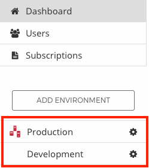
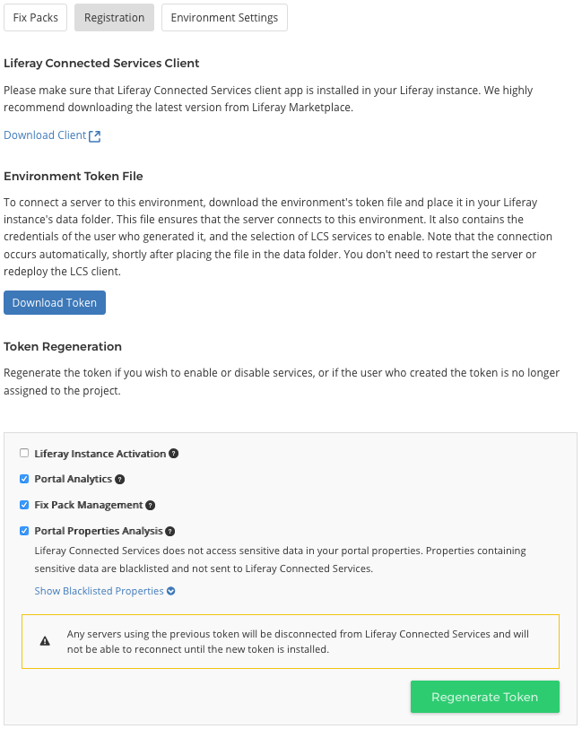
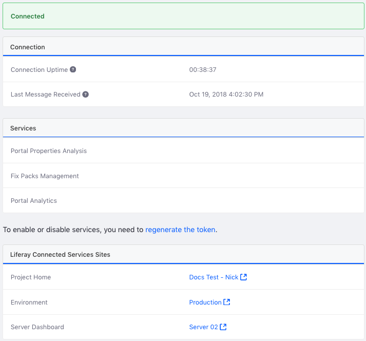

# Liferay DXPサーバーをLCSに登録する

+$$$

**注:**Elasticサブスクリプションを有効化するにはLCSを使用する必要があります。そうでなければ、アクティベーションにLCSを使う必要はありません。代わりにLiferayサポートからXMLアクティベーションキーをリクエストすることができます。

$$$

以下の手順に従って、@product@サーバーをLCSに登録してください:

1. まず、[LCSの事前設定手順](/discover/deployment/-/knowledge_base/7-1/lcs-preconfiguration)が完了したことを確認してください 。

2. 次に、[lcs.liferay.com](https://lcs.liferay.com)にログインします。
そうすると、会社のLCSプロジェクトに行くはずです。会社に複数のプロジェクトがある場合は、[Dashboard]タブの右側のメニューから新しいサーバーを作成しているプロジェクトを選択します。

   

3. このサーバーを登録する環境を選択または作成します。アクティベーションにLCSを使用している場合、LCSに接続すると、サーバーは環境に割り当てられているサブスクリプションタイプからアクティベーションキーを使用します。サブスクリプションタイプは、環境の作成時にのみその環境に割り当てることができます。会社のプロジェクトに十分な権限がある場合は、*Add Environment*を選択することにより[新しい環境を作成できます。](/discover/deployment/-/knowledge_base/7-1/managing-lcs-environments#creating-environments)

   

4. 環境の*Registration*タブを選択します。これは、環境内のサーバーを登録する、[環境のトークンファイル](/discover/deployment/-/knowledge_base/7-1/understanding-environment-tokens)を管理およびダウンロードする場所です 。

   必要に応じて、[Registration]タブの*Services*セクションで、LCSサービスの選択を変更してください。LCSサービスの選択を変更し、すでに環境に登録されているサーバーがある場合は、トークンファイルを再生成し、それを使用してそれらのサーバーをLCSに再接続する必要があります。
次のステップでトークンを再生成またはダウンロードします。

   選択したサービスは、この環境に接続しているすべてのサーバーに対して有効になります。ポータルプロパティ分析が選択されている場合、LCSが特定のプロパティを分析しないようにすることができます。 *Show Blacklisted Properties*を選択したときに表示されるボックスにそれらを入力します。[LCSは、セキュリティに敏感なプロパティにはアクセスしない](/discover/deployment/-/knowledge_base/7-1/what-lcs-stores-about-your-liferay-dxp-servers)ので注意してください。

   環境のRegistrationタブを使うと、 サーバーを環境に登録するために使用されるトークンファイルを管理できます。

5. 以下にすることは、前のステップでしたことによって異なります。

   - **LCSサービス選択の変更：**トークンを再生成してダウンロードします。トークンを再生成すると、古いトークンを使用しているすべてのサーバーがLCSから切断されます。新しいトークンを使用してそれらを再接続する必要があります。

   - **LCSサービス選択の変更なし：**トークンをダウンロードしてください。

6. トークンファイルをサーバーの`[Liferay Home]/data`フォルダに置いてください。[Liferay Home](/discover/deployment/-/knowledge_base/7-1/installing-liferay#liferay-home)は通常、アプリケーションサーバーのフォルダの親フォルダです。サーバーが稼働している場合は、約1分でLCSに接続するはずです。サーバーが稼働していない場合は、起動時にLCSに接続します。

7.  これで@product@ serverはLCSに登録されました。何らかの理由で登録されていない場合は、こちらの記事を参照してください：[LCS troubleshooting article](/discover/deployment/-/knowledge_base/7-1/troubleshooting-your-lcs-connection)

+$$$

**注：**LCSがオフラインになるとどうなるのか疑問に思われるかもしれません。これは時空連続体に亀裂を生じさせませんので、心配する必要はありません。LCSは自動故障回復のために設定されたグローバルクラウドインフラストラクチャにデプロイされています。非可用性の可能性は非常に低いです。ただし停電が発生した場合、登録されたサーバーは稼働時間情報のローカルコピーを保持し、オンラインに戻ったときにLCSに送信します。有効化のためにLCSを使用する場合は、有効なサブスクリプションは接続を再確立して維持するために30日間の猶予期間があります。これはLCSがオンラインに戻るのに十分な時間です。

$$$

## サーバーのLCS接続状態を確認する
 

@product@では、LCSクライアントアプリケーションでLCS接続状態を確認できます。
 *[Control Panel]*>*[Configuration]*>
*[Liferay Connected Services]*の順にクリックして、クライアントにアクセスします。

接続されたLCSクライアントアプリケーションに表示される内容の詳細は、次のとおりです:

**Connection Uptime:** クライアントとLCSの接続時間。

**Last Message Received:** LCSクライアントがLCSから最新の接続メッセージを受信した時刻。これらのメッセージは接続/再接続時にのみ発生し、サーバーの測定基準とは関係ありません。よって、クライアントが再接続イベントのためにそのようなメッセージを受信するまでに長い時間が経過するのが一般的です。

**Services:** このサーバーで有効になっているLCSサービス。環境内のすべてのサーバーは同じLCSサービスのセットを使用しています。LCSサービスはサーバーごとに制御することはできません。

**Project Home:** このサーバーのLCSプロジェクトへのリンク。

**Environment:**このサーバーのLCS環境へのリンク。

**Server Dashboard:** LCS上のサーバーへのリンク。

