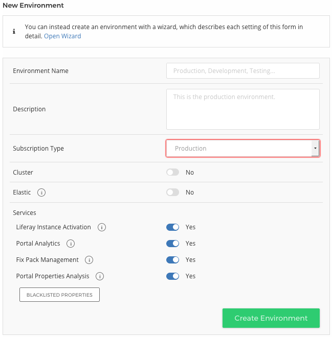
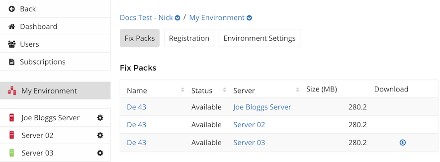

# LCS環境の管理

環境はLCSプロジェクトの重要なコンポーネントです。LCSにサーバーを登録する時、環境内で登録します。環境はLCSでサーバーを管理および監視するためのいわゆるゲートウェイです。

## 環境を作成する

初めてLCSにログインする時、ウィザードがプロジェクトの最初の環境を作成するために必要な各ステップを案内します。詳細は[getting started article](/discover/deployment/-/knowledge_base/7-1/getting-started-with-lcs)で説明されています。同じウィザードまたは簡単なフォームを使って追加の環境を作成することもできます。

環境を作成するには、ダッシュボードの*環境を追加*のボタンをクリックします。
すると、新しい環境のフォームが表示されます。このフォームの各セクションは、ウィザードのステップに対応しています。代わりにウィザードを使用したい場合は、フォーム上部の*ウィザードを開く*のリンクをクリックしてください 。フォームとウィザードの各設定の説明については、[getting started article](/discover/deployment/-/knowledge_base/7-1/getting-started-with-lcs)を参照してください。

+$$$

**注：**環境を作成する時には、*サブスクリプションタイプ*、*クラスター*、および*エラスティック*フィールドを慎重に選択してください。これらは環境を作成した後に変更することができません。

$$$

## 環境との連携

ダッシュボードの左側にある環境をクリックすると、環境ビューに移動して、LCSプロジェクトの環境を管理できます。

UIは3つのタブに分かれています：

1. **フィックスパック：**環境のサーバー用のフィックスパックを表示して適用します。このタブは、サーバーが環境に登録されている場合にのみ表示されます。表には、各フィックスパックに関する以下の情報が表示されます。

   - **名前：**フィックスパックの名前。

   - **状態：**フィックスパックの状態。

   - **サーバー：**フィックスパックを適用できるサーバー。

   - **サイズ：**フィックスパックのサイズ。これはサーバーが稼働している場合にのみ表示されます。

   - **ダウンロード：**フィックスパックをサーバーにダウンロードするためのボタン。これはサーバーが稼働している場合にのみ表示されます。
   フィックスパックがダウンロードされると、ダウンロードされたフィックスパックをインストールできるようにLCSはサーバーを再始動するようにプロンプ​​トを出します。パッチを保存して処理するディスクの場所（`パッチングツール`フォルダ）に書き込むために必要な権限を使ってサーバーを起動する必要があります。LCSを使用してクラスター全体にフィックスパックをインストールするには、同じ手順に従います。LCSは、すべてのノードに同時にフィックスパックをダウンロードしてインストールします。よって、個別に処理する必要はありません。

2. **登録： **サーバーをLCSに接続する[*環境トークン*](/discover/deployment/-/knowledge_base/7-1/understanding-environment-tokens)を生成してダウンロードします。

3. **環境設定：**環境の名前、場所、および説明を変更します。また、環境でクラスタサーバーが許可されているかどうかを確認したり、環境のサブスクリプションの種類を表示したりすることもできます。*保存*ボタンをクリックして、環境設定タブで行った変更を保存します。また、*環境を削除*をクリックすると、環境を削除することができます。

