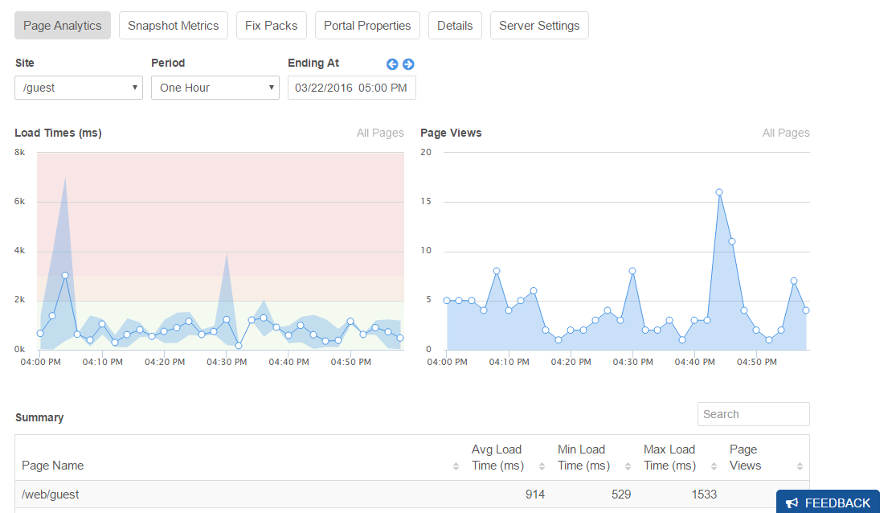
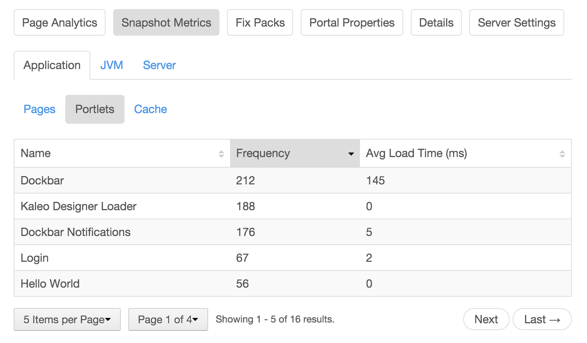
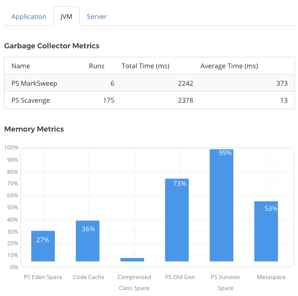
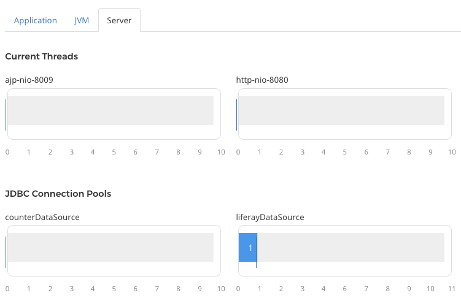
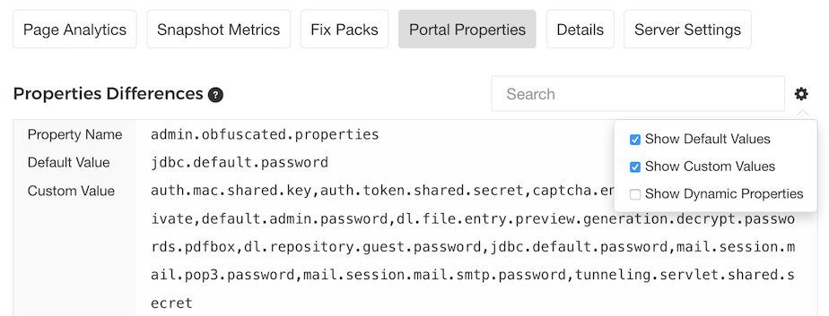
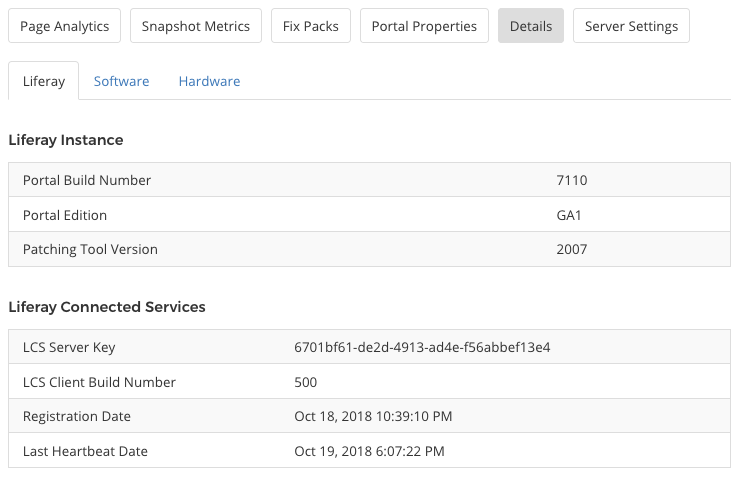
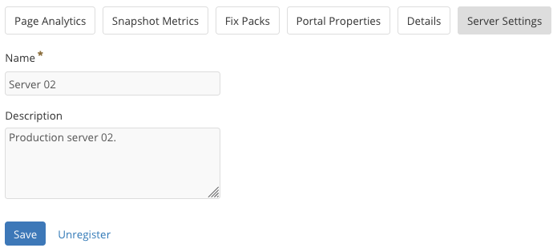

# LCSサーバの管理

ダッシュボードまたは環境ビューでサーバーをクリックすると、サーバービューに移動します。サーバービューには、統計やパフォーマンスメトリクスなど、サーバーに関する詳細情報が表示されます。ユーザーのプライバシーを保護するために、LCSはユーザーデータを収集、保存、または分析しません。

サーバービューは6つのタブに分かれています：

**ページ解析：**ページビューとロード時間にメトリクスを表示します。

**スナップショットの指標：**アプリケーション、JVM、およびサーバのメトリクスを表示します。

**フィックスパック：**サーバーの使用可能およびインストール済みのフィックスパックを表示します。

**ポータルのプロパティ：**ポータルのプロパティとその設定を表示します。

**詳細：** @product@のインストール、Javaのバージョン、およびハードウェアに関する一般的な情報を表示します。

**サーバーの設定：**サーバーの名前、場所、説明を表示または変更します。LCSからサーバーを登録解除することもできます。

+$$$

**注：**LCSは、TomcatまたはWebLogicで稼働しているサーバーのスナップショットメトリクスのみをサポートしています。他のアプリケーションサーバーでは、LCSはアプリケーションサーバーのサーバーメトリクスをサポートしません、と示すコンソールメッセージが表示されることがあります。LCSの`TaskSchedulerServiceImpl`と `ScheduleTasksCommand`のための`NullPointerException`も表示されるかもしれません。

$$$

## ページ解析

ページ解析は、サーバービューに入るとデフォルトで表示されます。ページ解析には、選択したサイトと期間に対するページビューとロード時間が表示されます。デフォルトでは、すべてのサイトが選択されています。*サイト*セレクターメニューから特定のサイトを選択できます。また、*期間*と*を終了*のフィールドから異なる時間帯を選択することができます。*Ending At*フィールドの横の矢印は、選択した期間をそれぞれ1期間多くまたは少なくします。例えば、*期間*のフィールドで*1時間*を選択した場合、*を終了*の横にある右矢印を押すと、選択した期間を1時間長くすることができます。現在の期間の開始時に、データが使用可能になるまでに最大15分かかることがあります。
また、データはLCSが収集した時点から3か月間利用可能です。

デフォルトでは、すべてのページのロード時間とページビューは時間に対して別々のグラフにプロットされます。これらのグラフの下には、各ページの同じ期間におけるデータの要約統計が表に表示されています。テーブル内のページをクリックすると、グラフはそのページだけのデータをプロットします。探しているページが見つからない場合は、表の上部にある*検索]*ボックスから検索することができます。
全てのページのデータをもう一度プロットするには、テーブルの下部にある*全てのページ*の行をクリックします。

ロード時間は速度を示すために色分けされています。*ロードタイム*グラフの背景は、3000ミリ秒以上の値は赤、2,000から3,000ミリ秒の値はオレンジ、2,000ミリ秒未満の値は緑となっています。同様に、3,000ミリ秒を超えるすべてのロード時間は赤いテキストで表示されています。

## スナップショットの指標

サーバーのパフォーマンスに関する他のメトリクスと統計を表示するには、ページ上部の*スナップショットの指標*のタブをクリックしてください。これらのメトリクスは、*アプリケーション*、*JVM*、および*サーバー*の 3つの主要カテゴリーに分類されています。スナップショットの指標のボタンをクリックすると、デフォルトでアプリケーションが選択されます。

アプリケーションにもさらに、*ページ*、*ポートレット*、および*キャッシュ*の3つのカテゴリーがあります。ページには、特定のページが読み込まれる頻度とその平均読み込み時間が一覧表示されます。ポートレットにも同じ統計が表示されますが、サーバー内の特定のポートレットの情報が表示されます。キャッシュカテゴリーには、Liferay Single VMメトリクスとHibernateメトリクスが一覧表示されます。以下のスクリーンショットは、ポートレットカテゴリーの統計を示しています。

JVMカテゴリは、その名の通り、サーバー上で実行されているJVMに関する統計を表示します。これには、ガーベージコレクターとメモリに関するデータが含まれます。各ガーベージコレクターアイテムの実行回数、合計時間、および平均時間が一覧表示されます。メモリーメトリクスは、PS Eden領域、コードキャッシュ、圧縮クラス領域、PS Old Gen、PS Survivor領域、およびMetaspaceの使用状況を示す棒グラフで表示されます。

スナップショットの指標の3番目のサーバーカテゴリーです。サーバーカテゴリーには、サーバーの稼働状況に関する追加情報が表示されます。例えば、横棒グラフは現在サーバー上で実行されているスレッド数とJDBC接続プールを示します。

スナップショットの指標は、アプリケーションとガーベージコレクターのメトリクスは、サーバー登録から現在までにLCSによって収集されたデータに基づいています。ただし、メモリーとサーバーのメトリクスには現在の状態のみが表示されます。

## フィックスパック

サーバーのフィックスパックを表示するには、ページ上部の「フィックスパック」のタブをクリックしてください。インストール済みの使用可能なフィックスパックが別々の表に表示されます。使用可能なフィックスパックの表は、フィックスパックをダウンロードおよびインストールするための、環境ビューのフィックスパック表とまったく同じように機能します。

## ポータルプロパティ

*ポータルプロパティ*のタブは、検索可能な表にポータルのプロパティ値を表示します。これにより、ポータルプロパティ設定を簡単に表示できます。この表のプロパティは、以下のカテゴリーに分類されています：

**初期値：**ポータルプロパティの初期値。

**変更値：**ポータルプロパティに設定した変更値。
これには、`portal-ext.properties`ファイルを介して変更したプロパティ値も含まれます。

**動的プロパティ：**実行時に設定されるプロパティ値。例えば、[Liferay Home](/discover/deployment/-/knowledge_base/7-1/installing-liferay#liferay-home)のフォルダの場所は設定方法により異なります。このフォルダを必要とするプロパティを設定する時、絶対的なティレクトリパスの代わりに`${liferay.home}`を使用してください。

テーブルの右上にある検索ボックスの横のギヤアイコンから対応するチェックボックスを選択すると、カテゴリの組み合わせを自由に表示できます。例えば、*初期値を表示*および*変更値を表示*のチェックボックスを選択すると、ポータルの初期値と変更プロパティ値が表に表示されます。変更値だけを表示するには、*変更値を表示*のみを選択してください。

## 詳細

*詳細*タブには、サーバーに関する一般情報が表示されます。詳細には3つのタブがあります：*ソフトウェア*、*Java*、および*ハードウェア*。それぞれに、@product@のインストール、Javaのインストール、およびハードウェアに関する情報が掲載されています。この情報は、Liferayサポートチームがサポートする必要がある時に役立ちます。

## サーバーの設定

最後に、*サーバーの設定*タブでは、サーバーの名前、場所、そして説明を表示し編集できます。LCSからサーバーを登録解除することもできます。

