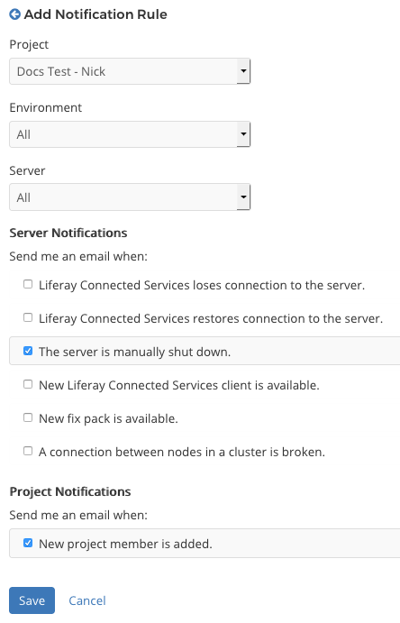
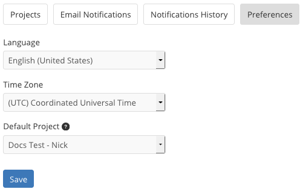
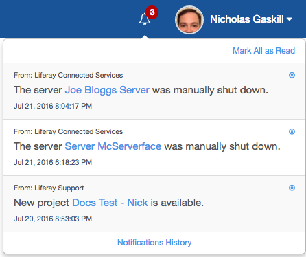

# LCSアカウントを管理する

LCSアカウントを管理するには、ドックバーのユーザーメニューから*マイアカウント*を選択します。すると、4つのタブがあるUIが表示されます：

**プロジェクト：**各プロジェクトの管理者のEメールアドレスをリストした検索可能な表にLCSプロジェクトが表示されます。

**Eメール通知：** LCSプロジェクトで特定の出来事が発生したときにEメールで通知するようにLCSを設定し、どんな出来事が通知されるかルールを追加することができます。デフォルトではルールはありません。*ルールの追加 *ボタンをクリックして定義します。

まず最初に、通知用のプロジェクト、環境、およびサーバーを指定します。
プロジェクト内のすべての環境とサーバーを選択することもできます。次に、Eメールで通知されたい出来事の項目のチェックボックスを選択します。例えば、プロジェクト内のすべてのサーバーと環境に対して*サーバーが予期せず停止した時*の通知ルールを設定した場合、プロジェクト内のいずれかのサーバーが通常にシャットダウンされずにオフラインになると、LCSからEメール通知がきます。通知ルールを設定したら、*保存*をクリックします。すると、他の既存のルールとともに表に表示されます。それぞれに編集ボタンと操作の削除のボタンがあります。

**通知履歴：** Web通知履歴を検索可能な表に表示します。通知を表示する日付範囲を選択することもできます。

**プリファレンス：** LCSアカウントのプリファレンス設定を管理します。ここでアカウントの言語、タイムゾーン、デフォルトのLCSプロジェクトを変更できます。LCSにログインするたびに表示されるのがデフォルトのLCSプロジェクトです。

## Web通知を使用する

LCSはドックバーのベルアイコンの下にWeb通知を表示します。このアイコンにある赤いバッジは、未読の通知数を示しています。LCSとLiferayサポートがこれらの通知を送ります。例えば、LCSは、サーバーがシャットダウンしたとき、または注意が必要なその他の出来事が発生したときに通知を生成します。通知に既読のマークを付けるには、その横にある小さい*x*アイコンをクリックします。すべての通知を既読にするには、*すべて既読にする* ボタンをクリックします。通知を再度未読にするには、表示される*元に戻す*ボタンをクリックします。通知履歴を確認するには、*通知履歴*ボタンをクリックします。ドックバーのユーザーメニューから*マイアカウント*を選択して通知履歴にアクセスすることもできます。<segment 0635 ¶>

