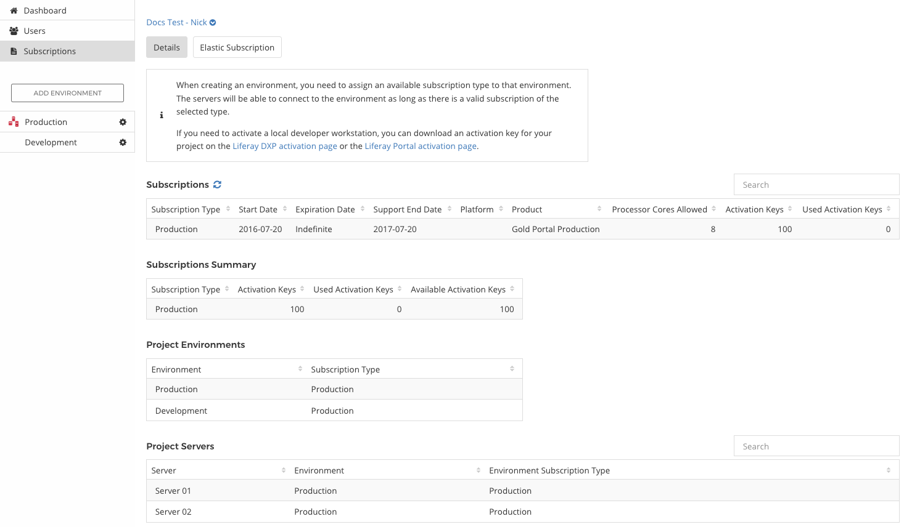
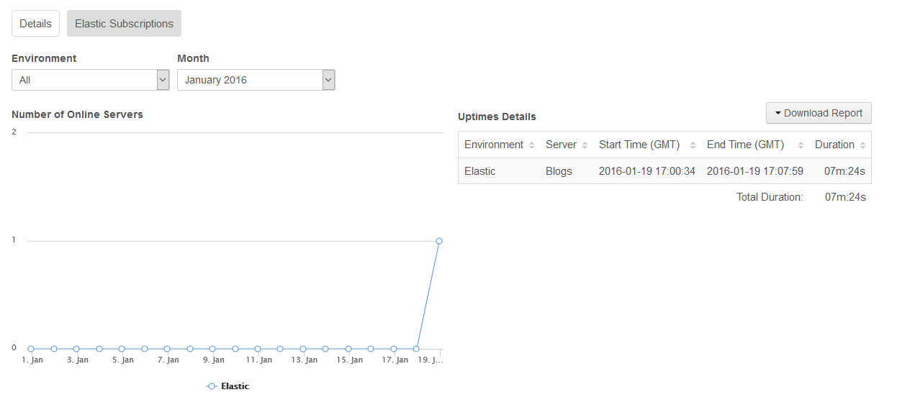

# Liferay DXPサブスクリプションの管理

LCSでは、@product@サブスクリプションを使用して表示できます。[環境を作成する](/discover/deployment/-/knowledge_base/7-1/managing-lcs-environments#creating-environments)ときに、そのサブスクリプションタイプを割り当て、LCSがその環境に接続するサーバーをアクティべートするかどうかを選択したと思います。アクティベーションにLCSを使用する場合、その環境にサーバーを登録すると、その環境のサブスクリプションタイプからアクティベーションキーが消費されます。プロジェクトで利用可能なアクティベーションキーを表示して、それらがどのように使用されているかを確認することもできます。

サブスクリプション契約によっては、LCSでは*エラスティックサブスクリプション*を介してサーバーを登録することもできます。エラスティックサブスクリプションでは、無制限の数のサーバーを登録することができます。これは、ロードに応じてサーバーが自動的に作成および破棄されるオートスケーリング環境では非常に大事です。エラスティックサブスクリプションを使用するには、作成時に環境をエラスティックとして設定する必要があります。また、LCSは、環境のサブスクリプションタイプで許容される数を超えるサーバーに対してのみエラスティックサブスクリプションを使用します。つまり、LCSはエラスティックサブスクリプションの前に環境の通常のサブスクリプションを使用します。

これらの機能には、LCSサイトの左上にある*サブスクリプション*タブからアクセスできます。このタブには、その他に2つのタブがあります：*詳細*と*エラスティック*サブスクリプションのタブです。

*詳細*タブには4つの表があります：

1. **サブスクリプション：** LCSプロジェクトで利用可能なサブスクリプションのリストを表示します。この表には、サブスクリプションごとに以下の情報が表示されます：

   - サブスクリプションタイプ

   - 開始日

   - 有効期限

   - サポート終了日

   - プラットフォーム

   - 製品

   - 許可されるプロセッサコア

   - アクティベーションキー

   - 使用済みアクティベーションキー
   * 許可されたプロセッサコア*には、サブスクリプションが各サーバーに許可するプロセッサコアの数が表示されます。

2. **サブスクリプションの概要：**サブスクリプションが現在プロジェクトでどのように使用されているかを示します。この表には、サブスクリプションの種類ごとに、許可、使用、および使用可能なアクティベーションキーの数が表示されます。

3. **プロジェクト環境：**プロジェクトの環境と割り当てられているサブスクリプションタイプを表示します。各環境にはサブスクリプションタイプが必要です。

4. **プロジェクトサーバー：** LCSプロジェクトの各サーバーの環境とサブスクリプションタイプを表示します。

これらの表のいずれかの情報が欠けているか正しくない場合は、Liferayサポートに連絡してください。

+$$$

**注：**サーバーをアクティベートするためにLCSを使用しない場合は、LCSに必要な数だけのサーバーを登録することができます。

$$$

+$$$

**注：**サブスクリプションで許可されているプロセッサコアの数を超えるサーバーをアクティベートしようとすると、アクティベーションは失敗し、サーバーがロックダウンされます。 コンソールエラーもサーバーのコア数を表示します。
これをLCSのサブスクリプション表で許可されているサブスクリプションのプロセッサコアと比較することができます。 サーバーをアクティベートするためには、使用するコアの数を減らすか（例えば、異なるサーバーハードウェアへのデプロイ、VMまたはコンテナー内の仮想プロセッサの数の削減など）、Liferay Salesに連絡してサーバーごとにサブスクリプションで許可されるプロセッサコアの数を増やしてください。

$$$

## サーバーの使用停止

サーバーを使用停止にしてそのアクティベーションキーを解放して再利用するには、左側にあるサーバーの環境を選択してからサーバーを選択します。サーバーの*サーバー設定*タブで*登録解除*を選択します。また、サーバーを正常にシャットダウンすると、そのアクティベーションキーはすぐに再利用できるように解放されます。サーバーがクラッシュした場合やシャットダウンが強制された場合（例えばkill）、アクティベーションキーは再利用するために6分以内に解放されます。

## エラスティックサブスクリプション

エラスティックサブスクリプションでは、無制限の数のサーバーを登録できます。これは、サーバーが自動的に作成および破棄される自動スケーリング環境にとって非常に大事です。*サブスクリプション*タブの*エラスティックサブスクリプション*タブから、エラスティックサーバー上のデータを表示できます。

+$$$

**注：**環境にエラスティックサーバーを登録するには、その環境は作成時にエラスティックであるように設定する必要があります。詳しくは[documentation on creating environments](/discover/deployment/-/knowledge_base/7-1/managing-lcs-environments#creating-environments)を参照してください。

$$$

 

*エラスティックサブスクリプション*タブには、オンライン上のエラスティックサーバーの数とそれぞれの稼働時間の詳細が表示されます。グラフは、毎日オンラインになっているエラスティックサーバーの数を示し、表は、各エラスティックサーバーの開始時間、終了時間、および期間を示しています。サーバーの合計期間は表の下にあります。テーブルのデータのレポートをダウンロードするには、*レポートのダウンロード*をクリックしてください。また、グラフの上にある*環境*と*月*セレクターを使用して、 データを表示する環境と月をそれぞれ選択できます。ここで選択したものがグラフと表の両方のデータに反映されます。
