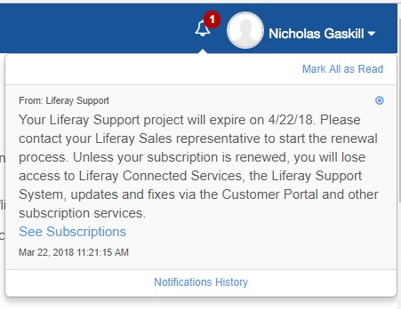

# LCS接続のトラブルシューティング

LCSを使用して@product@をアクティベートした場合、サーバーは常にLCSへの接続を維持する必要があります。この接続が中断されると、サーバーは再接続を許可するために猶予期間に入ります。ただし、長時間の中断はサーバーの稼働時間に影響を与える可能性があります。

+$$$

**注:**Elasticサブスクリプションを有効化するにはLCSを使用する必要があります。そうでなければ、アクティベーションにLCSを使う必要はありません。代わりにLiferayサポートからXMLアクティベーションキーをリクエストすることができます。

$$$

このドキュメントの以下のセクションでは、サーバーのLCS接続に関する背景情報と何か問題が起きた際にトラブルシューティングできるように説明します。

- [**LCS猶予期間：**](#lcs-grace-periods)猶予期間がLCSでどのように機能するかについて説明します。トラブルシューティングを行う前に必ずこのセクションを読んでください。

- [**トラブルシューティング：**](#troubleshooting)特定の問題に対するトラブルシューティングの手順について説明します。

- [**ログレベルの向上：**](#increasing-log-levels) Liferayサポートに連絡すると、サーバーのログレベルを上げてからログファイルを提出するように求められます。このセクションではその仕方を説明します。

+$$$

**注：**LCSが利用できない可能性は低いです。LCSは自動障害回復のためにグローバルクラウドインフラストラクチャにセットアップされています。LCSチームに通知がいくことで、あらゆるダウンタイムに迅速に対応できるようになっています。しかし、LCSのアップデート中や新しいバージョンリリースの時は、LCSは変更されている間の数分間利用できなくなります。

$$$

## LCS猶予期間

LCSには2つの猶予期間のタイプがあります：

1. **接続猶予期間：**アクティベートされたLCS接続が中断されたときに接続猶予期間が与えられます。これにより、接続を再確立する時間が与えられます。

2. **サブスクリプションの猶予期間：**サブスクリプションの有効期限が切れる直前に与えられます。これにより、購読を更新する時間が与えられます。

+$$$

**注：**これらの猶予期間は、以前からLCSに接続されていて、アクティベートされているサーバーにのみ適用されます。サーバーが初めてLCSに接続しようとした時にサブスクリプションチェックまたは接続に失敗した場合、サーバーに猶予期間が与えられません。したがって、新しいサーバーをLCSに接続する前にアクティブなサブスクリプションが有効であることを確認することが重要です。これを行うには、LCSの[サブスクリプションタブ](/discover/deployment/-/knowledge_base/7-1/managing-liferay-dxp-subscriptions)を確認してください。

$$$

### 接続猶予期間

サーバーのLCS接続が中断された場合、サーバーは稼働し続け、再接続を可能にするために最大30日間続く猶予期間に入ります。
この猶予期間中、@product@は管理者に警告メッセージを表示します。このメッセージが表示されたら、管理者はLiferayサポートに連絡して、以下のトラブルシューティングの手順を実行してください。再接続すると、LCSは自動的にサーバーのアクティベーションを復元します（サーバーを再起動する必要はありません）。何らかの理由で接続が復元できない場合は、Liferayサポートはサーバーをアクティベートするための代替方法を提供します。

LCSから切断されている間、LCSクライアントアプリケーションは継続的に再接続を試みます。再接続が失敗し続ける場合は、サーバーが`lcs.liferay.com`と`lcs-gateway.liferay.com`にアクセスできるようにしておいてください。LCSクライアントアプリケーションが再接続の試行を停止した場合、ログには何も記録されません。この場合、アプリケーションを再デプロイすることで強制的に再接続できます。そうするには以下の手順に従ってください：

1. サーバーの[Liferay Home](/discover/deployment/-/knowledge_base/7-1/installing-liferay#liferay-home)フォルダー（通常はアプリケーションサーバーのフォルダーの親フォルダー）から、このファイルを削除します：

       osgi/marketplace/Liferay Connected Services Client.lpkg
   
2. `Liferay Connected Services Client.lpkg`を`Liferay Home]/deploy`に移動させます。
[プロキシを介してLCSに接続し](/discover/deployment/-/knowledge_base/7-1/lcs-preconfiguration#preconfiguring-lcs-to-connect-through-a-proxy)、これをLCSクライアントアプリケーション内で構成した場合、デプロイしたアプリケーションもまた、そうするように設定されていることを確認してください。

また、サーバーが切断された時にEメール通知が来るようにLCSで設定されていることを確認してください。これを行うには、サーバーが予期せず停止した時にEメールで通知が来るようにルールを作成しておく必要があります。これを行う手順は[LCSアカウントの管理](/discover/deployment/-/knowledge_base/7-1/managing-your-lcs-account)に説明されています。

### サブスクリプション猶予期間

サブスクリプションの有効期限が切れる少なくとも90日前に、Liferayから更新プロセスを開始するために連絡が来るはずです。有効期限が切れる30日前に、Liferayサポートは[LESA](https://web.liferay.com/group/customer/support/-/support/ticket)、 [LCSサイト](https://lcs.liferay.com)、そして[カスタマーポータル](https://www.liferay.com/group/customer)を通して警告メッセージを送ります 。
有効期限が切れると、サーバーは追加の猶予期間に入ることがあります。この猶予期間が始まる前に、同じサポートチャンネルから連絡がくるはずです。この猶予期間中に更新が完了しない場合、サブスクリプションは無効になり、@product@インスタンスは30日間の猶予期間に入ります。更新が処理されるとすぐにインスタンスがアクティベートされ、エラーまたは警告メッセージが24時間以内に消えます。XMLアクティベーションキー（必要に応じてLiferay Supportから提供される）を使用すると、サブスクリプションの有効期限が切れた後でも@product@インスタンスを引き続き使用できます。

## トラブルシューティング

LCSで問題が発生した場合は、Liferayサポートチームがお手伝いします。サポートが必要な場合は、[LESA](https://web.liferay.com/group/customer/support/-/support/ticket)チケットを開いてください 。Liferayサポートチームがお手伝いできる以下のシナリオのトラブルシューティングを開始できます。

+$$$

**注：**特定の問題をトラブルシューティングしたりLiferayサポートに連絡する前に、LCSの[事前設定](/discover/deployment/-/knowledge_base/7-1/lcs-preconfiguration)と[登録](/discover/deployment/-/knowledge_base/7-1/activating-your-liferay-dxp-server-with-lcs)を正しく行なったかどうか確認してください。

$$$

### サーバーがLCSにアクセスできない

サーバーがLCSにアクセスできない場合は、LCSに必要な公開サイトにアクセスできるかどうか確認してください。

- ブラウザで[`lcs.liferay.com`](https://lcs.liferay.com/)
が表示できるはずです。
- ポート443で`lcs-gateway.liferay.com` が応答するはずです：

       curl -vk -I "https://lcs-gateway.liferay.com"
       telnet lcs-gateway.liferay.com 443
   
### サブスクリプションの問題

サブスクリプションに関する問題については、まず[managing your subscription](/discover/deployment/-/knowledge_base/7-1/managing-liferay-dxp-subscriptions)の記事を読んでください。
サブスクリプションエラーには通常、次のいずれかの問題があります：

- サーバーはLCSにアクセスできるけど、サブスクリプションを見つけることができない場合。
- サーバーはLCSにアクセスできてサブスクリプションを見つけることができるけど、サーバーをアクティベートすると、サブスクリプションのアクティベーションキーまたはコアの数を超える場合。

どちらの場合も、サブスクリプションが利用可能であることと、アクティベーションキーまたはコアの数を超えていないことを確認する必要があります。[the documentation on managing subscriptions](/discover/deployment/-/knowledge_base/7-1/managing-liferay-dxp-subscriptions)で説明されているように、この情報はLCSサイトのサブスクリプションページにあります。
サーバーをアクティベートしようとしている環境に、使用したいサブスクリプションが割り当てられていない場合は、新しい環境を作成し、それに正しいサブスクリプションを割り当てる必要があります。一度割り当てると、環境のサブスクリプションを変更することはできません。新規環境の作成および新規サーバーのアクティベーションについては、[the initial registration steps](/discover/deployment/-/knowledge_base/7-1/activating-your-liferay-dxp-server-with-lcs)に従ってください。

+$$$

**注：**サーバーをシャットダウンするときには、LCSサイトがサーバーを受信したことを確認する必要があります。そうでないと、LCSは再利用のためのサーバーのアクティベーションキーを解放しない可能性があります。また、追加のサーバーをアクティベートしようとすると、サブスクリプションのアクティベーションキーの数を超える可能性があります。これは、ローリングデプロイやコンテナ使用時に起こる可能性があります。詳しい情報は[KB article on properly unregistering subscriptions](https://customer.liferay.com/documentation/knowledge-base/-/kb/1464875)を参照してください。

$$$

### 無効なトークン

トークンが無効な場合は、まず[environment tokens](/discover/deployment/-/knowledge_base/7-1/understanding-environment-tokens)の記事を確認してください 。
次の表に、無効なトークンの原因と解決策が説明されています。

| &nbsp;原因 | &nbsp;解決策 |
| ----------- | -------------- |
| トークンを生成したLCSユーザーに権限がない。これは、ユーザーがLCSプロジェクトを終了するか、別の環境でLCS 環境マネージャーまたはLCS 環境ビュアーになると起こる。 | トークンを再生成する。
 |
| トークンのファイル名がダウンロード後に変更される。	 | LCSからトークンをもう一度ダウンロードする。
 |
| トークンが再生成される。 | 再生成したトークンを使用する。 |

## ログレベルを上げる

Liferayサポートに連絡すると、サーバーのログレベルを上げてからログファイルを提供するように求められます。これらのログファイルは、[`Liferay Home]/logs`（[Liferay Home](/discover/deployment/-/knowledge_base/7-1/installing-liferay#liferay-home) は通常、アプリケーションサーバーのフォルダの親フォルダです）にあります。このフォルダには2種類のログファイルがあります：

1. **Liferayログファイル：**`liferay.[date].log`と`liferay.[date].xml`のファイルは、@product@インストールのログです。同じ日付のLOGファイルとXMLファイルには同じ情報が含まれています。 -- 唯一の違いはファイル形式です。

2. **LCSログファイル：**`lcs-portlet-[date].log`のファイルは、LCSクライアントアプリケーションのログです。LCSログファイルが1つしかない場合は、日付なしで`lcs-portlet.log`と表示されることがあります。次のセクションの説明に従ってログレベルを上げると、追加のログメッセージがこれらのLCSログファイルに書き込まれます。

ログレベルを上げる方法は2つあります：

1. **@product@ インスタンスのControl Panel内で：**これはサーバーをシャットダウンするとリセットされる一時的な設定です。サーバーがアクティベートされていないと、Control Panelにアクセスできません。その場合、LiferayサポートはXMLアクティベーションキーを提供することができます。

2. **Log4j設定方法で：**これは、サーバーをシャットダウンして再始動しても持続する永続的な設定です。

次のセクションでは両方のオプションについて説明します。

### Control Panel

Control Panelからログレベルを上げるには、以下の手順に従ってください：

1. *[Control Panel]*> *Configuration*> *Server
Administration*に移動します。

2. *ログレベル*タブをクリックしてください。

3. "lcs"を検索してください。

4. 一致する各エントリーのログレベルをDEBUGに変更します。

5. Control Panelにいる間、*Configuration*>*Liferay Connected Services*に移動して、そこに表示されているもののスクリーンショットを撮ってください。。これはLiferayサポートに役立ちます。 

### Log4j 

Log4jを介してログレベルを上げるには、次の手順に従います：

1. [LCS preconfiguration article](/discover/deployment/-/knowledge_base/7-1/lcs-preconfiguration)に従って、最新のLCSクライアントをダウンロードしてください。
アプリは`Liferay Connected Services Client.lpkg`としてダウンロードします。最新のクライアントをダウンロードしたくない場合は、すでにサーバーにインストールされているものを使用することができます。それは`[Liferay Home]/osgi/marketplace`にインストールされています。（このセクションの残りの手順を実行する前に必ずサーバーをシャットダウンしてください）。[Liferay Home](/discover/deployment/-/knowledge_base/7-1/installing-liferay#liferay-home)のフォルダは通常、アプリケーションサーバーのフォルダの親フォルダです。

2. LPKGファイルを展開してから、その中の`lcs-portlet-[version].war`ファイルを展開します。

3. `WAR`ファイル内に`WEB-INF\classes\META-INF\portal-log4j.xml` の内容を以下の設定に置き換えます：

       <?xml version="1.0"?>
       <!DOCTYPE log4j:configuration SYSTEM "log4j.dtd">
       
       <log4j:configuration xmlns:log4j="http://jakarta.apache.org/log4j/">
       <appender class="org.apache.log4j.rolling.RollingFileAppender" name="RollingFileAppender">
       <rollingPolicy class="org.apache.log4j.rolling.TimeBasedRollingPolicy">
       <param name="ActiveFileName" value="@liferay.home@/logs/lcs-portlet.log" />
       <param name="FileNamePattern" value="@liferay.home@/logs/lcs-portlet.%d{yyyy-MM-dd}.log.zip" />
       </rollingPolicy>
       
       <layout class="org.apache.log4j.EnhancedPatternLayout">
       <param name="ConversionPattern" value="%d{yyyy/MM/dd HH\:mm\:ss} %-5p [%t][%c{1}:%L] %m%n" />
       </layout>
       </appender>
       
       <category name="com.liferay.lcs.task.scheduler">
       <priority value="ALL" />
       </category>
       
       <logger additivity="false" name="com.liferay.lcs">
       <level value="ALL" />
       <appender-ref ref="RollingFileAppender" />
       </logger>
       </log4j:configuration>
   
4. ファイルを保存し、WARとLPKGを再パッケージします（これらのファイルの名前を変更しないように注意してください）。

5. サーバーがシャットダウンされていることを確認してください。

6. インストールの[Liferay Home](/discover/deployment/-/knowledge_base/7-1/installing-liferay#liferay-home)フォルダで、既存のLCSクライアントアプリケーションを削除してください：

       osgi/marketplace/Liferay Connected Services Client.lpkg
   
7.  `osgi/marketplace`の手順４で再度パッケージした`Liferay Connected Services Client.lpkg`を入れてください。

8. サーバーを起動してください。

この記事に書かれている問題、またはLCSに関するその他の問題について何かサポートが必要な場合は、Liferayサポートに連絡してください。
