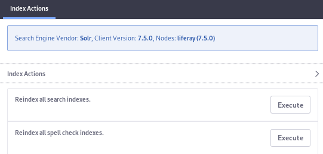

# Solrのインストール：基本インストール

Liferay Connector to Solr 7をインストールするには、２つの方法があります：

1. [Liferay Marketplace](https://web.liferay.com/marketplace/)へ移動し、利用中のポータルに対応するアプリケーションをダウンロードします。

       **Liferay Portal CE:** [Liferay CE Connector to Solr 7](https://web.liferay.com/marketplace/-/mp/application/118014614)
       
       **Liferay DXP:** [Liferay Connector to Solr 7](https://web.liferay.com/marketplace/-/mp/application/117931595)
       
       Once the app LPKG is downloaded, copy it to
       `Liferay_Home/osgi/marketplace`.

2. 稼働しているLiferayインスタンスで*[Control Panel]* &rarr; *[Apps]*
&rarr; *[Store]*へ移動します。ユーザー名とパスワードを入力しサインインの上、「Solr Search Engine」と検索し、Liferay Connector to Solr 7（無料）を選択します。

このガイドでは、Solrのインストールと構成について説明します。以下はSolrの統合方法を説明する上でよく使われる用語です。

*Solr Home*：Solrのルートフォルダ。ディレクトリは`solr-[version]/server/solr`です。

*Liferay Home*: インストールした@product@ のルートフォルダです。`osgi`、`deploy`、`data`、`license`等のフォルダが含まれています。

インストールには２つの手順があります：

1. Solr7のインストールと設定

2. @product@用のSolr 7コネクターのインストールと設定

Solr用に@product@を設定する前に、Solrをインストールして設定します。

## Solr7のインストールと設定

@product@にSolrをインストール、セットアップする手順は以下の通りです。

1. [Solr](http://archive.apache.org/dist/lucene/solr/7.5.0/)をダウンロードして解凍します。

2. `solr-[version]/server/solr`へ移動します
これが、Solr Homeです。

3. `liferay`という名称で、新しいフォルダを作成します

4. `liferay`ファルダ内に、`conf`と`data`という名称の新規フォルダを作成します

5. `Solr_Home/configsets/_default/conf`の内容を`Solr_Home/liferay/conf`にコピーします

6. アーカイブマネージャーでLiferay Connector to Solr 7のLPKGファイルを開きます

   `com.liferay.portal.search.solr7.impl.jar`ファイルを開き、下記の２ファイルを抽出します

       META-INF/resources/solrconfig.xml

   and

       META-INF/resources/schema.xml

   抽出したら、下記の場所に配置します

       Solr_Home/liferay/conf

   Solrサーバーの既存の`solrconfig.xml`及び`schema.xml`ファイルを、プラグインに含まれるもので置き換えます

7. `Solr_Home/liferay`の中に、`core.properties`ファイルを作成し、以下を追加します

       config=solrconfig.xml
       dataDir=data
       name=liferay
       schema=schema.xml

8. チェックポイント: ここまでの設定でSolr_Home/liferayフォルダは以下の構成になります

       liferay
       ├── conf
       │   ├── lang
       │   │   ├── contractions_ca.txt
       │   │   ├── ....txt
       │   ├── managed-schema
       │   ├── params.json
       │   ├── protwords.txt
       │   ├── schema.xml
       │   ├── solrconfig.xml
       │   ├── stopwords.txt
       │   └── synonyms.txt
       ├── core.properties
       └── data

8. 次のように入力してSolrサーバーを起動します。

       ./bin/solr start -f

   Solrインストールの最上位フォルダー（`solr-[version]`）にあります。

9. Solrサーバーはデフォルトで`8983`ポートを利用します
`http://localhost:8983/solr/#/~cores`にアクセスし(ホストを`localhost`としてローカル環境でテストしていると仮定）、`liferay`コアが使用可能になっている事を確認します

Solrのインストールが完了したら、次はLiferay DXPのSolrコネクタをインストールして設定します。

## Liferay Solrアダプタのインストールと設定

@product@にデフォルトで組み込まれているサーチエンジンはElasticsearchのため、Elasticsearch Connectorが既にインストールされ起動しています。Solrコネクタを設定する前に、Elasticsearch Connectorを停止する必要があります。

App Manager、Felix Gogo Shell、またはバンドルブラックリストを使用してElasticsearch Connectorバンドルを停止します。Liferay DXPのお客様は、下記のブラックリスト機能をご利用ください。App ManagerとGogoシェルのバンドルの状態の”記憶”は、`osgi/state`フォルダーに依存します。このフォルダを削除すると（推奨：パッチ適用時）、Elasticsearch Connectorが再インストールされて自動的に開始されます。

[Control Panel] &rarr; [Apps] &rarr; [App Manager]に移動します。

App Managerで*「elasticsearch」*と検索します。「Liferay Connector to Elasticsearch 6」の、編集(())ボタンをクリックし、[無効にする]を選択します。
これで、バンドルがインストールされた状態を維持したまま、OSGiランタイムでバンドルを停止します。

他の方法として、[Felix Gogo shell](/developer/tutorials/-/knowledge_base/7-1/using-the-felix-gogo-shell)を使ってElasticsearchコネクタを停止することもできます。
以下を入力します。

    lb elasticsearch

Liferay Connector to Elasticsearch 6には、２つのアクティブなバンドルが表示されます。APIとIMPLバンドルです。

    ID|State      |Level|Name
    476|Active     |   10|Liferay CE Connector to Elasticsearch 6 - API (2.0.0)
    478|Active     |   10|Liferay Portal Search Elasticsearch 6 API (2.0.6)
    706|Active     |   10|Liferay CE Connector to Elasticsearch 6 - Impl (2.0.0)
    707|Active     |   10|Liferay Portal Search Elasticsearch 6 Implementation (2.0.5)

Elasticsearchコネクタを停止するには以下を入力します。

    stop [bundle ID]

この例では、`[bundle ID]`は`476`です。

+$$$

**Liferay DXP**：DXPをご利用中の場合、Elasticsearch、Shield、およびMarvelプラグインを[ブラックリスト](/discover/portal/-/knowledge_base/7-1/blacklisting-osgi-modules-and-components)に登録する必要があります。

1. 以下を作成します。

       com.liferay.portal.bundle.blacklist.internal.BundleBlacklistConfiguration.config

   作成したファイルに、以下の内容を追記します。

       blacklistBundleSymbolicNames=["com.liferay.portal.search.elasticsearch6.api","com.liferay.portal.search.elasticsearch6.impl","Liferay Connector to X-Pack Monitoring [Elastic Stack 6.x]","Liferay Connector to X-Pack Security [Elastic Stack 6.x]"]

   X-Pack LPKGファイルがインストールされている場合は、これらもブラックリストに登録します。

2. 作成したファイルを`Liferay Home/osgi/configs`へ配置します。

$$$

Solrコネクタのインストールと設定：

1. @product@を起動し、その後`Liferay_Home/deploy`にダウンロードしたLPKGをコピーしてSolrコネクタをデプロイします。

   Solrコネクタがインストールされると、@product@ログに`STARTED`というメッセージが出力されます。下記は実際のログです。

       2018-11-06 19:59:49.396 INFO  [pipe-start 943 944][BundleStartStopLogger:39] STARTED com.liferay.portal.search.solr7.api_1.0.0 [943]
       2018-11-06 19:59:49.490 INFO  [pipe-start 943 944][BundleStartStopLogger:39] STARTED com.liferay.portal.search.solr7.impl_1.0.0 [944]

2. Solrを再度インデックスする場合、*[Control Panel]* → *[Configuration]* → *[Search]*へ移動し、「*検索で利用するインデックスを再構築する*」の隣にある「*実行*」を選択します。

本番環境のデプロイでは、Solrコネクタのデフォルト設定に加えた編集を`Liferay_Home/osgi/configs`フォルダに配置した設定ファイルで指定します。ファイル名を以下のように設定します。

    com.liferay.portal.search.solr7.configuration.SolrConfiguration.config

テスト環境及び開発時には、[Control
Panel] &rarr; [Configuration[ &rarr; [System Settings] の「Solr 7」からもデフォルト設定を編集できます。

![図2: @product@'のシステム設定からSolrを設定できます。これは開発およびテスト中に非常に役立ちます。

次の記事は、SolrCloudのSolrクラスタリングについて説明します。
