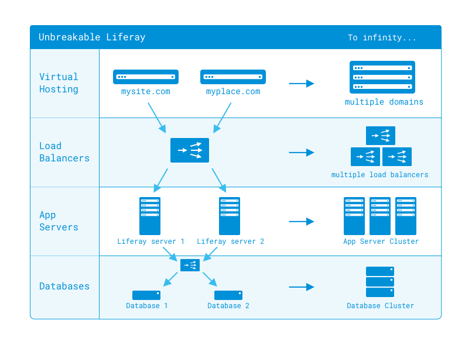

# @product@のクラスタリング

@product@は、最小規模から最大規模のWebサイトまであらゆるサイズのウェブサイトに対応しています。デフォルト設定では、単一サーバー環境に設定されています。サイトのアクセス数が多く単一サーバーで十分に対応できない場合は、Liferay DXPを適切な規模に調整することが可能です。

@product@は複数のマシンクラスタ（水平クラスタ）または単一マシン（垂直クタスタ）上の複数VMのクラスタ、もしくはそれらの混成構成で機能します。Liferay DXPを複数のアプリケーションサーバーノードにインストールする際は、最適化する必要があります。クラスター環境では、最低条件として@product@を下記の構成にする必要があります。

1. [全ノードが全て同じLiferay DXPデータベース、もしくはデータベースクラスタを指している。](/discover/deployment/-/knowledge_base/7-1/point-all-nodes-to-the-same-database)

2. [ドキュメントとメディアレポジトリが同じ構成で、クラスタの全ノードからアクセスできる。](/discover/deployment/-/knowledge_base/7-1/configure-documents-and-media-the-same-for-all-nodes)

3. [検索エンジンはクラスタ化された（任意）別の検索サーバーに配置する。](/discover/deployment/-/knowledge_base/7-1/clustering-search)

4. [Cluster Linkを有効にして、キャッシュがクラスタ内全ノードに複製されるようにする。](/discover/deployment/-/knowledge_base/7-1/enabling-cluster-link)

5. [各ノードに個別でアプリケーションをホットデプロイする。](/discover/deployment/-/knowledge_base/7-1/auto-deploy-to-all-nodes)

これらの構成への変更は、 `portal-ext.properties`ファイルのプロパティを追加または調整することで行えます。このファイルは、portal.propertiesファイル内のデフォルト``値を上書きするので注意してください。ファイル内容はこちらで閲覧できます。この時、` portal.properties`から変更を加えたい箇所をご自身の`portal-ext.properties `ファイルにコピーしてから、値を変更する方法を推奨します。

+$$$

**注**:この記事では、Java EE アプリケーションサーバー、 HTTP サーバー、およびロードバランサー等サードパーティソフトウェアを実行せずに行う、@product@特有のクラスタ設定を説明しています。クラスタ環境でこのようなコンポーネントを設定する時は、対応する資料を参照してください。
また、@product@クラスタリング環境を作成する前に、お使いのOSのホスト名が127.0.0.1のローカルネットワークに定義されていないことを確認してください。

$$$

上記で説明したステップは、次の資料で詳細に説明しています。まずは、すべてのノードが同じデータベースをさすようにすることから始めます。
