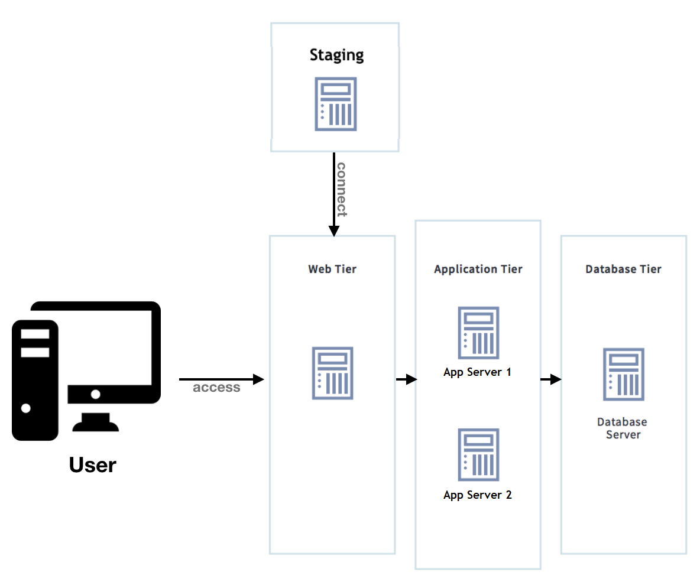
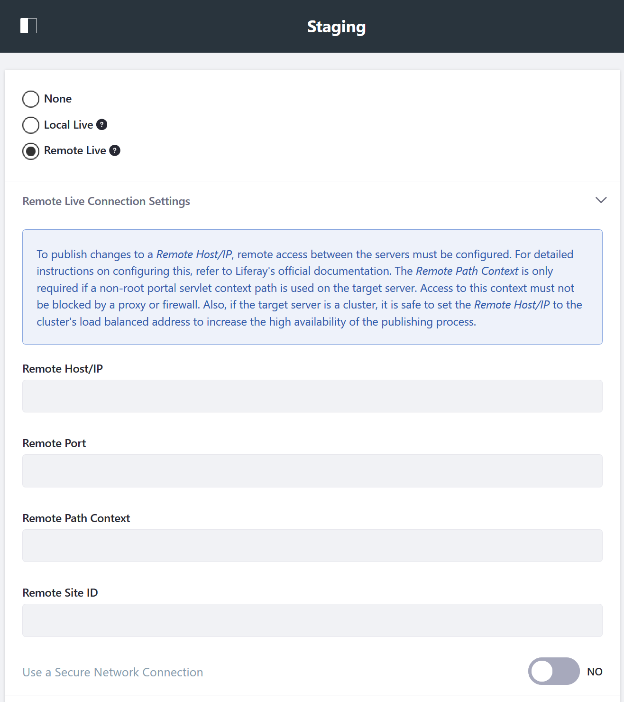

# クラスタ環境でのリモートステージングの設定

[クラスタ環境](/discover/deployment/-/knowledge_base/7-1/liferay-clustering)として@product@を実行していて 、リモートステージングを使用したい場合は、適切な設定をする必要があります。このチュートリアルでは、クラスタ環境のシナリオ例でリモートステージングを設定する方法を説明します。例の環境では、以下が備わっていると仮定します。

- データベースインスタンス設定およびクラスタノードとは異なるファイルリポジトリを持つステージングインスタンス。
- クラスターのノード間のトラフィックフロー管理を担当するバランサー。
- 2つのLiferayアプリケーションサーバー（たとえば、*App Server 1*と*App Server 2*）を呼び出す、同じデータベースに接続されている2つのノード。

以下の手順でも、Web層、アプリケーション層、およびクラスタ環境がすでに設定されていることを前提としています。特定の設定で作業するには、このチュートリアルの設定を調整する必要があります。

Let's begin!

1. ノードとステージングサーバー間の通信を保護する必要があります。アプリケーションサーバーとステージングサーバーの両方の`portal-ext.properties`ファイルに、次のプロパティを追加し ます。

       tunneling.servlet.shared.secret=[secret]
   
   この秘密鍵は、設定されたポータルサーバへの他のポータルアクセスを拒否します。16進エンコーディングを使用して秘密鍵を設定したい場合は、`portal-ext.properties`ファイルに次のプロパティも設定してください。

       tunneling.servlet.shared.secret.hex=true
   
   +$$$

   **注：**以下の鍵長は、使用可能な暗号化アルゴリズムによってサポートされています。

   - *AES：*128、192、および256ビット鍵
   - *Blowfish：* 32〜448ビット鍵
   - *DESede（Triple DES）：*56、112、または168ビット鍵（Liferayは最小鍵長に人為的な制限を設けており、56ビット鍵長はサポートしていません）
   たとえば、[OpenSSL](https://www.openssl.org/)を使用して128ビットのAES鍵を生成することができます。

       openssl enc -aes-128-cbc -k abc123 -P -md sha1
   
   $$$

2. アプリケーションサーバーとステージングサーバーの設定されたIP間の接続を許可する必要があります。リモートLiferayサーバーの`portal-ext.properties`ファイルを開き 、以下のプロパティを追加します。

       tunnel.servlet.hosts.allowed=127.0.0.1,SERVER_IP,[STAGING_IP]
       tunnel.servlet.https.required=false
   
   この`[STAGING_IP]`変数は、ステージングサーバーのIPアドレスに置き換える必要があります。`SERVER_IP定数`は、このプロパティに設定されたままにすることができます。LiferayサーバーのIPアドレスに自動的に置き換えられます。

3. IPv6アドレスを検証する場合は、IPv4アドレスの使用を強制しないようにアプリケーションサーバーのJVMを設定する必要があります。たとえば、Tomcatを使用している場合は、`$TOMCAT_HOME\bin\setenv.[bat|sh]`ファイルに次の属性を追加し ます。

       `-Djava.net.preferIPv4Stack=false`
   
4. 新しいプロパティを有効にするために両方のアプリサーバーを再起動します。

5. ノードのアプリケーションサーバー用の*TunnelAuthVerifier*プロパティを設定します。
これを行うには2つの方法があります。

   - **` .configファイル`の使用（推奨）：**いずれかのノードの@product@インスタンスの`$LIFERAY_HOME/osgi/configs`フォルダーに、（必要に応じて）`com.liferay.portal.security.auth.verifier.tunnel.module.configuration.TunnelAuthVerifierConfiguration-default.config`ファイルを作成し、 下記のプロパティを挿入します。`.config`ファイルを1つ作成すると、すべてのクラスタノードで同じように設定されます。`.config`ファイルの詳細については、[Understanding System Configuration Files](/discover/portal/-/knowledge_base/7-1/understanding-system-configuration-files)の記事を参照してください。

          enabled=true
          hostsAllowed=127.0.0.1,SERVER_IP,STAGING_IP
          serviceAccessPolicyName=SYSTEM_USER_PASSWORD
          urlsIncludes=/api/liferay/do
      
   - **システム設定の経由：***[コントロールパネル]* &rarr; *[設定]* &rarr; *[システム設定]* &rarr; *[Foundation]* &rarr; *[>Tunnel Auth Verifiers]*へ移動します。*/api/liferay/do*設定のエントリをクリックし、ステージングIPアドレスを*許可されたホスト*のフィールドに追加します。*TunnelAuthVerifier*をこのように設定することを選択した場合は、すべてのノード（たとえば、App Server 1とApp Server 2）に対してこれを実行する**必要**があります。

6. ステージングインスタンスで、製品メニューのサイト管理部分に移動し、*[公開]* → *[ステージング]*の順に選択します。それから、*[リモートライブ]*を選択します。

   

7. リモートホスト/ IPフィールドに、Web層のバランサーのIPを入力します。
バランサーのIPを使用してステージングインスタンスを設定することで、ステージングからライブまで、公開時の環境の可用性を確保できます。

8. リモートポートフィールドに、バランサーが動作しているポートを入力します。

9. アプリケーションサーバーのリモートサイトIDをリモートサイトIDフィールドに挿入します。
すべてのアプリケーションサーバーのサイトIDは同じです。同じデータベースで設定されており、ノード間で共有されているためです。

   製品メニューのサイト管理部分に移動し、*[設定]* → *[サイト設定]*を選択してサイトIDを見つけます。

10. リモートライブ設定を保存します。

 これで、クラスタ環境でのリモートステージングが設定できました。
