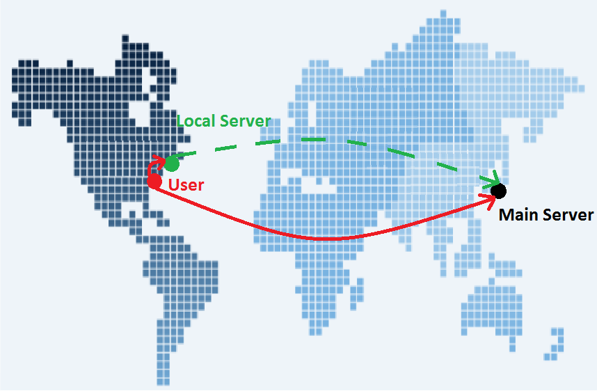
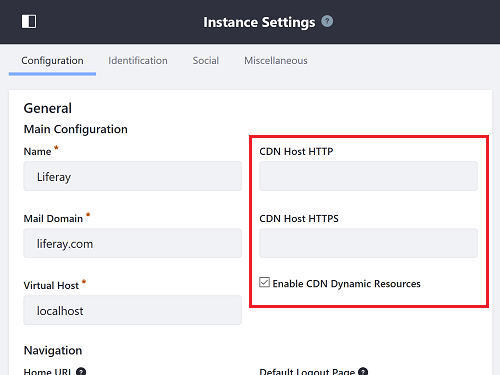

# コンテンツ配信ネットワーク

コンテンツ配信ネットワーク（CDN）は、静的コンテンツを含む複数のデータセンターにデプロイされたサーバーのネットワークです。ユーザーがサイトにアクセスすると、その静的コンテンツがユーザーから地理的に近いサーバーからロードされることで、リクエストが高速化されます。

ここでは、まずCDNを使用することによる利点と@product@でCDNを使用するための一般的なガイドラインについて説明します。次に、CDNを設定します。

## パフォーマンス向上のためのCDNの使用

CDNは静的Webリソースをユーザーに提供します。これらのリソース（画像、CSSファイル、JavaScriptファイルなど）は、世界中の複数のサーバーに保存されています。リクエストがあると、リソースはユーザーに最も近いサーバーから取得されます。

CDNはキャッシングプロキシとして機能しています。つまり、静的コンテンツが一度ローカルサーバーにコピーされると、すばやく簡単に取得できるようにキャッシュに保存されるのです。
これにより、ブラウザは世界中の途中ではなくローカルサーバーから静的リソースをダウンロードすることができるため、待ち時間が大幅に短縮されます。コンテンツに対するCDNへのユーザーの要求は、ユーザーに最も近いサーバーを見つけるアルゴリズムに基づいて、特定のサーバーマシンに送られます。次の図は、地理的な距離を使用して待ち時間を短縮する方法を視覚的に表したものです。

要求の待機時間が短縮され、アプリケーションサーバーの負荷が軽減されるため、CDNはパフォーマンスを向上させるのに役立ちます。ただし、@product@でCDNを使用する場合にはいくつかの制限があります。

## Liferay CDNの要件

@product@は、要求されたリソースを動的に取得できるCDNでのみ機能します。動的リソースは時間の経過とともに、またはエンドユーザーとの対話によって変化するため、キャッシュすることはできません。このため、CDNが機能するために手動で何かをアップロードする必要がないことを確認するためにCDNプロバイダに確認してください。
CDNは自動的にコンテンツを取得する必要があります。

また、透過的なプロキシのように機能しなければなりません。要求は最初にCDNに行きます。要求されたリソースがCDNにない場合、CDNは同一の要求をオリジン（@product@）に返し、リソースをキャッシュしてからリソースを処理します

CDNを使用すると（下記参照）、ポータルリソースとプラグインリソースの両方に対応します 。（たとえば、テーマリソースやプラグインの`liferay-portlet.xml`ファイルから参照されたJavaScriptファイルなど）CDNはプラグインに含まれているリソースのみを提供します。外部ソースから動的にロードされるリソースには対応できません。

リソースのCDN URLを取得するには、開発者はリソースパスのポータルホストを`themeDisplay.getCDNDynamicResourcesHost()`に置き換える必要があります。CDNホスト名をリソースの前に付けます。手動でCDNにリソースをアップロードしたり、アクセス許可の確認や複雑なポリシーアクセスを必要とするものをCDNに配置しないでください。

ニーズに合わせてCDNを設定するためのポータルプロパティがいくつかあります。次にこれを行う方法を説明します。

## CDNを使用するための@product@の設定

 CDNとそのプロパティは、2つの異なる方法で設定できます。

1. ポータルプロパティファイルの編集

2. コントロールパネルの使用

プロパティファイルでCDNを設定するには、[Liferay Home](/discover/deployment/-/knowledge_base/7-1/installing-liferay#liferay-home)フォルダに`portal-ext.properties`ファイルを作成し、適切な[Content Delivery Network](@platform-ref@/7.1-latest/propertiesdoc/portal.properties.html#Content%20Delivery%20Network)プロパティを設定します。

CDNホストを設定すると、@product@は古いホストを新しいCDNホストに置き換える静的アセットへのURLを生成するので、自動的にキャッシュされ、後にCDNによって提供されます。

コントロールパネルでCDNを設定するには、*[コントロールパネル]* → *[設定]* → *[インスタンス設定]*へと移動します。主な設定では、CDNに関連する3つのフィールドがあります。

- *CDNホストHTTP*
- *CDNホストHTTPS*
- *CDNの動的リソースを有効にする*

これらのプロパティは、`portal-ext.properties`で指定できるものとまったく同じです。CDNフィールドの入力方法がわからない場合は、必ず[portal.properties](@platform-ref@/7.1-latest/propertiesdoc/portal.properties.html#Content%20Delivery%20Network)参照ドキュメントのコンテンツ配信ネットワークというセクションにアクセスしてください 。終了したら、*[保存]*をクリックすると、静的コンテンツ用に古いホストが新しいCDNホストに置き換えられます。

As you can see, configuring a CDN is easy and can drastically reduce latency
time and improve performance.
