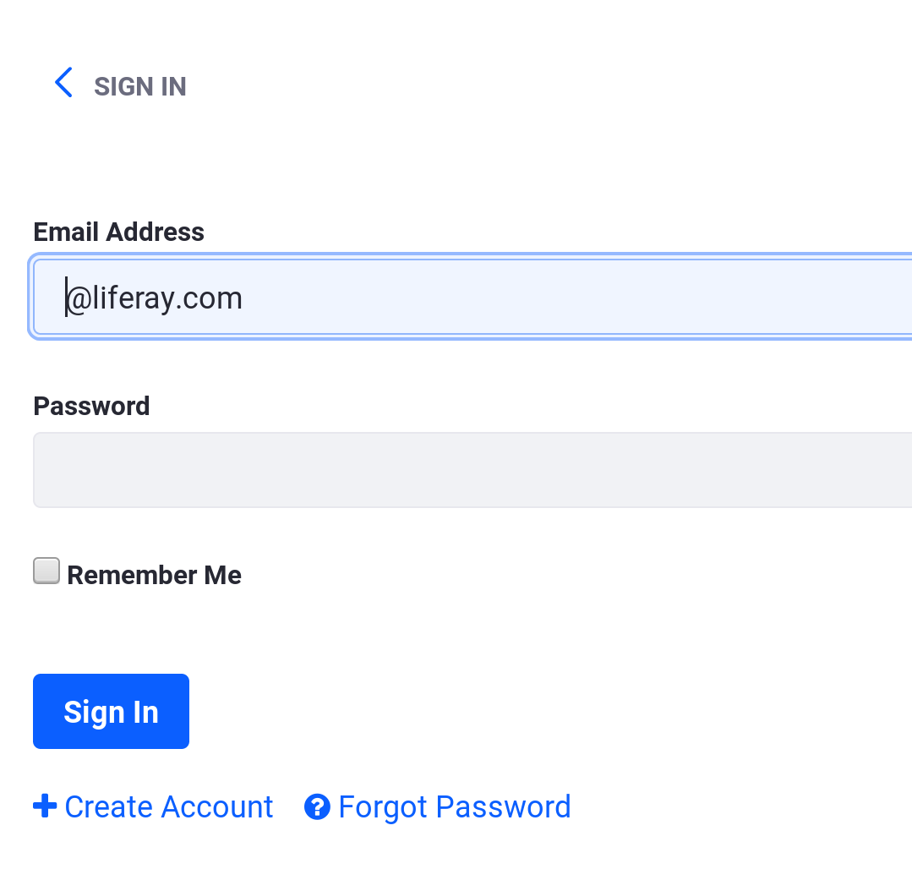

# @product@へのログイン

セキュリティシステムの主な機能の1つは、ページ、コンテンツ、およびWebアプリケーションに適切なユーザーだけがアクセスできるようにすることです。例えば、大学のポータルにログインしている学生が教授と同じリソースにアクセスできないようにします。そして、医療ポータルにログインしている患者が医者のリソースにアクセスできないようにします。一部のコンテンツ（少なくともログインページ）は、認証されていないユーザー（*ゲスト*ユーザーと呼ばれる）を含むすべてのユーザーが利用できるようにする必要があります。
<!-- To learn more about how @product@ restricts access to portal resources to
different users, please see the [Roles and Permissions]() documentation. (Not
yet written) -->

## 認証タイプ

認証タイプは3つあります。Emailアドレス、スクリーンネーム、またはユーザーIDです。認証タイプを選択するには、[コントロールパネル]へ行き、*[設定]* → *[インスタンス設定]* → *[認証]*をクリックして、*[ユーザーの認証方法]*というセレクタを使用し、選択を行います。あるいは、`portal-ext.properties`ファイルに以下の行を追加し 、適切な行のコメントを外し、他の行をコメントアウトして、サーバーを再起動します。

    company.security.auth.type=emailAddress
    #company.security.auth.type=screenName
    #company.security.auth.type=userId

デフォルトの認証タイプはEmailアドレスによるものですが、代わりにスクリーンネームやユーザーIDを選択することもできます。ユーザーが自分のアカウントを作成する時は、スクリーンネームは自分で選択、あるいは管理者の方で選択できます。アカウント作成時に、ユーザーIDは自動作成されます。どの認証タイプが設定されているかにかかわらず、ユーザーは常にパスワードを入力する必要があります。<!-- For information on
adding restrictions on the kinds of passwords that are allowed or required
(e.g., to require a minimum password length or require special characters),
please see the [Password Policies]() documentation. -->

## サインインポートレット

サインインポートレットは、ユーザーのログイン方法です。デフォルトでは、サインインポートレットは新しいアカウントを作成したり、パスワードのリセットを要求したりできます。デフォルトのホームページにはサインインポートレットが含まれています。
このページには、[http://localhost:8080/web/guest/home](http://localhost:8080/web/guest/home)からアクセスできます 。

サインインポートレットがどのページにも表示されない場合は、ここからアクセスできます。

- [localhost:8080/c/portal/login](localhost:8080/c/portal/login)

デフォルトでは、ゲストユーザーはサインインポートレットの*[アカウント作成]*リンクをクリックしてフォームに入力し、送信することでアカウントを作成できます。ユーザーがすでにアカウントを持っていて、パスワードを忘れてしまった場合、ユーザーは*[パスワードをお忘れですか?]*のリンクをクリックして、パスワードのリセットを要求できます。*[アカウント作成]*フォームと*[パスワードをお忘れですか?]*フォームの両方に、CAPTCHAベースのテキスト認証フィールドがあります。[CAPTCHA](http://www.captcha.net)を使用すると、ボットがフォームを送信できなくなります。CAPTCHAの代わりに、[reCAPTCHA](https://www.google.com/recaptcha/intro/index.html)を使用できます。reCAPTCHAの利点の1つは、視覚障害のあるユーザーがテストに合格できることです。reCAPTCHAを使用するには、[コントロールパネル]へ行き、*[設定]* → *[システム設定]* → *[CAPTCHA]* の順にクリックします。

ユースケースによっては、すべてのユーザーアカウントを管理者が作成する必要があります。
ゲストユーザーが新しいユーザーアカウントを作成できないようにするには、[コントロールパネル]へ行き、*[設定]* → *[インスタンス設定]* → *[認証]*とクリックし、*[アカウント作成を許可しますか?]*のボックスからチェックを外します。適切なチェックボックスをオフにすることで、ユーザーが忘れたパスワードを要求したり、パスワードのリセットリンクを要求したりすることを防ぐこともできます。

![図2：これは、*[アカウントの作成]*および*[パスワードをお忘れですか?]*のオプションを削除したサインインポートレットの図です。](../../images/sign-in-portlet2.png)

サインインポートレットは、ユーザーがログインするためのデフォルトの方法ですが、唯一の方法というわけではありません。ユーザーアカウントは、LDAPディレクトリからインポートおよびエクスポートすることができます。シングルサインオン（SSO）ソリューションまたはトークンベースの認証を使用できます。これにより、リモートWebアプリケーションが認証を受けることができます。詳細については、このセクションの他の記事を参照してください。最後に、ユーザー認証とリモートアプリケーションの認証メカニズムは[拡張可能](/develop/tutorials/-/knowledge_base/7-1/authentication-pipelines)であることに注意してください 。

