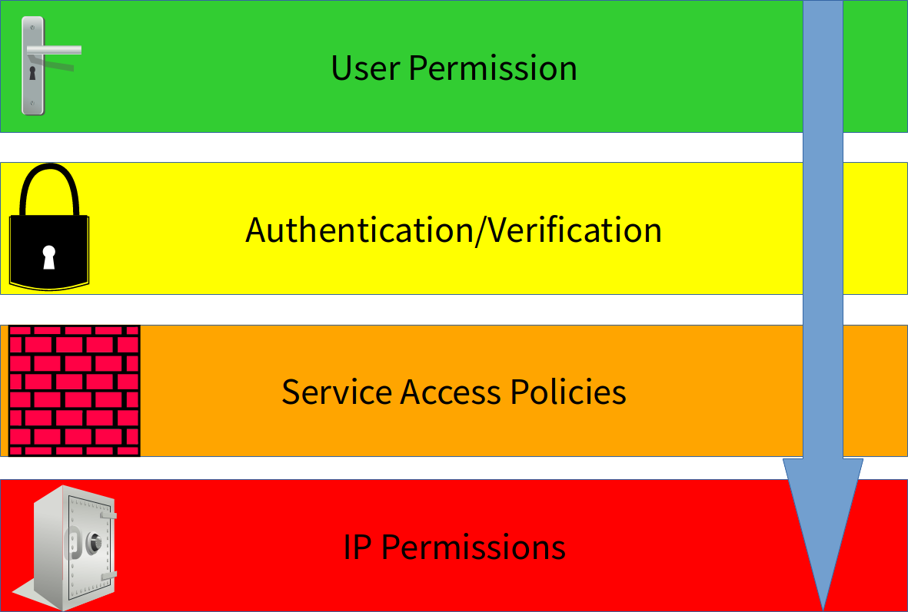

# サービスアクセスポリシー

*サービスアクセスポリシー*は、どのサービスまたはサービスメソッドをリモートで呼び出すことができるかを定義するWebサービスセキュリティの追加レイヤーです。そのため、リモートサービスにのみ影響し、ローカルサービスには影響がありません。複数を一度に適用して、複合効果を生み出すことができます。サービスアクセスポリシーが全体にどのように適合するかを理解するために、@product@のWebサービスセキュリティレイヤーの概要を以下で説明します。

**IP許可レイヤー：**Webサービス呼び出し要求の発信元のIPアドレスは、ポータルプロパティーファイルのホワイトリストに記載されている必要があります。ホワイトリストに含まれていないIPアドレスからのWebサービスの呼び出しの試行は、自動的に失敗します。

**サービスアクセスポリシーレイヤー：**Webサービスの呼び出し要求に対応するメソッドは、有効になっている各サービスアクセスポリシーによってホワイトリストに登録されている必要があります。ワイルドカードを使用すると、明示的にホワイトリストに登録する必要があるサービスクラスとメソッドの数を減らすことができます。

**認証/検証レイヤー（ブラウザのみ）：**Webサービスの呼び出し要求がブラウザから送信される場合、その要求には認証トークンが含まれている必要があります。
この認証トークンは`p_auth`URLパラメータの値です。認証トークンの値は@product@によって作成され、ブラウザセッションに関連付けられています。JSON WebサービスのAPIページまたは`Liferay.Service(...)`を使用したJavaScriptを介して@product@のWebサービスを呼び出すと、`p_auth`パラメータが自動的に提供されます。@product@が発信者の認証トークンをポータルユーザーに関連付けることができない場合、Webサービスの呼び出し要求は失敗します。

**ユーザー権限レイヤー：**正しく実装されたWebサービスには、権限チェックがあります。Webサービスを呼び出すユーザーには、そのサービスを呼び出す権限が必要です。

サービスアクセスポリシーは許可システムを尊重することに注意してください。サービスアクセスポリシーによってリモートサービスへのアクセスがユーザーに許可されている場合でも、ユーザーはそのサービスを呼び出すための適切な権限を持っている必要があります。

モバイルデバイスやLiferay SyncインスタンスなどのリモートアプリケーションがWebサービスにアクセスする必要がある場合は、サービスアクセスポリシーが特に役立ちます。
管理者はサービスアクセスポリシーを使用して、これらのデバイスが実行時に変更できる承認済みリストだけからリモートサービスを呼び出せるようにすることができます。

## サービスアクセスポリシーの管理

[コントロールパネル]へ行き、[設定]の見出しの下にある*[サービスアクセスポリシー]*をクリックします。ここでは、デフォルトのサービスアクセスポリシーを確認したり、新しいものを追加したりできます。サービスアクセスポリシーを作成または編集するときは、次の点に注意してください。

- サービスアクセスポリシー名はポータルインスタンスごとに一意である必要があります。
- サービスアクセスポリシー名に含めることができるのは、以下の文字だけです。

       0123456789ABCDEFGHIJKLMNOPQRSTUVWXYZabcdefghijklmnopqrstuvwxyz#:@-./_
   
- サービスアクセスポリシーのタイトルはローカライズできますが、サービスアクセスポリシー名はローカライズできません。
- 許可されたサービス署名は1行に1つずつ入力する必要があります。ワイルドカード（`*`）は、クラス名とメソッド名の両方に使用できます。`#`シンボルは、メソッド名からクラス名を区切るために使用する必要があります。例えば、例えば、

       com.liferay.portal.kernel.service.UserService
   
   は`UserService`クラスの任意のメソッドを呼び出すことを許可します。

       com.liferay.document.library.kernel.service.DLAppService#get*
   
   は`get`で始まる`DLAppService`から、任意のメソッドを呼び出すことを許可します。したがって、

       com.liferay.portal.kernel.service.UserService
       com.liferay.document.library.kernel.service.DLAppService#get*
   
   は`UserService`クラスの任意のメソッドを呼び出すこと、および名前が`get`で始まる`DLAppService`の全てのメソッドを呼び出すことができます。

デフォルトで有効になっているサービスアクセスポリシーは6つあります。

- ASSET_ENTRY_DEFAULT
- CALENDAR_DEFAULT
- SYNC_DEFAULT
- SYNC_TOKEN
- SYSTEM_DEFAULT
- SYSTEM_USER_PASSWORD

`ASSET_ENTRY_DEFAULT`は、アセットの取得時にアセットのビューカウンタを更新することができます。`CALENDAR_DEFAULT`は、カレンダーで公開イベントを検索できるようにします。`SYSTEM_DEFAULT`ポリシーは、認証されていない要求を含むすべてのリクエストに適用されます。このポリシーは、JavaScriptの呼び出しによる国/地域サービスへのアクセスを許可するので、ユーザーはその場で言語を切り替えることができます。`SYSTEM_USER_PASSWORD`ポリシーは、`AuthVerifierResult.isPasswordBasedAuthentication`が`true`である要求に適用されます。つまり、ユーザー認証がパスワードを使用して行われたときはいつでも適用されます。許可されたメソッド署名のリストは`*`なので、あらゆるAPIを呼び出すことができます。もちろん、API関数には権限チェックが含まれているため、この呼び出しはユーザーが必要な権限を持っている場合にのみ機能します。特定のAPI関数の呼び出しを完全に無効にしたい場合は、`SYSTEM_USER_PASSWORD`ポリシーを`*`より制限の厳しいものに変更できます。

`SYNC_DEFAULT`ポリシーは、認証されていない同期要求を含むすべてのLiferayの同期要求に適用されます。許可されたメソッド署名のリストには、`com.liferay.sync.service.SyncDLObjectService.getSyncContext`のメソッドだけが含まれています。
`SYNC_TOKEN`ポリシーは、認証トークンを伴う同期要求に適用されます。許可された署名のリストには`com.liferay.sync.service.*`が含まれています。つまり、このパッケージのクラスのメソッドであるAPI関数はすべて呼び出すことができます。

`SYNC_DEFAULT`と`SYSTEM_DEFAULT`は、その名前が示すように、デフォルトのサービスアクセスポリシーです。デフォルトのサービスアクセスポリシーは、認証されていない要求を含むすべての着信要求に適用されます。

新しいデフォルトのサービスアクセスポリシーを作成できます。

1. [コントロールパネル]の*[設定]* → *[サービスアクセスポリシー]*セクションへ行きます。

2. *追加*（）をクリックします。

3. ポリシーを有効にするためにスイッチを切り替えます。

4. ポリシーを認証された要求だけでなく認証されていない要求にも適用する場合は、*[デフォルト]*というラベルの付いたスイッチを切り替えます。

5. ポリシーにタイトルをつけます。

6. [許可されたサービス署名]に、インストールされているサービスクラスの完全修飾名の入力をします。コード補完はクラスを見つけるのに役立ちます。
たとえば、Liferayのナレッジベースアプリケーションのポリシーを作成している場合は、`com.liferay.knowledge.base.service.KBArticleService`と入力します。

7. [メソッド名]で、サービスメソッド呼び出しの入力を開始します。ここでも、コード補完が役立ちます。ナレッジベースの場合は、`getKBArticle`と入力します。

8. 別のサービスまたはメソッドを指定するには、プラスアイコンをクリックして別のエントリを追加してください。

9. 完了したら、*[保存]*をクリックします。

Liferayアプリケーションは独自のデフォルトポリシーを宣言できます（`SYNC_DEFAULT`ポリシーが良い例です）。このポリシーは、管理者によって変更、または無効にすることができます。この場合、プラグインはまだポリシーが存在することを確認できるので、再定義や更新をする必要はありません。

デフォルトでは、Liferayのトンネリングサーブレットは`SYSTEM_USER_PASSWORD`サービスアクセスポリシーを使用しています。しかしながら、トンネリングサーブレット用に独自のポリシーを作成し、`TunnelingServletAuthVerifier`の`service.access.policy.name` プロパティを使用して、デフォルトのポリシーの代わりに独自のポリシーを使用するように指定することができます。

## サービスアクセスポリシーのモジュール

Liferayのサービスアクセスポリシー機能は、サービスアクセスポリシーモジュールによって提供されます。このモジュールには、以下の重要なクラスが含まれています。

- `com.liferay.portal.kernel.security.service.access.policy.ServiceAccessPolicy`：`ServiceAccessPolicy`の公開インタフェースを定義します。
- `com.liferay.portal.kernel.security.service.access.policy.ServiceAccessPolicyManager`：`ServiceAccessPolicy`のインスタンスを取得するための公開インタフェースを定義します。
- `com.liferay.portal.kernel.security.service.access.policy.ServiceAccessPolicyManagerUtil`：サービスアクセスポリシー機能を、まだモジュール化されていないLiferayのコア部分に橋渡しします。
- `com.liferay.portal.kernel.security.service.access.policy.ServiceAccessPolicyThreadLocal`：`ServiceAccessPolicy`インスタンスをアクティブにします。

Liferayのサービスアクセスポリシーモジュールは、ソースコード内の`modules/apps/service-access-policy`フォルダにあります。実行時に、以下の3つのバンドルがサービスアクセスポリシー機能を提供します。（`[Liferay Home]/osgi/modules`フォルダ内にあります）

- `com.liferay.service.access.policy.api.jar`
- `com.liferay.service.access.policy.service.jar`
- `com.liferay.service.access.policy.web.jar`

上記のモジュールは、[コントロールパネル]からアクセスできるサービスアクセスポリシー管理UIを提供します。そして、`ServiceAccessPolicy`のインタフェースとデフォルトの実装も提供します。

サービスアクセスポリシーモジュールを設定するには、[コントロールパネル]へ行って、*[システム設定]*をクリックし、[セキュリティ]セクションで*[サービスアクセスポリシー]*モジュールを見つけます。名前をクリックして、編集します。ここで、デフォルトのサービスアクセスポリシー設定を編集できます。`AuthVerifier`で何もポリシーが適用されていない場合でも、デフォルトのポリシーを適用するように強制することもできます。

また、`AuthenticatedAccessControlPolicy`もあります。`ServiceAccessPolicyManager`の実装が存在する場合、このポリシーは何もしません。ただし、サービスアクセスポリシーモジュールが無効になっている場合は、 `AuthenticatedAccessControlPolicy`によってWebサービスへの認証アクセスを必要とするフォールバックが提供されます。

## まとめ

 サービスアクセスポリシーによって@product@のWebサービスへのアクセスを制限する方法は以上です。カスタムサービスアクセスポリシーはポータル管理者が作成できます。ポータルのトークンオーセンティケーター、例えばOAuthによって適用されます。

## 関連トピック

[サービスアクセスポリシーの作成](/develop/tutorials/-/knowledge_base/7-0/service-access-policies)

