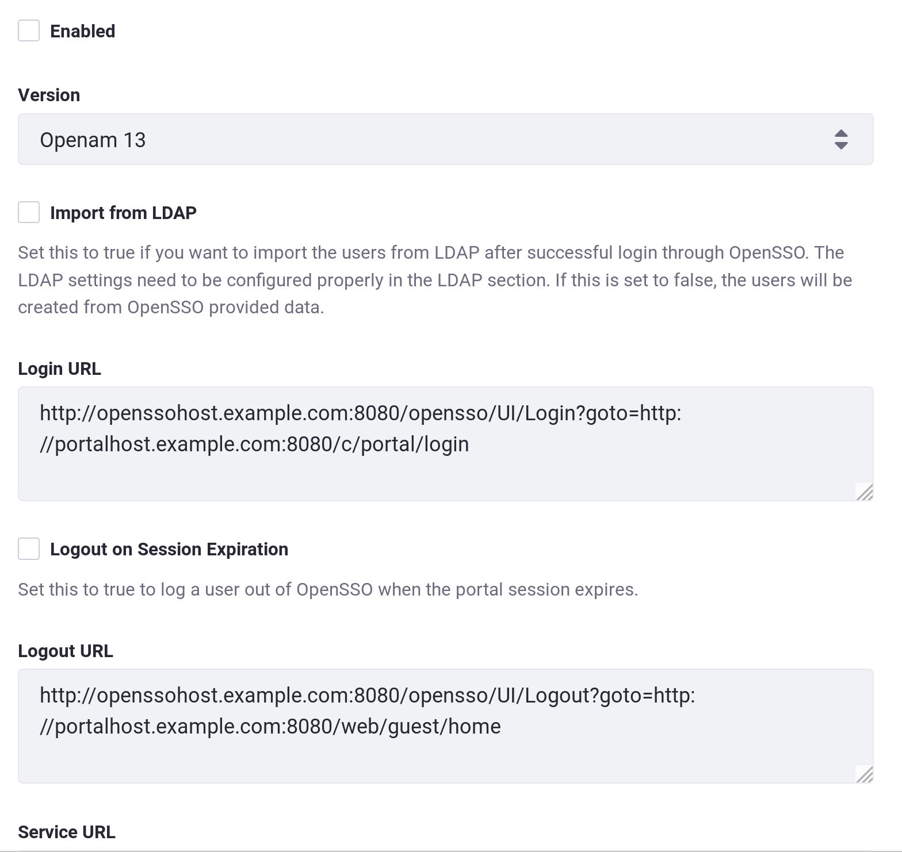

# OpenAMシングルサインオン認証

OpenAMは、SunのSystem Access Manager製品のコードベースに基づくオープンソースのシングルサインオンソリューションです。@product@はOpenAMと統合されているため、OpenAMを介して、異なるユーザー情報を保持するリポジトリに対して、複数の認証スキーマが利用可能です。

+$$$

**注**: OpenAMは@product-ver@では推奨されておらず、将来のバージョンでは削除される可能性があります。

$$$

OpenAMはアプリケーション間のcookie共有に依存していることに注意してください。したがって、OpenAMが機能するためには、**SSOを必要とするすべてのアプリケーションが同じWebドメインに属している必要があります**。一部のWebコンテナ（Apache Tomcat ???など）が特殊文字を含むCookieを解析する方法が原因でHTTPOnly Cookieを有効にしている場合も、次のプロパティを追加する必要があります。

com.iplanet.am.cookie.encode=true

@product@と同じサーバーまたは別のサーバーにOpenAMをインストールできます。OpenAMサーバーのコンテキストパスとサーバーホスト名を確認してください。

@product@と同じサーバーにOpenAMをインストールする場合は、ここからダウンロード可能なOpenAM`.war`を展開する必要があります。
それ以外の場合は、[OpenAM 13サイト](https://backstage.forgerock.com/docs/openam/13/install-guide/)の指示に従ってOpenAMをインストールしてください。

+$$$

**注**: OpenAM 12およびそれ以前は@product@で動作しますが、サービス終了期間間近です。
このため、本番用にはOpenAM 13のみを推奨します。

$$$

インストールが完了したら、@product@の管理ユーザーを最初に作成してください。ユーザーはスクリーン名で前後にマッピングされます。デフォルトでは、Liferay DXPの管理ユーザーのスクリーンネームは*test*に設定されているため、このアカウントをOpenAMで使用するには、ユーザー名を*test*、Emailアドレスを*test@liferay.com*で登録します。このユーザーの設定が完了したら、このユーザー情報を使い、OpenAMにログインします。

同じブラウザウィンドウで、管理ユーザーとして(*test@liferay.com*)を使い@product@にログインします。[コントロールパネル] > [設定] > [インスタンス設定] > [認証] > [OpenSSO ]へ行きます。

3つのURL(ログインURL、ログアウトURL、サービスURL)を変更し、URLがOpenAMサーバーに指すようにします。言い換えると、URLのホスト名の部分のみを変更します。*[有効]*にチェックを入れて、*[保存]*するをクリックします。
@product@ はユーザーが`/c/portal/loginURL`を要求した際にOpenAMにリダイレクトします。(例:* [ログイン]*リンクをクリックした時など）

@product@のOpenAM設定は、システムまたは、インスタンスレベルで適用できます。システムレベルでOpenID SSOモジュールを設定するには、 [コントロールパネル]へ行き、[設定] > [システム設定] > [セキュリティ]  > [SSO] の順にクリックします。以下を設定します。ここで入力した値は、ポータルインスタンスに対するデフォルト値となります。Javaプリミティブ型をリテラル値で開始する時と同じフォーマットで値を入力します。

| プロパティーレベル | プロパティーキー | 説明 | タイプ |
----- | ----- | ----- | -----
| **バージョン** | `バージョン` | 使用するOpenAMのバージョン（12以下または13） | `String` |
| **Enabled** | `enabled` | OpenAM認証を有効にするには、この欄にチェックを入れます。LDAP認証が有効で、Liferay DXPの認証タイプがスクリーンネームに設定されている場合に限りOpenAMが有効になります。 | `boolean` |
| **Import from LDAP** | `importFromLDAP` | この設定にチェックすると、OpenAMで認証済みで@product@に存在しないユーザーはLDAPからインポートされます。LDAPは有効になっている必要があります。 | `boolean` |
| **Login URL** | `loginURL` | OpenAMサーバーのログインページのURLです。 | `String` |
| **Logout URL** | `logoutURL` | OpenAMサーバーのログインページのURLです。 | `String` |
| **Service URL** | `serviceURL` | 認証されたWebサービスを使用するためににOpenAMにアクセスできるURLです。ユーザーのスクリーンネームを表すOpenAM上の属性の名前。 | `String` |
| **スクリーンネーム属性** | `screenNameAttr` | ユーザーの画面名を表すOpenAM上の属性の名前 name | `String` |
| **Eメールアドレス属性** | `emailAddressAttr` | ユーザーのEメールアドレスを表すOpenAM上の属性の名前 | `String` |
| **名前属性** | `firstNameAttr` | ユーザーの名を表すOpenAM上の属性の名前 | `String` |
| **姓属性** | `lastNameAttr` | ユーザーのEmailアドレスを表すOpenAM上の属性の名字。 | `String` |

特定のインスタンスのデフォルト設定を上書きするには、Liferay DXPから[コントロールパネル] > [設定] > [インスタンス設定]へ行き、画面に右の [認証]へ行き、画面上部の[OpenSSO]から行います。

