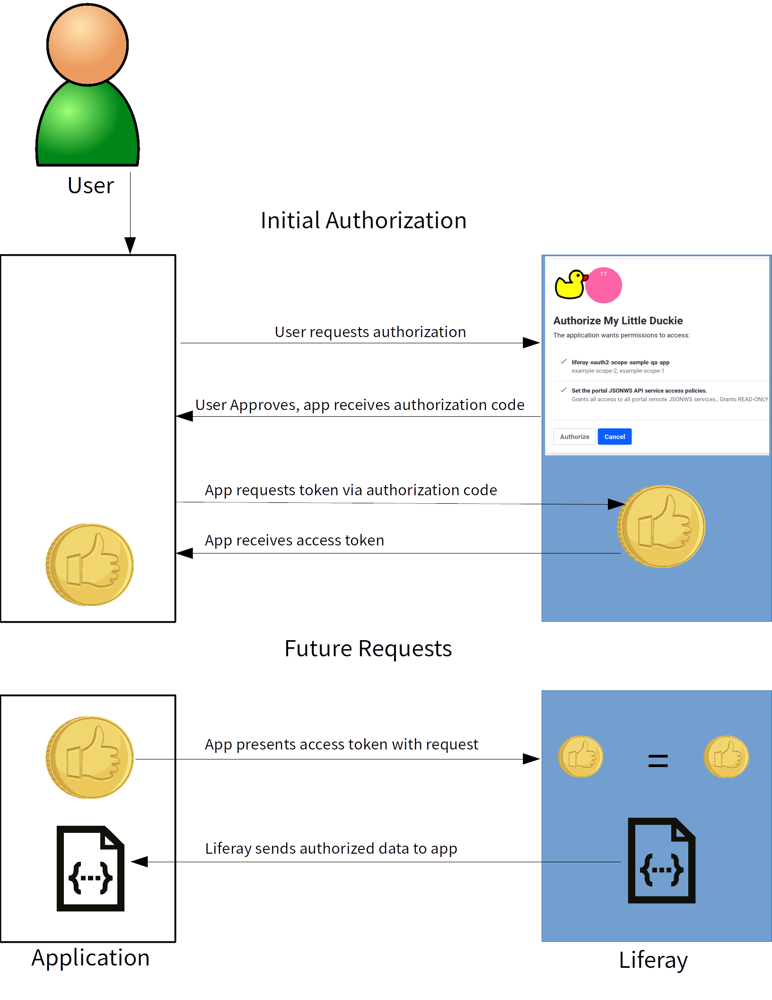
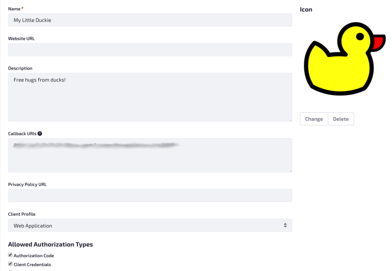

# OAuth 2.0 

OAuth 2.0は業界標準の認可プロトコルです。ユーザーは別のWebサイトから選択した資格情報をシームレスに共有して、ログインできます。「Facebookでログイン」または「Googleでログイン」ボタンが表示された場合、またはサードパーティーのTwitterクライアントを許可した場合に、OAuth 2.0が動作しているのがわかります。これは、ユーザーが所有するリソースの一部（Emailメールアドレス、ユーザーのプロフィール写真、またはアカウントの他のものなど）、およびその他の許可されたリソースへのパスワードなしのアクセスを許可することによって、機能しています。

OAuth 2.0の設計は、HTTPSを介してすべての認可転送を暗号化します。これにより、システム間でやり取りされるデータが傍受されるのを防ぎます。

## OAuth 2.0のフロー

OAuth 2.0は可能な限りWeb標準を活用しています。トランスポートはHTTPSで暗号化されており、トークンはHTTPヘッダーとして実装されています。そして、データはWebサービスを介して渡されます。

以下がOAuth 2.0のしくみです。

1. ユーザーがLiferayベースのWebサイトからの資格情報を使用して、認可をサポートするサードパーティのアプリケーションにアクセスします。アプリケーション（Webまたはモバイル）では、ユーザーはOAuthを介して認可を要求し、ブラウザまたはアプリをLiferayベースのWebサイトに送信します。PKCE（後述）を使用する場合、アプリケーションはコードベリファイアも生成し、それに変換を適用することによって作成されたコードチャレンジを送信します。

2. ユーザーが許可し、アプリケーションがアクセス許可を求めているリソースが表示されます。ユーザーが*[許可する]*をクリックして許可を与えると、LiferayはHTTPS経由でアプリケーションに送信される認可コードを生成します。

3. その後、アプリケーションはより永続的な認可トークンを要求し、その要求と共に（PKCEコードベリファイアと共に）コードを送信します。

4. 認可コードが一致（および変換されたPKCEコードベリファイアが以前に送信されたコードチャレンジと一致）する場合、Liferayは、このユーザーとアプリケーションの組み合わせに対して認可トークンを暗号化して生成します。そして、HTTPS経由でアプリケーションにトークンを送信します。これで、初期認可は完了です。

5. アプリケーションがデータを取得する必要がある場合に、そのデータを取得する権限があることを証明するための要求と共にこのトークンを送信します。

6. Liferayがユーザーとアプリケーションに対して保持しているものと送信されたトークンが一致すると、データを取得するためのアクセスが許可されます。

説明にはたくさんの用語が使われています。定義は以下の通りです。

## OAuth 2.0の用語

**認証：**システムが保管している内容と照合することによって、誰なのかを確認できるように、資格情報を提供します。OAuthは認証プロトコルではありません。

**認可：**別のシステムに保管されているリソースへのアクセスを許可します。OAuthは認可プロトコルです。

**アプリケーション：**リソースへのアクセス許可が必要とされている任意のクライアント（Web、モバイルなど）。ユーザーが自分のリソースへのアクセスを許可する前に、アプリケーションを管理者が登録しておく必要があります。

**クライアント：**アプリケーションがWebやモバイルなどのバリアントを持つことができることを除いて、*アプリケーション*とほぼ同義です。これらのバリアントがクライアントです。

**クライアントID：**クライアントを識別できるようにクライアントに与えられた識別子。

**クライアントシークレット：**クライアントを正当なクライアントとして識別する、予め決められたテキスト文字列。

**アクセストークン：**ユーザーのリソースにアクセスするためのユーザー/クライアントの組み合わせを識別する、暗号化して生成されたテキスト文字列。

**レスポンスタイプ：**OAuth 2.0はいくつかのレスポンスタイプをサポートしています。上の写真で説明されているのが最も一般的な認可コードです。その他のレスポンスタイプは、*パスワード*（ユーザー名とパスワードでログイン）、および*クライアントの資格情報*（ヘッドレスの事前定義済みアプリケーションアクセス）です。

**スコープ：**アプリケーションがアクセスを求めているものを定義する項目のリスト。
このリストは、最初の認可要求中に送信される（またはアプリケーション登録で選択されたスコープがデフォルトになる）ので、ユーザーは自分のリソースへのアクセスを許可または拒否できます。

**コールバックURI：**リダイレクトエンドポイントURIとも呼ばれます。認可が完了すると、認可サーバー（Liferayなど）はクライアントをこの場所に送信します。

## アプリケーションの作成

認可にOAuth 2.0を使用できるアプリケーションがある場合は、@product@が識別できるようにそのアプリケーションを登録する必要があります。これを行うには、*[コントロールパネル]* → *[設定]* → *[OAuth2管理]*にアクセスし ます。

1. クリックして、*[追加]*（）ボタンを押します。

2. フォームに入力してください（以下で説明）。

3. *[保存]*をクリックして、アプリケーションを保存します。

**名前：**アプリケーションにわかりやすいタイトルを付けます。

**WebサイトのURL：**アプリケーションのWebサイトへのリンクを追加します。

**コールバックURI：**ユーザーがアカウントへのアクセスを許可した（または許可を拒否した）後にユーザーをリダイレクトするために、少なくとも1つの（行区切り）URIを入力します。これはサポートしている許可された認可タイプのいずれかのハンドラーとリンクしている必要があります（下記参照）。

**クライアントプロファイル：**そのプロファイルに適した（安全な）認可タイプをフィルタリングするテンプレートを選択します。例えば、アプリケーションがWebアプリケーションであれば、*Webアプリケーション*を選択すると、認可コード、クライアントの資格情報、更新トークン、およびリソース所有者のパスワード資格情報は使用可能であり、自動的に選択されます。以上が[OAuth 2 RFC 6749規格文書](https://tools.ietf.org/html/rfc6749)に記述されている、OAuth 2「フロー」 です。
認可タイプを手動で選択する場合は、*その他*を選択してください。

**許可された認可タイプ：**アプリケーションがサポートする定義済みのOAuth 2 [プロトコルフロー](https://tools.ietf.org/html/rfc6749#section-1.2)を選択します。上記のさまざまなクライアントプロファイルで、いくつかの一般的な組み合わせが定義されています。

フォームを保存すると、いくつか追加のフィールドが表示されます。

**クライアントID：**システムによって生成されます。これはアプリケーションの識別子で、@product@がどのアプリケーションがユーザーデータへのアクセスを許可されているのかを識別できるようにするためのものです。

**クライアントシークレット：***鉛筆*アイコンをクリックして、クライアントシークレットを生成します。このシークレットは、認可プロセス中にクライアントが本物であるかを識別します（上部図1を参照）。一部のクライアントプロファイルでは秘匿にしておくことができないため、すべてのクライアントプロファイルにクライアントシークレットが必要なわけではありません。この場合、前述のPKCEコードチャレンジとベリファイアが必要となります。

**アイコン：**アプリケーションのユーザーがアプリケーションと識別しているアイコンをアップロードします。これは認可画面に表示されます。

**プライバシーポリシーのURL：**アプリケーションのプライバシーポリシーへのリンクを追加します。

**トークンイントロスペクション：**アプリケーションが@product@から要求することで、トークンからメタデータを取得できるようにします。[RFC 7662](https://tools.ietf.org/html/rfc7662)を実装します。

 アプリケーションのためのOAuth2認可を@product@へ追加する方法は以上です。次に、アプリケーションがアクセスできるユーザーデータのスコープを定義します。
