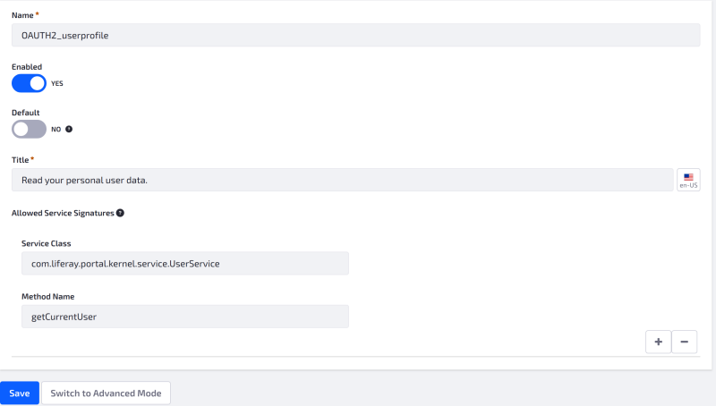

# OAuth2のスコープ

OAuth 2.0では、アプリケーションはユーザーデータの限られたサブセットへのアクセスが許可されています。
これらは*スコープ*と呼ばれます（Liferayスコープと混同しないでください）。スコープは二通りの方法で作成されます。

1. 管理者による、スコープに対するサービスアクセスポリシーの作成。

2. 開発者による、JAX-RSエンドポイントの作成。フォルトでは、スコープはJAX-RSエンドポイントでサポートされているHTTP動詞に基づいて生成されます。
特別なアノテーションがこの動作を無効にして、特定のスコープを登録します。

## JSONWSサービスのスコープの作成

スコープを作成する最も一般的な方法は 、`OAUTH2_`という名前をプレフィックスとする[サービスアクセスポリシー](/discover/deployment/-/knowledge_base/7-1/service-access-policies)を作成することです。この命名規則により、ポリシーはスコープとしてOAuthアプリケーション設定画面に表示されます。

たとえば、Emailメールアドレスを取得するためにアプリケーションがユーザーのプロフィール情報にアクセスする必要があるとします。アプリケーションにこの情報へのアクセスを許可するには、*[コントロールパネル]* → *[設定]* → *[サービスアクセスポリシー]*の順に選択し、以下に示すポリシーを作成します。

このポリシーはデフォルトのポリシーではなく、`UserService`にある1つのメソッドへのアクセスのみを許可することに注意してください。これはService Builderによって生成されたJSONWS Webサービスです。インストール先で利用可能なすべてのサービスのリストをこのURLで表示できます。

    http://[host]:[port]/api/jsonws/

ポリシーを作成し、`OAUTH2_プレフィックス`を付けて名前を付けると、OAuth 2管理の*[スコープ]*タブに表示されます。

![図2：適切なプレフィックスで名前が付けられたスコープは、アプリケーション設定の[スコープ]タブに表示されます。](../../../images/oauth-scopes-tab.png)

そして、選択をしてアプリケーションを保存します。

## JAX-RSサービスのスコープの作成

Liferay OAuth2の特別なアノテーションやプロパティがない場合、標準のOSGi JAX-RSアプリケーションはLiferay OAuth2ランタイムによって検査され、スコープはアプリケーションでサポートされているHTTP動詞に基づいて導出されます。

開発者がさらに細かく制御する場合は、JAX-RSアプリケーションを`oauth2.scopechecker.type=annotations`プロパティに登録して、`Liferay
OAuth2プロバイダースコープAPI`バンドルからエクスポートされた`com.liferay.oauth2.provider.scope.RequiresScope`を使って、エンドポイントリソースメソッドまたはクラス全体に以下のようにアノテーションを付けることができます。

    @RequiresScope("scopeName")

デプロイされると、これがOAuth 2.0設定のスコープになります。

## 認可ページの作成

この手順はオプションです。ユーザーは自分のアカウントへのアクセスを許可するためのインターフェースが必要で、インターフェースは自動的に提供されます。ただし、ページをカスタマイズしたい場合は、サイトに認可ページを作成できます。

1. *[コントロールパネル]* → *[システム設定]* → *[セキュリティ]* → *[OAuth2]*へ行きます。左側にある*[画面の承認]*というラベルの付いた一番下の項目をクリックします。

2. 2つのデフォルトが表示されます。一番目にあるのが承認ページへのURLです。デフォルトでは、 `/group/guest/authorize-oauth2-application`です。これはデフォルトサイトのURLと`authorize-oauth2-application`と呼ばれるサイト上のページに対応します。

3. デフォルトサイトの名前とURLをカスタマイズした場合は、次にそのサイトで作成するページとURLが一致するように、ここで適切な変更を加えます。*[保存]*をクリックします。

4. サイトの*[ビルド]* → *[ページ]*画面に行きます。![[追加]](../../../images/icon-add.png)ボタンをクリックして、 *[プライベートページ]*を選択します。これにより、ユーザーは強制的にログインします。

5. *フルページアプリケーション*の種類を選択します。

6. ページに手順2で設定したものと同じ名前を付けます。

7. *[次のメニューにこのページを追加する]*というラベルの付いたボックスのチェックを外します。このページがサイトナビゲーションに表示されないようにします。

8. 次に表示されるページで、フレンドリーURLが手順2で設定したURLと一致していることを確認します。

9. *[フルページアプリケーション]*内にある、*[OAuth2にポートレットを認可する]*を選択します。

10. *[保存]*をクリックします。

 ユーザーはデフォルトまたは今回設計したUIを使用して、認可プロセスを進めることができます。これでUIが完成し、スコープが分かったので、次はアプリケーションで認可プロセスを実行します。
