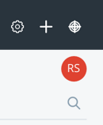

# 開発プラットフォームとしてのLiferay

[TOC levels=1-4]

これまでの記事では、@product@のアーキテクチャ、モジュール性、およびテクノロジーを取り扱いましたが、この記事では、カスタマイズやアプリケーションの開発において、Liferayプラットフォームをサイトの基盤として利用する方法を説明します。Liferayのプラットフォームは、開発者が通常使用しているツールに統合して、簡単かつ快適に開発作業をできるように設計されています。

 

## Webアプリケーションとポートレット

Liferayは開発プラットフォームとして、1つのページに複数のアプリケーションを簡単に配置でき、柔軟性のある管理方法を管理者と開発者に提供しています。このように作成されたアプリケーションは、*ポートレット*と呼ばれ、Liferayのプラットフォームの中枢を担っています。[LiferayのMVCポートレットフレームワーク](/docs/7-1/tutorials/-/knowledge_base/t/liferay-mvc-portlet)、または[Spring MVC](/docs/7-1/tutorials/-/knowledge_base/t/spring-mvc)や[JSF](develop/tutorials/-/knowledge_base/7-1/jsf-portlets-with-liferay-faces)などの共通フレームワークを使用して、ポートレットを作成することができます。アプリケーションにWebベースのインタフェースを持たせ、管理者によるアプリケーションの設定方法に対して十分に柔軟性を持たせたい場合、ポートレットは非常に強力なモデルです。このモデルでは、大規模なアプリケーションではなく複数のポートレットを作成して、管理者が既存のポートレットと統合することでより大きなインターフェースにする方法を選択できます。

しかし、これが唯一の方法と言うわけではありません。LiferayではビジネスロジックをUI(別のモジュールで提供)から切り離しているので、他のテクノロジーを使ってUIを自由に実装することができます。

したがって、[Service Builder](/docs/7-1/tutorials/-/knowledge_base/t/service-builder-web-services)、JAX-RS、およびJAX-WSをベースとして[Webサービス](/docs/7-1/tutorials/-/knowledge_base/t/web-services)が作成でき、Liferayをヘッドレスプラットフォームとして利用することができます。そして、お好みのフロントエンドテクノロジーまたはモバイルテクノロジーを使って、単体のWebアプリケーションを作成することができます。

## 拡張性

上記のシステムには、開発者がモジュールに基づいてアプリケーションを作成するだけでなく、既存機能を拡張できるように設計されたシステムを構築するのに必要となるツールが全て揃っています。Liferayのプラットフォームはアプリケーションの開発とカスタマイズの両方の効率を考慮した設計になっているため、このようなシステムが提供できるのです。

コンポーネントによって、拡張機能とカスタマイゼーションの開発が便利になるので、カスタマイゼーションを考慮せずに設計されている他の製品と比較すると、Liferayの使い勝手の良さが分かります。

既存のサービスをカスタマイズするには、既存の実装を拡張するコンポーネントを配置するだけでいいのです。実装を削除してデフォルトの動作に戻したい場合は、コンポーネントをアンデプロイするだけで済みます。

従来の方法である、ソースをダウンロードし、それに対するパッチのセットを維持することによってソフトウェアのカスタマイズを行う方法について考えてみましょう。この従来的な方法では、ソフトウェアが更新されるたびにソースを再度ダウンロードし、パッチを再適用して、ソフトウェアを再コンパイルする必要があります。

一方、Liferayではカスタムコードは独自のモジュールに保持され、コンテナは指定したメタデータに基づいて適用するのです。

## 開発ツール

LiferayのOSGiコンテナの利点は、以下の通りです。

- コンテナはコンポーネントを開始および停止できます。
- コンポーネントはOSGiサービスを実装します。
- コンポーネントはOSGiサービスを使用または消費します。
- フレームワークは、コンポーネントが消費するサービスのまとまり(SpringやEJBに似ていますが、動的です)を管理します。

次に、コンポーネントの開発について説明します。Liferayでは、新人の開発者のみなさんのために、利用しやすいツールを提供すると同時に、経験豊富な開発者向けに詳細なツール設定も提供する、といった柔軟性にも重点を置いています。それを実現するために、Liferayでは優れたツールを提供しています。経験豊富な開発者であれば、これらのツールを既に使用しているものに統合することもできます。例えば、GradleやMavenなどの標準のビルドツールや、Eclipse、intelliJ、NetBeansなどのテキストエディタや一般的なJava IDE、またはSpockやJUnitなどのテストフレームワークを使用する場合、それらをLiferayで使用して、コンポーネントを開発することができます。

[Liferayのツール](/docs/7-1/tutorials/-/knowledge_base/t/tooling)が提供する拡張機能は以下の通りです。

- [Blade CLI](/docs/7-1/tutorials/-/knowledge_base/t/blade-cli)は[テンプレート](/docs/7-1/reference/-/knowledge_base/r/project-templates)からGradleベースのLiferayプロジェクトを作成することで、開発速度を上げることができます。
- [Liferay Workspace](/docs/7-1/tutorials/-/knowledge_base/t/liferay-workspace)は、Gradleに基づいた独断的なSDKです。Blade CLIを使用して、プロジェクトとランタイムを統合することで、ディストリビューションと共有が可能な使い勝手のいい場所を作成します。
- Liferay IDEは、Eclipseベースの開発環境であり、Blade CLIとLiferay Workspaceの持つ良さをあらゆる機能を備えた最高のグラフィカル環境へと統合します。
- Liferay Developer Studioは、Liferay IDE が提供するすべての機能と、エンタープライズ開発者が必要とする追加のツールを提供します。
- [Liferay Service Builder](/docs/7-1/tutorials/-/knowledge_base/t/service-builder)を使用すると、1つのXMLファイルからすべてのデータベーステーブル、ローカルサービス、およびWebサービスを作成でき、バックエンドを素早く作成することができます。

また、Liferayが提供しているツール以外のものも使用できます。つまり、Liferayでは多様なケースに適応できるオープンな開発フレームワークを提供しており、ご希望に合わせて自由に選択できるのです。特定のツールにロックインするのではなく、すでに利用されているツールでの開発環境を補完するよう設計されています。

ビルドツールやIDE以外にも、アプリケーションの構築に使用するフレームワークがあります。
Liferayの開発フレームワークには、コメント、ソーシャルリレーションシップ、ユーザー管理、およびその他多数の機能が含まれており、アプリケーションの開発を高速化できます。これらの十分にテストされた最新のスケーラブルなスキンも変更できる構成要素を利用して、アプリケーションを作成することができます。機能的に優れているアプリケーションだけではなく、短い開発時間で、希望通りの外観を持った、優れたパフォーマンスを発揮するアプリケーションも作成できます。また、Liferayが提供するものだけに限らず、サードパーティ製のフレームワークを使用することもできます。

Liferayではポートレットを簡単に作成するために[MVCPortlet](/docs/7-1/tutorials/-/knowledge_base/t/liferay-mvc-portlet)と呼ばれるフレームワークを提供していますが、Spring MVC などの他のフレームワークを使用してポートレットを作ることもできます。MVCPortletはコンポーネントを使用してリクエストを処理し、上記のすべての特性 (ライフサイクル、拡張性、設定の容易さなど) を活用しています。フレームワークに強いこだわりがない限りは、MVCPortletの使用をお勧めしています。

Liferayには、[Service Builder](/docs/7-1/tutorials/-/knowledge_base/t/service-builder)と呼ばれるユーティリティがあります。これにより、バックエンドデータベーステーブルの作成とそれらのテーブルにアクセスするためのJavaのオブジェクトリレーショナルマップの作成、そしてビジネスロジックを配置する場所の作成が簡単にできます。JSONまたはSOAP Webサービスも作成することができ、開発者にWebまたはモバイルクライアントを使用したデータの保存、および取得のための完全なスタックを提供することもできます。しかし、これでJava永続性 (JPA) の使用やJAX-WS Webサービスの作成ができなくなるわけではありません。

上記で紹介したツールに加えて、Liferayでは再利用が可能なフレームワークを多数提供しています。

## フレームワークとAPI

Liferayの開発プラットフォームでは、アプリケーション開発に適したフレームワークと数多くのAPIを提供しています。Liferayのフレームワークを活用して、今日のアプリケーションに対して一般的に必要とされる機能をカプセル化することで、アプリケーションが作成できます。たとえば、コメントシステムを使用すると、開発するアセットであれシステムに同梱されるアセットであれ、定義したアセットにコメントを添付することができます。[アセット](/docs/7-1/tutorials/-/knowledge_base/t/asset-framework)はシステムによって共有され、ユーザー、組織、サイト、ユーザーグループ、ブログエントリ、さらにはフォルダやファイルなど、多くの一般的な要素を表すために使用されます。

さらに、Liferayではアセットを操作するためのフレームワークも多数提供しています。[ワークフローシステム](/docs/7-1/tutorials/-/knowledge_base/t/liferays-workflow-framework)を使用すると、ユーザーに対する承認プロセスを必要とするアプリケーションが簡単に作成できます。ごみ箱では、削除されたアセットを指定した期間保存し、管理者の介入なしにユーザーがデータを簡単に復元できるようにします。複数のバックエンドを備えたファイルストレージ APIを使用すると、ファイルの保存と共有が簡単になります。検索機能はシステム内にも組み込まれており、開発者がアプリケーションと統合できるよう設計されています。複雑なアプリケーションを開発する際に必要となるフレームワークの多くは、既にLiferay内にあります。ソーシャルネットワーキングAPIやデータリスト付きのユーザー作成フォーム、[メッセージバス](/docs/7-1/tutorials/-/knowledge_base/t/message-bus)や監査システムなどが利用できます。

## Liferayプロジェクトの例

 ここからは、Liferayのプラットフォーム上で開発する例を具体的に説明します。まずは、MVCPortletで開発されたポートレットと、コンポーネントの使用方法をとりあげます。それから、拡張子の例を説明します。両方の例を見ていくことで、Liferayで採用しているモジュラー方式で機能を構築することがいかに簡単かが分かります。

Liferayでは、[Blade CLI](/docs/7-1/tutorials/-/knowledge_base/t/blade-cli)や[Liferay IDE](/docs/7-0/tutorials/-/knowledge_base/t/liferay-ide)が作成するテンプレートを使うと、「Hello World」のようなプロジェクトはデフォルトで作成できてしまうため、ここでは取り扱いません。代わりに、Hello *You*ポートレットを取り扱います。これは、Hello Worldと同じ動作をしますが、メッセージにユーザーのファーストネームが追加されます。ジョンというユーザー名であれば、「こんにちは、ジョン」と表示されるのです。

プロジェクトのレイアウトは以下のようになります。

LiferayのBlade CLIツールでプロジェクトを作成した後に、追加で新しいファイルは作成されなかったので、いたってシンプルなのです。. `.java`ファイルに、ポートレットクラスが作成されます。また、[言語プロパティ](/docs/7-1/tutorials/-/knowledge_base/t/internationalization)とJSPファイルという2種類のリソースも作成されます。そして、`bnd.bnd`ファイルはOSGiコンテナのアプリケーションのメタデータを記述し、`build.gradle`ファイルはプロジェクトをビルドします。

Javaに精通しているWeb開発者なら誰でもJSPを理解できると思いますが、スタイルに関して以下で一部説明します。Liferayのコーディングスタイルでは、フロントエンドに必要なすべてのインポートとタグライブラリの初期化を含んでいる、単一の`init.jsp`を定義します。これにより、JSPがただ`init.jsp`をインポートするだけで、必要項目のインポートがすべて完了するのです。このプロジェクトの`init.jsp`は、プロジェクトの作成後は変更されていないので、以下のようになります。

    <%@ taglib uri="http://java.sun.com/jsp/jstl/core" prefix="c" %>
    
    <%@ taglib uri="http://java.sun.com/portlet\_2\_0" prefix="portlet" %>
    
    <%@ taglib uri="http://liferay.com/tld/aui" prefix="aui" %>
    
    <%@ taglib uri="http://liferay.com/tld/portlet" prefix="liferay-portlet" %>
    
    <%@ taglib uri="http://liferay.com/tld/theme" prefix="liferay-theme" %>
    
    <%@ taglib uri="http://liferay.com/tld/ui" prefix="liferay-ui" %>
    
    <liferay-theme:defineObjects />
    
    <portlet:defineObjects />

このように、使用したいタグライブラリを宣言するだけで、ポートレットフレームワークのオブジェクトを利用できるタグがいくつか呼び出されます。次に、`view.jsp`を確認します。

    <%@ include file="/init.jsp" %>
    
    <jsp:useBean id="userName" type="java.lang.String" scope="request" />
    
    

    
    <b>Hello, <%=userName %>!</b>
    
    

 ポートレットクラス(MVCの用語では、Controller)はリクエスト内で`userName`文字列を使用可能にし、JSPがそれを取得して使用することで、ユーザーに表示されます。したがって、実際の機能はポートレットクラスにあります。

    @Component(
    immediate = true,
    property = {
    "com.liferay.portlet.display-category=category.sample",
    "com.liferay.portlet.instanceable=true",
    "javax.portlet.display-name=hello-you Portlet",
    "javax.portlet.init-param.template-path=/",
    "javax.portlet.init-param.view-template=/view.jsp",
    "javax.portlet.resource-bundle=content.Language",
    "javax.portlet.security-role-ref=power-user,user"
    },
    service = Portlet.class
    )
    public class HelloYouPortlet extends MVCPortlet {
    
    @Override
    public void render(RenderRequest renderRequest,
    RenderResponse renderResponse)
    throws IOException, PortletException
    {
    ThemeDisplay themeDisplay = (ThemeDisplay)
    renderRequest.getAttribute(WebKeys.THEME_DISPLAY);
    
    User user = themeDisplay.getUser();
    
    renderRequest.setAttribute("userName",
    user.getFirstName());
    
    
    
    super.render(renderRequest, renderResponse);
    }
    
    }

 一番上に、`@Component`アノテーションがあります。これは、OSGiコンテナに対して、このモジュールをどのように扱うかを指示しています。`immediate=true`を指定することによって、このモジュールがデプロイされてすべての依存関係が解決されたら、遅延読み込みすることなく、すぐに開始するように指示しています。その次は、LiferayのUIに表示されるカテゴリ、その表示名、デフォルトビューなどの[ポートレットに固有のいくつかのプロパティ](/docs/7-0/reference/-/knowledge_base/r/portlet-descriptor-to-osgi-service-property-map)を示しています。最後に、実装されているサービス(Java Interface)が定義されます。これが、ポートレットクラスです。

次に、Liferayの[`MVCPortlet`クラス](@platform-ref@/7.1-latest/javadocs/portal-kernel/com/liferay/portal/kernel/portlet/bridges/mvc/MVCPortlet.html)（`Portlet`を実装する`GenericPortlet`クラス）を拡張するクラスがあります。オーバーライドできる唯一のメソッドは`render()`メソッドで、LiferayのAPIを使用してユーザーのファーストネームを取得し、それを`userName`と呼ばれるリクエスト属性に入れます。

これで、上記の例がどのように機能するのかが分かります。ポートレットが実行され、ユーザー名を取得してそれをリクエストに入れ、テンプレートパスを使用して`@Component`アノテーションで指定されたテンプレートプロパティを表示し、ユーザーの名が取得および表示される`view.jsp`へ処理を転送するようになっているるのです。

他に関連のある項目は、`bnd.bnd`ファイルだけです。

    Bundle-SymbolicName: com.liferay.docs.hello.you
    Bundle-Version: 1.0.0

これは、モジュール名（バンドルとも呼ばれます）を宣言しています。コンテナ内の名前の衝突を避けるために、名前空間を正しく付けることをお勧めします。
バージョンも宣言されているため、コンテナはモジュールのバージョンレベルまで依存関係を管理できます。これはセマンティックバージョニングと呼ばれています。

 次に、ポートレットよりもシンプルな拡張機能について説明します。

LiferayのUIはいくつかのエリアに分かれています。コントロールメニューと製品メニューがあり、製品メニューには追加メニューとシミュレーションメニューがあります。UIを拡張したい場合は、必要なものを追加するモジュールをデプロイして、UIを拡張することができます。この例では、製品メニューにリンクを追加します。このメニューは、デフォルトではブラウザの右上にあります。

これに、このウェブサイトへのリンクを追加します:

ポートレットプロジェクトと同様に、このプロジェクトのレイアウトには分かりやすいアイテムだけが含まれています。

前の例と同じように、ビルドスクリプト、モジュールの名前とバージョンを宣言する`bnd.bnd`ファイル、そして今回はJavaクラスと言語プロパティファイルのみがあります。

以下のJavaクラスは、4つのメソッドしか定義していません。

    @Component(
    immediate = true,
    property = {
    "product.navigation.control.menu.category.key=" +
    ProductNavigationControlMenuCategoryKeys.USER,
    "product.navigation.control.menu.entry.order:Integer=1"
    },
    service = ProductNavigationControlMenuEntry.class
    )
    public class DevProductNavigationControlMenuEntry
    extends BaseProductNavigationControlMenuEntry
    implements ProductNavigationControlMenuEntry {
    
    @Override
    public String getIcon(HttpServletRequest request) {
    
    return "link";
    }
    
    @Override
    public String getLabel(Locale locale) {
    
    ResourceBundle resourceBundle = ResourceBundleUtil.getBundle(
    "content.Language", locale, getClass());
    
    return LanguageUtil.get(resourceBundle, "custom-message");
    }
    
    @Override
    public String getURL(HttpServletRequest request) {
    
    return "https://liferay.com";
    
    }
    
    @Override
    public boolean isShow(HttpServletRequest request) throws
    PortalException {
    
    return true;
    }
    
    }

前の例と同様に、このプロジェクトもBlade CLIの[テンプレート](/docs/7-1/reference/-/knowledge_base/r/project-templates)を使用して作成されています。ソースコードはテンプレートの一部なので、リンクの提供だけが必要となります。

最初のメソッドでは、メニューで使用したいFont Awesomeアイコンを取得しています。次のメソッドでは、「ラベル」と呼ばれるユーザーがリンク上にマウスを置いたときに表示されるテキストを取得しています。このテキストは、`Language.properties`ファイル内の唯一のプロパティの値です。

custom-message=Liferay Developer Network    
次のメソッドはこのリンクの宛先であるURLを返し、最後のメソッドはリンクの表示または非表示のブール値を返します。

[このモジュールをデプロイ](/docs/7-1/reference/-/knowledge_base/r/project-templates)して起動すると、リンクがメニューに表示されます。メニューをカスタマイズするために、LiferayのJSPファイルやJavaScriptファイルを探す必要はありません。拡張ポイントを利用してカスタマイズできるように設計されています。

これがモジュラー方式での開発手法です。アプリケーションや拡張機能であるかどうかに関わらず、Liferayのコードから独自のコードを明確に分離でき、実行中にシステムを動的にカスタマイズできることで、ダウンタイムを回避することができます。通常とは異なる方法ですが、Liferayはこれがより良い方法であると信じています。モジュール作業を行う過程で、その利点が明らかになります。
