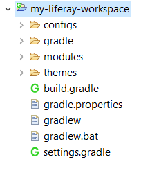
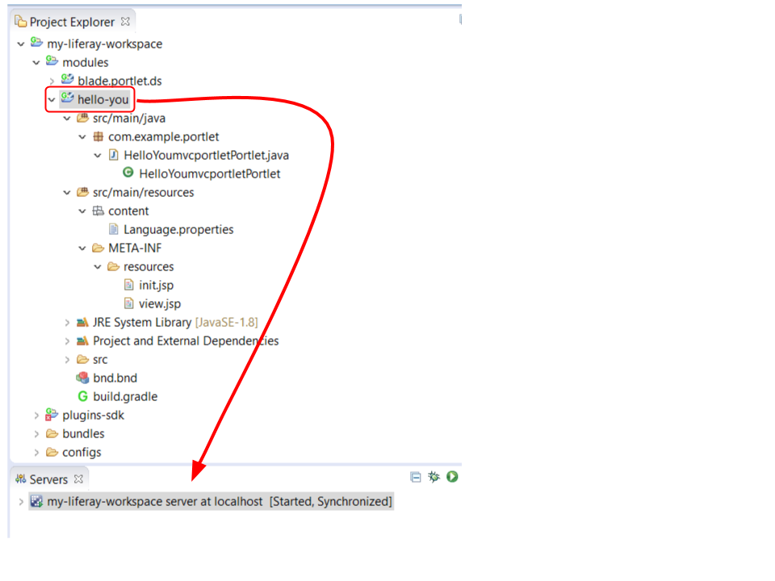
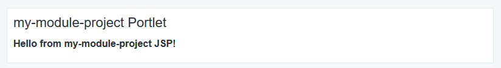

# モジュール開発の開始

[TOC levels=1-4]

@product@のモジュールを開発するには、以下を行う必要があります。

- **フォルダ構造の作成**: 適切なフォルダ構造により、特にコラボレーションにおいてのコードの発展と維持が容易になります。一般的なツールでは、開発者が使い慣れている定義済みのフォルダ構造を使用しています。

- **コードと設定ファイルの作成**: マニフェスト、Javaクラス、およびリソースを作成します。モジュールをスタブ化することで、ロジックの実装に集中できます。

- **コンパイル**: 
[依存関係の設定](/docs/7-1/tutorials/-/knowledge_base/t/configuring-dependencies)とモジュールのビルドを行います。依存関係を管理する一般的なビルドツールには、Gradle、Maven、およびAnt/Ivyが含まれます。

- **デプロイメント**: ランタイム環境と対話して、モジュールのインストール、モニター、および修正を行います。

モジュール開発に優れたビルドツールがいくつかあります。このチュートリアルでは、[Liferay Workspace](/docs/7-1/tutorials/-/knowledge_base/t/liferay-workspace)を使用して新しいモジュールを開始する方法を説明します。
モジュール開発を簡素化し、その大部分を自動化するのは、Gradleとbndに基づいたLiferay独自のビルド環境です。

| **注**: Liferayでは、ご希望のツールを使用して開発できます。希望するビルド| 環境をまだ持っていない人にLiferay Workspaceを提供する| だけではなく、LiferayではMavenとGradleに対する優れたサポートも提供しています。以下の| チュートリアルとサンプルでは、これらの環境での開発について説明します。
|
| -   [Maven in Liferay @ide@](/docs/7-1/tutorials/-/knowledge_base/t/using-gradle-in-liferay-ide)、
|    [Maven tutorials](/docs/7-1/tutorials/-/knowledge_base/t/maven)、
|     および [サンプル](/docs/7-1/tutorials/-/knowledge_base/t/liferay-sample-projects)
|
| -   [Gradle in Liferay @ide@](/docs/7-1/tutorials/-/knowledge_base/t/using-gradle-in-liferay-ide)
|     および[サンプル](/docs/7-1/tutorials/-/knowledge_base/t/liferay-sample-projects)

| **注**: テーマとレイアウトテンプレートは、モジュールとしてビルドされません。[Themes and Layout Templates tutorials](/docs/7-1/tutorials/-/knowledge_base/t/themes-and-layout-templates)にて、| 作成方法をデモンストレーションしています。

モジュール開発を開始する手順は、以下のとおりです。

1. [Liferay Workspaceをセットアップする](#setting-up-a-liferay-workspace)

2. [モジュールを作成する](#creating-a-module)

3. [モジュールをビルドしてデプロイする](#building-and-deploying-a-module)

このチュートリアルを完了すると、モジュールが作成され、ローカルの@product@バンドルにデプロイできています。

## Liferay Workspaceのセットアップ

Liferay Workspace（以下、Workspace）の作成と設定は、[Blade CLI（以下、Blade）](/docs/7-1/tutorials/-/knowledge_base/t/blade-cli)と呼ばれるツールを使用して簡単に行うことができます。
Bladeはコマンドラインツールであり、Workspaceとプロジェクトを作成し、一般的なタスクを実行します。

まだ持っていない場合は、[Bladeをインストール](/docs/7-1/tutorials/-/knowledge_base/t/installing-blade-cli)します。

これで、`blade`実行可能ファイルがシステムパスに追加されました。

以下のコマンドを実行して、現在のディレクトリにWorkspaceを作成できます。

`blade init [workspaceName]`

これで、Workspaceが作成されました。このフォルダ構造は、以下の図のようになっています。

Workspaceでは、@product@のインストールバンドルをローカルファイルシステムのあらゆる場所で使用できるように設定することができます。`gradle.properties`にある`liferay.workspace.home.dir`プロパティは、デフォルトのバンドルの場所を`[workspace]/bundles`フォルダ（ここでは、まだ作成されていません）に設定します。便宜上、 そこに[バンドルをインストールする](/docs/7-1/deploy/-/knowledge_base/d/preparing-for-install)ことをお勧めします。別の場所にインストールする場合は、`liferay.workspace.home.dir`プロパティのコメントを外して、 希望する場所に設定します。

| **注**：Liferay @ide@のユーザーインターフェイスでは、Liferay| Workspaceプロジェクトの作成およびインポートができます。
|
| プロジェクトを作成するには、[Creating a Liferay Workspace Project with Liferay @ide@](/docs/7-1/tutorials/-/knowledge_base/t/creating-a-liferay-workspace-with-liferay-ide)のチュートリアルに従ってください。
|
| プロジェクトをインポートするには、*[ファイル] → [インポート] → [Liferay] → [Liferay Workspace Project]からウィザードを使用します*。

これで、Workspaceでモジュールを作成する準備ができました。

## モジュールを作成する

Bladeでは、プロジェクト*テンプレート*と*サンプル*プロジェクトを提供しています。テンプレートは、さまざまなタイプのモジュールのファイルをスタブアウトします。サンプルはWorkspaceで作成でき、多くのモジュールタイプの動作確認を行います。テンプレートとサンプルを使用すると、モジュールをすばやく作成できます。

### モジュールテンプレートの使用

Bladeコマンドの`blade create -l`は、プロジェクトテンプレートを一覧表示します。

| **注**：[Liferay @ide@のモジュールウィザード](/docs/7-1/tutorials/-/knowledge_base/t/creating-modules-with-liferay-ide)では、| モジュールプロジェクトテンプレートが選択できます。

モジュールを作成するためのコマンド構文は、以下のとおりです。

    blade create [options] moduleName

モジュールテンプレートとそのオプションについては、[こちら](/docs/7-1/reference/-/knowledge_base/r/project-templates)で説明しています。

以下は、Liferay MVCポートレットモジュールの作成例です。

    blade create -t mvc-portlet -p com.liferay.docs.mymodule -c MyMvcPortlet my-module

モジュールプロジェクトは、デフォルトでは`modules`フォルダに作成されます。

モジュールプロジェクトの構造は、以下のとおりです。

- `src/main/java/` → Javaパッケージルート

- `src/main/resources/content/`（オプション）→ 言語プロパティのルート

- `src/main/resources/META-INF/resources/`（オプション）→ JSPなどのUIテンプレートのルート

- `bnd.bnd` → 必須のOSGiモジュールマニフェストのヘッダーを指定します。

- `build.gradle` → Gradleを使用して、[依存関係などの設定](/docs/7-1/tutorials/-/knowledge_base/t/configuring-dependencies)を行います。

以下の図は、MVCポートレットのプロジェクトを示しています。

サンプルモジュールは、もう1つの有用な開発リソースです。

### サンプルモジュールの使用

テンプレートからモジュールを作成する代わりに、*サンプル*モジュールを作成することもできます。用途に合わせて、モジュールを調べたり、変更したりして、使用できます。

以下のコマンドでは、サンプル名をリストします。

    blade samples

以下の図は、リストを示しています。

Bladeサンプルのコマンド構文は、以下のとおりです。

    blade samples [sampleName]

これにより、サブフォルダにサンプルプロジェクトが作成されます。

モジュールをビルドして、Liferayにデプロイするのは簡単です。

## モジュールのビルドとデプロイ

Liferay Workspaceでは、モジュールをビルドおよびデプロイするためのGradleタスクを提供しています。
Bladeの`blade gw`コマンドを使用すると、任意のプロジェクトフォルダからGradleラッパーを呼び出すことができます。ラッパーパスを指定せずに、`gradlew`を呼び出す場合と同様に、`blade gw`を使用することができます。

| **注**：さらに簡単なGradleラッパーコマンドの場合は、*gw*をインストールします。
|
| `(sudo) jpm install gw@1.0.1`
|
| 使用法：`gw <task>`

モジュールフォルダで以下のコマンドを実行し、使用可能なGradleタスクを一覧表示します。

    blade gw tasks

Workspaceは、bndを使用してモジュールのOSGi `MANIFEST.MF`ファイルを作成し、モジュールJARにパッケージ化します。モジュールをコンパイルしてモジュールJARを作成するには、以下の`jar` Gradleタスクを実行します。

    blade gw jar

作成されたJARはモジュールプロジェクトの`build/libs`フォルダにあり、デプロイの準備ができています。

まだ開始していない場合は、@product@サーバーを開始します。

| **ヒント**：新しいターミナルウィンドウとWorkspaceの@product@サーバー|（TomcatまたはJBoss/Wildflyにバンドルされている）を開くには、次のコマンドを実行します。|
| `blade server start -b`

Bladeは、モジュールをローカルのLiferayサーバーにデプロイします。Felix Gogoシェルを使用してOSGiフレームワークと通信し、Felix File Installコマンドを使用して、OSGiコンテナにモジュールを直接デプロイします。上記のコマンドは、デフォルトの`11311`番ポートを使用します。

モジュールをデプロイするには、以下のコマンドを実行します。

    blade deploy

使用しているフォルダツリーにモジュールをデプロイします。たとえば、`[workspace]/modules`フォルダで`blade deploy`を実行すると、そのフォルダとサブフォルダ内のすべてのモジュールがデプロイされます。

Liferay @ide@を使用すると、モジュールをPackage ExplorerからLiferayサーバーにドラッグしてデプロイできます。@ide@は、[Liferay Workspace Gradleタスク](/docs/7-1/tutorials/-/knowledge_base/t/managing-projects-with-liferay-ide)へのアクセスも提供します。

| **注：**[Blade CLIは、モジュールをOSGiコンテナに直接インストールします。](/docs/7-1/tutorials/-/knowledge_base/t/deploying-projects-with-blade-cli)
| Bladeは、モジュールをLiferay に保存するにあたって、| `LIFERAY_HOME/deploy`フォルダにコピーする場合とは異なる方法をとります。

ポートレットモジュールをデプロイすると、[ポートレットコンポーネントの`com.liferay.portlet.display-category`および`javax.portlet.display-name`プロパティ](/docs/7-1/tutorials/-/knowledge_base/t/liferay-mvc-portlet#liferay-mvc-portlet-component)を介して指定したアプリケーションカテゴリと名前の下にあるLiferay UIで使用できます。

## モジュールの変更を自動的に再デプロイする

Bladeを使用すると、モジュールプロジェクトの出力ファイルの変更に対する*watch*を設定できます。ファイルが変更された場合に、Bladeはモジュールを自動的に再デプロイします。デプロイ時にモジュールに対してwatchを設定するには、モジュールプロジェクトで以下のコマンドを実行します。

    blade deploy -w

*com.liferay.docs.mymodule*という名前のモジュールのデプロイ（および監視）からの出力は、以下のとおりです。

    E:\workspaces\my-liferay-workspace\modules\my-module-project>blade deploy -w
    
    :modules:my-module-project:compileJava UP-TO-DATE
    :modules:my-module-project:buildCSS UP-TO-DATE
    :modules:my-module-project:processResources UP-TO-DATE
    :modules:my-module-project:transpileJS SKIPPED
    :modules:my-module-project:configJSModules SKIPPED
    :modules:my-module-project:classes UP-TO-DATE
    :modules:my-module-project:jar UP-TO-DATE
    :modules:my-module-project:assemble UP-TO-DATE
    :modules:my-module-project:build
    
    BUILD SUCCESSFUL
    
    Total time: 2.962 secs
    install file:/E:/workspaces/my-liferay-workspace/modules/my-module-project/build/libs/com.liferay.docs.mymodule-1.0.0.jar
    Bundle ID: 505
    start 505
    
    Scanning E:\workspaces\my-liferay-workspace\modules\my-module-project
    
    ...
    
    Waiting for changes to input files of tasks... (ctrl-d then enter to exit)

コマンド出力はモジュールがインストールおよび起動されたことを示しており、モジュールのOSGiバンドルIDを報告し、モジュールに変更をデプロイする準備ができています。

これで、モジュールの開発が開始されます。

## 関連記事

[Configuring Dependencies](/docs/7-1/tutorials/-/knowledge_base/t/configuring-dependencies)

[Liferay Workspace](/docs/7-1/tutorials/-/knowledge_base/t/liferay-workspace)

[Tooling](/docs/7-1/tutorials/-/knowledge_base/t/tooling)

[OSGi Basics for Liferay Development](/docs/7-1/tutorials/-/knowledge_base/t/osgi-basics-for-liferay-development)

[Portlets](/docs/7-1/tutorials/-/knowledge_base/t/portlets)
