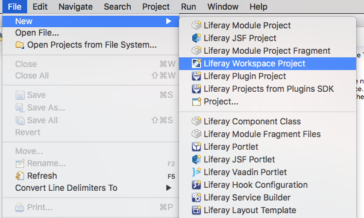
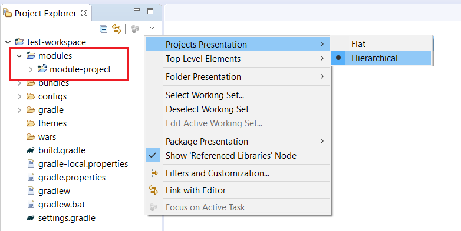

# Dev Studioを使用したLiferay Workspaceの作成

[TOC levels=1-4]

このチュートリアルでは、Liferay Dev Studioを使用してLiferay Workspaceを作成する方法を説明します。Liferay Dev Studioは、バックグラウンドでは[Blade CLI](/docs/7-1/tutorials/-/knowledge_base/t/blade-cli)で実行されます。Dev Studioはコマンドプロンプトの代わりにグラフィカルインターフェイスを提供することで、ワークフローを合理化します。Liferay Workspaceの詳細については、専用の[チュートリアルセクション](/docs/7-1/tutorials/-/knowledge_base/t/liferay-workspace)を参照してください。

!P[Video Thumbnail](https://portal.liferay.dev/documents/113763090/113919826/vid-ide-thumbnail.png)

Liferay Workspaceを作成する前に、@product@開発のために設計された新しいパースペクティブである、 *Liferay Workspace*および *Liferay Plugins*パースペクティブを理解しておく必要があります。@product@開発でLiferay Workspaceを使用する予定がある場合は、 *Liferay Workspace*パースペクティブ（デフォルト）を選択する必要があります。これにより、Liferay Workspaceを使用する際に役立つ開発ツールが提供されます。*Liferay Plugins*パースペクティブは、Plugins SDKなどのAntベースの開発ツールを使用する開発者向けのものです。Plugins SDKはLiferay Portal/DXP 7.0以前の開発でしか提供されていないため、@product-ver@開発では使用しないでください。

Dev StudioでLiferay Workspaceを作成するには、*[ファイル]* → *[新規]* → *[Liferay Workspace Project]*を選択します。

新しいLiferay Workspaceのダイアログが表示され、設定オプションがいくつか表示されます。以下の手順に従って、ワークスペースを作成します。

1. ワークスペースプロジェクトに名前を付けます。

2. ワークスペースを配置する場所を選択します。*[Use default location]*というチェックボックスをオンにすると、Liferay Workspaceが作業中のEclipseワークスペースに配置されます。

3. ワークスペースを構築するためのビルドツール（GradleまたはMaven）を選択します。

4. 開発予定のバージョン（7.1または7.0）を選択します。

5. 開発対象のGAリリースに対応する、特定のターゲットプラットフォームのバージョンを選択します（例: 7.1.0→7.1 GA1）。ターゲットプラットフォームの利点の詳細については、[Managing the Target Platform for Liferay Workspace](/docs/7-1/tutorials/-/knowledge_base/t/managing-the-target-platform-for-liferay-workspace)に関する記事を参照してください。

6. ワークスペースでLiferayインスタンスを自動的に作成する場合は、*[Download Liferay bundle]*のチェックボックスをオンにします。ここを選択した場合、サーバーに名前を付け、サーバーのダウンロードURLを指定するよう求められます。このLiferayバンドルは、前のセクションで説明した方法と同じ方法で作成されます。

   | ** 注：**既存のLiferayバンドルを| ワークスペースに設定する場合、ワークスペースにバンドル用のディレクトリを作成し、| `liferay.workspace.home.dir`プロパティを設定することで、| ワークスペースの`gradle.properties`ファイルに設定することができます。

7. ワークスペースをDev Studioで既に作成したより大きなワーキングセットの一部にする場合は、*[Add project to working set]*のチェックボックスをオンにします。
ワーキングセットの詳細については、[Eclipse Help](http://help.eclipse.org/mars/index.jsp?topic=%2Forg.eclipse.platform.doc.user%2Fconcepts%2Fcworkset.htm)を参照してください。

8. *[完了]*をクリックして、Liferay Workspaceを作成します。

Liferay Workspaceのパースペクティブを開くように求めるダイアログが表示されます。
*[はい]*をクリックすると、パースペクティブがLiferay Workspaceに切り替わります。

| ** 注：**Liferay Developer Studioインスタンスの初回起動時に| Liferay Workspaceを作成することもできます。

 これで、Dev StudioにLiferay Workspaceが正常に作成されました。

## Dev StudioでのLiferay Workspaceの設定

Liferay Workspaceパースペクティブは、@product@のGradleまたはMavenプロジェクトを対象としています。Liferay WorkspaceはGradle/Mavenベースの開発に使用され、Liferay PluginsパースペクティブはPlugins SDKおよびAntベースの開発を対象としているため、2つのパースペクティブは互いに独立しています。

Project Explorerに新しいワークスペースが表示され、サーバーメニューにLiferayサーバー（作成した場合）が表示されます。Eclipseのワークスペースに含めることができるLiferay Workspaceのプロジェクトは1つだけであることに注意することが重要です。

デフォルトの*階層*ビューまたは*フラット*ビューを切り替えることにより、ワークスペースのモジュール表示を設定できます。これを行うには、Project Explorerの*表示メニュー*（）に移動し、*[プロジェクトプレゼンテーション]*を選択してから、表示するプレゼンテーションモードを選択します。階層ビューでは、ワークスペースプロジェクトの下にあるサブフォルダとサブプロジェクトが表示されますが、フラットビューでは、ワークスペースとは別にワークスペースのモジュールが表示されます。

Liferay Workspaceを既に作成した状態で既存のDev Studioにインポートする場合は、*[ファイル]* → *[インポート]* → *[Liferay]* → *[Liferay Workspace Project]*に移動して作成できます。*[次へ]*をクリックして、ワークスペースプロジェクトを参照します。ワークスペースを選択したら、*[完了]*をクリックします。

 Liferay Dev Studioを使用した、Liferay Workspaceの作成および設定方法は以上です。ワークスペースが作成されたので、これでLiferayプロジェクトの作成が開始できます。

!V[Video Tutorial](https://portal.liferay.dev/documents/113763090/113919826/getting-started-with-liferay-ide.mp4|https://portal.liferay.dev/documents/113763090/113919826/getting-started-with-liferay-ide.webm)
