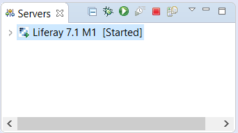

# Liferay Dev Studioにサーバーをインストールする

[TOC levels=1-4]

Liferay Dev Studioへのサーバーのインストールは簡単で、ほんの数ステップで、サーバーを稼働させることができます。サーバーをインストールするには、以下の手順に従ってください。

1. サーバービューで、*[No Servers are available]*というリンクをクリックします。サーバーが既にインストールされている場合は、[サーバー]ビューで右クリックし、*[新規]* → *[サーバー]*を選択します。
これにより、新しいサーバーを定義するプロセスのためのウィザードが表示されます。

2. 使用可能なオプションのリストから、作成するサーバーのタイプを選択します。標準サーバーの場合、*[Liferay, Inc.]*フォルダを開き、*[Liferay 7.x]*というオプションを選択します。サーバー名はサーバービューに表示される名前で、より一意な名前に変更することもできます。
*[次へ]*をクリックします。サーバーを初めて作成する場合は、以下の手順へと進みます。

   

   **注：**旧バージョンのLiferayサーバーを既に設定している場合は、*[サーバーランタイム環境]*フィールドが表示され、以前に設定したランタイム環境を選択できます。既存のサーバーを再度追加する場合は、ドロップダウンメニューからサーバーを選択します。また、*[追加]*を選択すると新しいサーバーを追加することができ、*[ランタイム環境の設定]*を選択すると既存のサーバーを編集することができます。
サーバーランタイム環境を設定したら、*[完了]*を選択します。既存のサーバーを選択した場合、サーバーのインストールは完了です。手順3〜5はスキップしてください。

3. サーバーの名前を入力します。これは、Dev Studioで使用される@product@ランタイム設定の名前であり、サーバータブで使用される表示名ではありません。

4. @product@バンドルのインストールフォルダを参照します。例として、`C:\liferay-ce-portal-7.1-m1\tomcat-8.0.32`の場合を考えてみます。

   

5. ランタイムJREを選択して、*[終了]*をクリックします。新しいサーバーがサーバービューに表示されています。

   

これで、Liferay Dev Studioでサーバーが利用可能になりました。

参考までに、Dev Studioのサーバーボタンが@product@インスタンスでどのように機能するかを以下に示します。

- *[起動]* ()：サーバーを開始します。
- *[停止]* ()：サーバーを停止します。

- *[デバッグ]* ()：デバッグモードでサーバーを起動します。Dev Studioでのデバッグの詳細については、[Debugging @product@ source in Liferay Dev Studio](/docs/7-1/tutorials/-/knowledge_base/t/debugging-product-source-in-liferay-ide)の記事を参照してください。

これで、Liferay Dev Studioでサーバーを使用する準備が完了しました。
