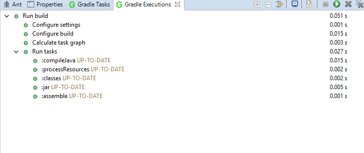

# Liferay Dev StudioでGradleを使用する

[TOC levels=1-4]

[Gradle](http://gradle.org/)は、オープンソースのビルド自動化システムです。
[Buildship](https://projects.eclipse.org/releases/photon)を利用することで、Liferay Dev StudioでGradleを最大限に活用することができます。Buildshipは、Liferay Dev StudioでGradleを使用してソフトウェアをビルドするためのサポートを提供するEclipseプラグインのコレクションで、Liferay Dev Studioバージョン3.0以降にバンドルされています。

![図1：*[ヘルプ]* → *[インストールの詳細]*に移動して、Dev Studioに含まれるプラグインを確認します。](../../../images/buildship-in-liferayide.png)

このチュートリアルでは、まずDev StudioでのGradleプロジェクトの作成について説明します。

## Gradleプロジェクトの作成とインポート

Gradle Projectウィザードを使用して、Gradleプロジェクトを作成することができます。

1. *[ファイル]* → *[新規]* → *[プロジェクト...]*に移動し、*[Gradle]* → *[Gradle Project]*を選択します。最後に、*[次へ]* → *[次へ]*をクリックします。

2. 有効なプロジェクト名を入力してください。プロジェクトの場所と作業セットを指定することもできます。

3. 必要に応じて次のページに移動し、Gradleディストリビューションおよびその他の詳細オプションを指定できます。設定が完了したら、*[完了]*を選択します。

Liferay Dev Studioで既存のGradleプロジェクトをインポートすることもできます。

1. *[ファイル]* → *[インポート...]* → *[Gradle]* → *[既存のGradleプロジェクト]* → *[次へ]* → *[次へ]*と進みます。

   

2. *[参照... ]*ボタンをクリックして、Gradleプロジェクトを選択します。

3. 必要に応じて次のページに移動し、Gradleディストリビューションおよびその他の詳細オプションを指定できます。終了したら、 もう一度*[次へ]*をクリックしてインポート設定を確認します。Gradleプロジェクトのインポートを確認したら、*[完了]*を選択します。

   

次は、Gradleのタスクと実行について解説し、Liferay Dev Studioでそれらを実行および表示する方法について説明します。

## Gradleのタスクと実行

Dev Studioには、Gradleを使用した開発エクスペリエンスを強化するために、Gradle TasksとGradle Executionsの2つのビューがあります。以下の手順に従って、これらのビューを開くことができます。

1. *[ウィンドウ]* → *[ビュー表示]* → *[その他...]*に移動します。

2. *Gradle*フォルダに移動し、*Gradle Tasks*と*Gradle Executions*を開きます。

Gradleプロジェクトを作成またはインポートすると、Gradle TasksビューとExecutionsビューが自動的に開きます。

Gradle Tasksビューでは、Gradleプロジェクトで使用できるGradleタスクを表示できます。ユーザーは、Gradleプロジェクトの下にリストされているタスクをダブルクリックして実行できます。

Gradleタスクを実行したら、Gradle Executionsビューを開いてその出力を確認できます。

Gradleプロジェクト内でGradleビルドスクリプトを変更する場合（例: `build.gradle`または`settings.gradle`）は、プロジェクトを更新して、Dev Studioが変更に対応して変更箇所がビューに適切に表示されるようにする必要があることに注意してください。Gradleプロジェクトを更新するには、プロジェクトを右クリックして、*[Gradle]* → *[Refresh Gradle Project]*を選択します。

Eclipseが自動的にGradleのプロジェクトをリフレッシュするようにしたい場合は、*[ウィンドウ]* → *[設定]* → *[Gradle]*に移動して、*[プロジェクトの自動同期]*チェックボックスを有効にします。Gradleの自動同期を単体のGradleプロジェクトのみに有効にしたい場合は、Gradleのプロジェクトを右クリックして、*[プロパティ]* → *[Gradle]*を選択し、同様に自動同期を有効にします。

 これで、Liferay Dev StudioでGradleプロジェクトを追加、インポート、ビルドすることができます。
