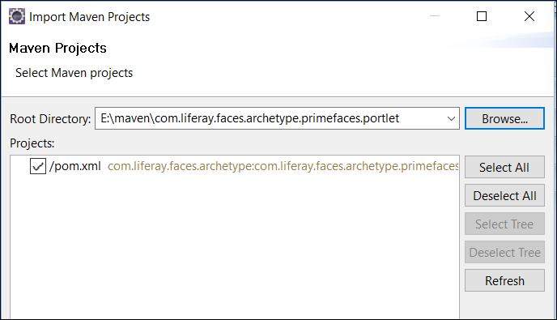

# Liferay Dev StudioでMavenを使用する

[TOC levels=1-4]

Liferay Dev Studioに組み込まれたMavenサポートを使って、Mavenを最大限に活用することができます。このチュートリアルでは、以下のトピックについて説明します。

- [Liferay Dev Studio用のMavenプラグインのインストール](#installing-maven-plugins-for-liferay-dev-studio)
- [Mavenプロジェクトの作成](#creating-maven-projects)
- [Mavenプロジェクトのインポート](#importing-maven-projects)
- [POMグラフィックエディタの使用](#using-the-pom-graphic-editor)

最初に、Dev Studioに必要なMavenプラグインをインストールします。

## Liferay Dev Studio用のMavenプラグインのインストール

Dev StudioでMavenプロジェクトを適切にサポートするには、まずMavenプロジェクトをDev Studioプロジェクトとして認識するメカニズムが必要です。Dev Studioプロジェクトは、適切なLiferayプラグインファセットを含むファセットWebプロジェクトとしてEclipseで認識されます。したがって、すべてのDev StudioプロジェクトもEclipse Webプロジェクト（Webファセットがインストールされたファセットプロジェクト）です。Dev StudioがMavenプロジェクトを認識し、プロジェクトでJava EEツール機能（サーバービューなど）を活用できるようにするには、プロジェクトが柔軟なWebプロジェクトである必要があります。Dev Studioは、以下のEclipseプラグインに依存してこの機能を提供します。

- `m2e`（Eclipse用Maven統合）
- `m2e-wtp`（WTP用Maven統合）

これらをインストールすると、@product@のMavenプロジェクトの開発を開始できます。

Liferay Dev Studioを初めてインストールするとき、インストールのスタートアップ画面では、Mavenプラグインを自動的にインストールするかどうかを選択できます。万一、セットアップ中にこの部分を見逃しても慌てないでください。以下に、Dev Studioに必要なMavenプラグインを手動でインストールする方法を説明します。

1. *[ヘルプ]* → *[新規ソフトウェアのインストール]*に移動します。*[作業]*フィールドに、以下の値を挿入します。

       Liferay IDE repository - http://releases.liferay.com/tools/ide/latest/stable/
   
2. *[Liferay IDE Mavenサポート]*オプションを確認してください。これには、@product@のMavenプロジェクトの開発を開始するために必要なすべてのMavenプラグインがバンドルされています。

   ![図1：*[Liferay IDE Mavenサポート]*オプションをインストールすることにより、Dev Studioに必要なすべてのMavenプラグインをインストールできます。

   *[Liferay IDE Mavenサポート]*オプションが表示されない場合は、すでにインストールされています。インストールされていることを確認するには、*[既にインストールされているアイテムを非表示にする]*というチェックボックスをオフにし、インストールされたプラグインのリストで*[Liferay IDE Mavenサポート]*を探します。また、*[Liferay IDE Mavenサポート]*オプションにバンドルされているすべてのものを表示したい場合は、*[カテゴリー別にアイテムをグループ化する]*というチェックボックスをオフにします。

3. *[次へ]*をクリックしてインストールの詳細を確認し、条件と免責事項に同意して、*[完了]*を選択します。

 これで、Dev Studioは@product@のMavenプロジェクトを開発する準備ができました。

次は、Dev StudioでのMavenプロジェクトの作成について説明します。

## Mavenプロジェクトの作成

Liferayが提供するMavenアーキタイプに基づいて、Mavenプロジェクトを作成できます。

1. *[ファイル]* → *[新規]* → *[Liferay Module Project]*に移動します。

2. プロジェクトに名前を付け、`Maven`のビルドタイプを選択し、使用するプロジェクトテンプレート（アーキタイプ）を選択します。

   

3. （オプション）*[次へ]*をクリックし、コンポーネントクラスとパッケージに名前を付けます。[プロパティ]メニューで、コンポーネントクラスのプロパティを指定することもできます。

4. そして、*[完了]*をクリックしたら完了です。

 これで、Mavenを使用して、Liferay Module Projectが作成されました。

MavenプロジェクトをDev Studioの外部で別のツールを使用して作成した場合、そのプロジェクトをDev Studioで管理できますが、最初にインポートする必要があります。
ここでは、その方法について説明します。

## Mavenプロジェクトのインポート

既存のMavenプロジェクトをDev Studioにインポートするには、以下の手順に従います。

1. *[ファイル]* → *[インポート]* → *[Maven]* → *[既存のMavenプロジェクト]*に移動し、*[次へ]*をクリックします。

   

2. *[参照...]*をクリックして、Mavenプロジェクトのルートフォルダを選択します。選択すると、そのプロジェクトの`pom.xml`が[プロジェクト]メニューに表示されます。

   

3. そして、*[完了]*をクリックしたら完了です。

これで、MavenプロジェクトがPackage Explorerから利用可能になりました。次は、Dev StudioのPOMグラフィカルエディタについて説明します。

### POMグラフィカルエディタの使用

Mavenプロジェクトの`pom.xml`をDev Studioで開くと、POMグラフィックエディタが提供されます。これにより、プロジェクトでMavenを活用するために以下の手段が使用できるようになります。

- **Overview：**`pom.xml`ファイルを追加および編集できるグラフィカルインターフェイスを提供します。

- **Dependencies：**プロジェクトの依存関係を追加および編集をしたり、`pom.xml`ファイルの`dependencyManagement`セクションを変更したりするためのグラフィカルインターフェイスを提供します。

- **Effective POM：**親POM、`ettings.xml`、およびMaven用のEclipseの設定とマージされたプロジェクトのPOMの読み取り専用バージョンを提供します。

- **Dependency Hierarchy：**プロジェクトの依存関係の階層ビューと、解決された依存関係のインタラクティブなリストを提供します。

- **pom.xml:** POMのソースXMLのエディタを提供します。

次の図は、`pom.xml`ファイルエディタとそのモードを示しています。

これらのインタラクティブモードを利用することで、Dev StudioはPOMとその依存関係を簡単に変更および整理できます。
