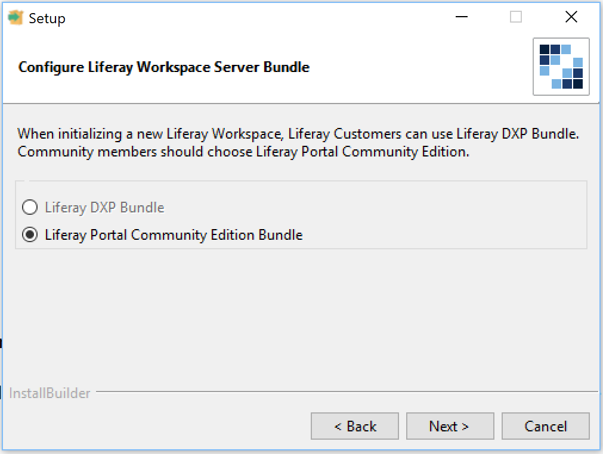

# Blade CLIのインストール

[TOC levels=1-4]

Liferay Project SDKインストーラーを使用して、Blade CLIをインストールできます。これにより、JPMとBlade CLIがお使いのユーザーホームフォルダにインストールされ、オプションで[Liferay Workspace](/docs/7-1/tutorials/-/knowledge_base/t/liferay-workspace)フォルダが初期化され ます。

| ** 注：**過去にBlade CLIをグローバルにインストールした場合（例: | `sudo`を使用した場合）、インストーラーを実行してBlade CLIバージョンを*アップデート*しないでください。
| インストーラーはBlade CLIをお使いのユーザーホームフォルダだけにインストールするため、| 以前のグローバルインストールは、インストーラーのインストールを常に上書きしてしまいます。
| したがって、常に| [Updating Blade CLI](/docs/7-1/tutorials/-/knowledge_base/t/updating-blade-cli)| チュートリアルの手順に従うようにしてください。

Blade CLIのプロキシ設定を設定する必要がある場合は、[Installing Blade CLI with Proxy Requirements](/docs/7-1/tutorials/-/knowledge_base/t/setting-blade-cli-proxy-requirments)に従ってください。

以下の手順に従って、Blade CLIをダウンロードしてインストールします。

1. 使用しているオペレーティングシステム（例: Windows、MacOS、またはLinux）に対応する最新の[Liferay Project SDKインストーラー](https://sourceforge.net/projects/lportal/files/Liferay%20IDE/)をダウンロードします。Project SDKインストーラーは*[Liferay IDE]*の下にリストされており、フォルダのバージョンはIDEリリースに基づいています。@ide@の使用を予定していない場合は、@ide@を含まないインストーラーを選択できます。Project SDKインストーラーは、バージョン3.2.0以降で使用できます。大きな緑色のダウンロードボタンを**選択しないでください**。ボタンを押してしまうと、代わりにLiferay Portalがダウンロードされてしまいます。

2. インストーラーを実行します。*[次へ]*をクリックして、インストーラーの概要を確認します。

3. Liferay Workspaceを初期化する場合、ディレクトリの場所を設定することができます。

   

   Blade CLIのみをインストールする場合は、*[Don't initialize Liferay Workspace directory]*というオプションを選択します。そして、*[次へ]*をクリックします。

4. 先に紹介した手順でLiferay Workspaceフォルダを初期化することにした場合は、ワークスペースで使用するLiferayの製品タイプを選択するための追加オプションがあります。製品タイプを選択して、*[次へ]*をクリックします。

   

5. *[次へ]*をクリックして、コンピューターへのBlade CLI/Liferay Workspaceのインストールを開始します。

 これで、Blade CLIがマシンにインストールされました。Liferay Workspaceフォルダを初期化する場所を指定した場合は、そこにフォルダがインストールされます。

| ** 注：**Liferay Project SDKインストーラーは、JPMをパスに追加しようとします。
| Windowsの場合、Windowsレジストリを使用します。Mac/Linuxの場合、`.bashrc`| または`.zshrc`がアップデートされます。
| | 少なくとも、Mac/Linuxユーザーは、新しい機能を利用できるようにするために| インストーラーの終了後に新しいシェルを開く必要があります。ただし、別の| シェル（Korn、cshなど）を使用している場合、またはCLIを`.profile`か| 他の設定ファイルからカスタマイズした場合、JPMをパスに手動で追加する必要があります。

Blade CLIは、@product-ver@アプリケーションの構築に役立つ[テンプレート](/docs/7-1/reference/-/knowledge_base/r/project-templates)を多数提供しています。また、これらのアプリをデプロイし、Liferayサーバーと対話するさまざまな方法を提供しています。詳細については、他のBlade CLIのチュートリアルも必ず参照してください。

## macOS/Linuxでのインストーラーの問題

macOSまたはLinuxを使用している場合、コマンドラインから`blade`コマンドを使用できないという問題が発生する可能性があります。これは、インストーラーがJPMの`bin`フォルダをユーザーパスに追加できないために発生します。JPMは、Blade CLIで使用されるJavaのパッケージマネージャーです。

必要な`bin`フォルダを追加するには、使っているオペレーティングシステムに基づいて以下の適切なコマンドを実行します。

macOS：

    echo 'export PATH="$PATH:$HOME/Library/PackageManager/bin"' >> ~/.bash_profile

Linux：

    echo 'export PATH="$PATH:$HOME/jpm/bin"' >> ~/.bash_profile

コマンドラインを再起動すると、`blade`コマンドが使用可能になります。
