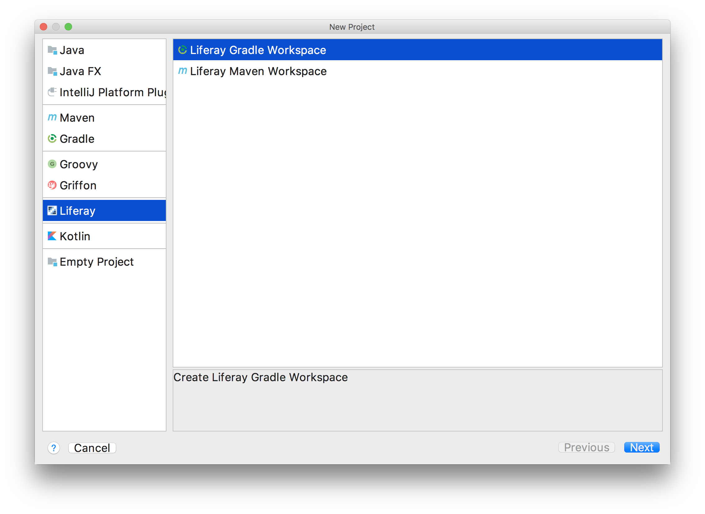

# IntelliJ IDEAでLiferay Workspaceを作成する

[TOC levels=1-4]

このチュートリアルでは、バックグラウンドで[Blade CLI](/docs/7-1/tutorials/-/knowledge_base/t/blade-cli)上で実行されるIntelliJ IDEAを使用して、Liferay Workspaceを作成する方法を説明します。IntelliJは、コマンドプロンプトの代わりにグラフィカルインターフェイスを提供し、ワークフローを合理化します。また、既存のLiferay WorkspaceをIntelliJにインポートする方法についても説明します。Liferay Workspaceの詳細については、専用の[チュートリアルセクション](/docs/7-1/tutorials/-/knowledge_base/t/liferay-workspace)を参照してください。

## Liferay Workspaceの作成

Liferay Workspaceを作成するには、以下の手順に従ってください。

1. *[ファイル]* → *[新規]* → *[プロジェクト]*を選択して、New Projectウィザードを開きます。IntelliJを初めて起動する場合は、起動時に表示されるウィンドウで*[Create New Project]*を選択すると、これを行うことができます。

2. 左側のメニューから、*[Liferay]*を選択します。

3. ワークスペースのビルドタイプ（GradleまたはMavenなど）を選択します。そして、*[次へ]*をクリックします。

   

4. ワークスペースの名前、場所、対象とする@product@バージョン、 [ターゲットプラットフォーム](/docs/7-1/tutorials/-/knowledge_base/t/managing-the-target-platform-for-liferay-workspace)、およびSDK（つまり、Java JDK）を指定します。そして、*[完了]*をクリックします。

   

5. 選択したビルドタイプ（つまり、GradleまたはMaven）の追加のビルド設定のウィンドウが開きます。設定を確認し、*[OK]*をクリックします。

 これで、IntelliJ IDEAでが正常に作成されました。

## Liferay Workspaceのインポート

既存のワークスペースをIntelliJにインポートするには、以下の手順に従います。

1. *[ファイル]* → *[新規]* → *[Project from Existing Sources...]*を選択します。

2. インポートするワークスペースを選択します。次に、*[OK]*をクリックします。

   

3. *[Import project from external model]*というラジオボタンをクリックし、ワークスペースで使用するビルドツール（例: GradleまたはMaven）を選択します。

4. プロジェクトのインポートを設定し（必要な場合）、*[完了]*をクリックします。詳細については 、IntelliJの公式ドキュメントの[Import a Project](https://www.jetbrains.com/help/idea/creating-and-managing-projects.html#importing-project)のセクションを参照してください。

5. 残りのインポートプロンプトを実行し、インポートしたワークスペースを必要に応じて（つまり、現在のウィンドウまたは新しいウィンドウで）開きます。

 これで、既存のLiferay WorkspaceがIntelliJ IDEAにインポートされました。
