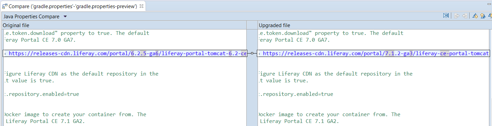

# Liferay Upgrade Planner

[TOC levels=1-4]

Liferay Upgrade Plannerでは、インストールのデータとレガシープラグインを希望する@product@のアップグレードバージョンに自動的に適合させることができます。以下のアップグレードを行う場合は、このツールを活用することをお勧めします。

- Liferay Portal 6.2 → @product@ 7.0、7.1、または7.2
- @product@ 7.0 → @product@ 7.1または7.2
- @product@ 7.1 → @product@ 7.2

上記の2つのアップグレードパスを実行するための詳細な手順については、以下のドキュメンテーションを参照してください。

- [Data Upgrade](/docs/7-2/deploy/-/knowledge_base/d/upgrading-to-product-ver)
- [Code Upgrade](/docs/7-1/tutorials/-/knowledge_base/t/upgrading-plugins-to-liferay-7)

Upgrade Plannerは、[Liferay Dev Studio](/docs/7-1/tutorials/-/knowledge_base/t/liferay-ide)（バージョン3.6以降）で提供されています。Upgrade Plannerの機能は、以下のとおりです。

<!-- Standalone app is planned, but not available yet. -->

- 使用している開発環境をアップデートします。
- APIの変更によって影響を受けるコードを識別します。
- コードに関連する各APIの変更について説明します。
- コードを適応させる方法を提案します。
- 場合によって、コードを自動的に調整するオプションを提供します。
- データベースとサーバーのデータを新しい環境に転送します。

EclipseベースのDev Studio以外のツールを使う場合でも、最初にUpgrade Plannerを使用してデータとレガシープラグインをアップグレードする必要があります。その後は希望するツールを使用できます。

Dev StudioでUpgrade Plannerを開始するには、以下の操作を行います。

1. *[プロジェクト]* → *[New Liferay Upgrade Plan...]*に移動します。

2. New Liferay Upgrade Planウィザードでプランに名前を割り当て、[Upgrade plan outline]を選択します。データとコードのアップグレードプロセスは別個なので、各プロセスを個別に実行する必要があります。

3. 現在使用しているLiferayのバージョンとアップグレードする新しいバージョンを選択します。

4. コードのアップグレードを完了することを選択した場合は、レガシープラグインが存在するフォルダ（例: Liferay 6.2プロジェクト用のPlugins SDK）も選択する必要があります。

5. そして、*[完了]*をクリックしたら完了です。

新しいLiferay Upgrade Plannerパースペクティブに切り替えます（自動的にプロンプトが表示されます）。
UIに、いくつかのウィンドウが表示されます。

- *Project Explorer:* レガシープラグイン環境と新しい開発環境を表示します。また、これは*Fix Upgrade Problems*ステップで検出された[アップグレードの問題](/docs/7-1/tutorials/-/knowledge_base/t/fixing-upgrade-problems)も表示します。
- *Liferay Upgrade Plan:* アップグレードプランのステップとそのアウトラインを説明します。
- *Liferay Upgrade Plan Info:* アップグレードのステップを説明した公式ドキュメンテーションを表示します。

アップグレードの計画を進めるには、Liferay Upgrade Planウィンドウに示されているステップをクリックします。各ステップにはオプションがいくつかあります。

- *Click to preview:* 自動ステップが実行する内容をプレビューします。
- *Click to perform:* ステップで提供される自動プロセスを実行します。これは、Upgrade Plannerが支援できるステップのみに対して提供されます。
- *Click when complete:* ステップを完了としてマークします。これは、Upgrade Plannerが自動化された支援を提供できない場合にのみ提供され、代わりにステップを手動で完了するのに役立つドキュメンテーションを提供します。
- *Restart:* 完了したステップに、未完了のマークを付けます。自動化が関係している場合、このステップが再度実行されます。
- *Skip:* ステップをスキップして、アウトラインの次のステップにジャンプします。

 Liferay Upgrade PlannerのUIと開始方法は、以上です。これらのアップグレードプロセスの詳細については、[Data Upgrade](/docs/7-2/deploy/-/knowledge_base/d/upgrading-to-product-ver)および[Code Upgrade](/docs/7-1/tutorials/-/knowledge_base/t/upgrading-plugins-to-liferay-7)のセクションを参照してください。
