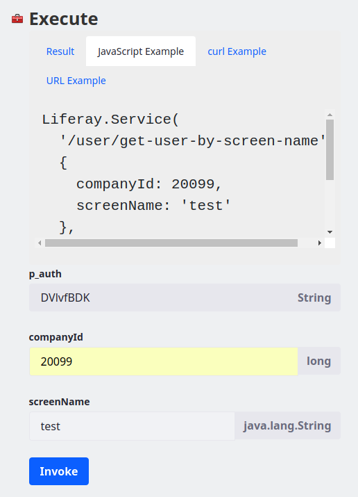

# JSON Webサービスの呼び出し

[TOC levels=1-4]

URLが分かっていてインターネットに接続できている場合は、LiferayのJSON WebサービスAPIを希望する言語で呼び出すか、URLまたは[cURL](http://curl.haxx.se/)を使って直接呼び出すことができます。さらに、LiferayのJSON Webサービスページを使って、サービスメソッドを参照して呼び出すことができます。

8080番ポートでLiferayをローカルで実行している場合は、[http://localhost:8080/api/jsonws](http://localhost:8080/api/jsonws)でJSON Webサービスページにアクセスできます。
このページを使用すると、Webサービスを呼び出すためのサンプルコードを作成できます。[Invoking Remote Services](/docs/7-1/tutorials/-/knowledge_base/t/invoking-remote-services)のチュートリアルで説明されているように、このページでサービスを呼び出すと、サービス呼び出しのJSON結果が表示されるので、*[JavaScript Example]*、*[curl Example]*、または*[URL Example]*タブをクリックすると、Webサービスを呼び出すさまざまな方法が確認できます。



このチュートリアルでは、URLを介してそれらを呼び出す方法を含め、JSON Webサービスの操作方法について詳しく説明します。

パラメータを提供する方法はさまざまあるため、JSON Webサービスを呼び出す方法も複数ありますが、このチュートリアルでは、Webサービスの呼び出しにパラメータを含める方法を紹介します。まず最初に、特にオーバーロードされたサービスメソッドの場合は、呼び出しがメソッドとどのように一致するのかを理解する必要があります。

*null*値のみを指定する場合でも、原則としてサービスメソッドの名前と`すべて`のサービスメソッドのパラメータを指定します。すべてのパラメータを提供することは重要ですが、*どのように*するのかは関係ありません（例: URL行の一部として、リクエストパラメータとして、など）。パラメータの順序も重要ではありません。

| **注：**認証に関連するトークン（`p_auth`）は、| それぞれのLiferay Webサービスの呼び出しに添付する必要があります。詳細については、| [Service Security Layers](/docs/7-1/tutorials/-/knowledge_base/t/service-security-layers)| のチュートリアルを参照してください。また、次のセクションの注記を参照して、| Liferayセッションに対応する`p_auth`トークン値の見つけ方を確認してください。

ただし、*すべて*のパラメータが必要であるというルールには、例外があります。数値*ヒント*を使用してメソッドを一致させる場合は、すべてのパラメータが必要というわけではありません。次に、ヒントを使用する方法について説明します。

## URLを介したサービスの呼び出しでヒントを使用する

数値ヒントは、サービスが持つメソッド引数の数を指定します。構文的には、メソッド名にドットで区切られた数字としてヒントを追加できます。以下に例を示します。

    /foo/get-bar.2/param1/123/-param2

ここでは、`.2`が数値ヒントで、2つの引数を持つサービスメソッドのみが一致するように指定しており、他のものは照合のために無視されます。

ヒントを使用したマッチングとヒントを使用しないマッチングには、重要な区別があります。ヒントが指定されている場合、すべてのパラメータを指定する必要はありません。欠落している引数は、すべて`null`として扱われます。上記の例では、以下のように呼び出すことができます。

    /foo/get-bar.2/param1/123

この例では、`param2`は自動的に`null`に設定されています。

以下は、Liferayでの実際の例です。

    http://localhost:8080/api/jsonws/bookmarks.bookmarksfolder/add-folder.4/parent-folder-id/0/name/News?p_auth=[value]

この例では、ヒントの数は`4`です。`parentFolderId`、`name`、`description`、および`p_auth`の4つのパラメータがあるからです。`description`パラメータが省略されているので、その値は`null`であると仮定できます。`3`または`5`など、別のヒント数でこのWebサービスを呼び出そうとすると、その数のパラメータを取る`bookmarks/add-folder`メソッドがないため、例外が発生します。認証パラメータの`p_auth`は、Liferayセッションに関連付けられています。詳細については、以下を参照してください。

| **重要：**| ブラウザにURLを入力してLiferay Webサービスを呼び出す場合は、| Webサービスを呼び出す権限を持つアカウントでLiferayにログインする必要があります。また、認証トークンをURL| パラメータとして提供する必要があります。この認証トークンはブラウザセッションに関連付けられており、| `p_auth`と呼ばれます。この認証トークンを使用すると、CSRF攻撃を防ぐことができます。

以下に、`p_auth`トークンを見つけるための簡単な方法を2つ紹介します。

1. LiferayのJSON Webサービスページに移動し、[サービスメソッド]をクリックします。`p_auth`トークンの値は、[実行]ヘッダーの下に表示されます。

2. JavaScriptコンテキストから作業していて、`Liferay`オブジェクトにアクセスできる場合、`Liferay.authToken`を呼び出すと`p_auth`パラメータの値が提供されます。

たとえば、`p_auth`パラメータの値が`n35K1pb2`の場合、前述のURLの例を以下のように呼び出すことができます。

    http://localhost:8080/api/jsonws/bookmarks.bookmarksfolder/add-folder.4/parent-folder-id/0/name/News?p_auth=n35K1pb2

分かりやすくするために、このチュートリアルの残りの部分では、Webサービスを呼び出すためのURLの例から`p_auth`パラメータを省略します。ブラウザからサービスを呼び出す場合は、このパラメータを含める必要があることに注意してください。

次に、URLパスの一部としてパラメータを渡す方法を説明します。

## URLパスの一部としてパラメータを渡す

サービスURLの後に名前と値のペアでパラメータを指定します。パラメータ名は、キャメルケースからすべて小文字のダッシュ区切りの名前に変換することにより、メソッド引数名から作成する必要があります。たとえば、以下は指定したサイトからトップレベルのブックマークフォルダをすべて返します。

    http://localhost:8080/api/jsonws/bookmarks.bookmarksfolder/get-folders/group-id/20181/parent-folder-id/0

パラメータは任意の順序で渡すことができるので、メソッドシグネチャの引数の順序に従う必要はありません。

メソッド名がオーバーロードされた場合は、*最も適合するもの*を使用します。つまり、未定義の引数が最も少ないメソッドが選択され、呼び出されます。

URLクエリでパラメータを渡すこともできます。次のセクションでは、このデプロイ方法を説明します。

## パラメータをURLクエリとして渡す

パラメータをリクエストパラメータとして渡すには、そのままの状態で指定し（キャメルケース）、引数値に等しく設定します。以下に例を示します。

    http://localhost:8080/api/jsonws/bookmarks.bookmarksfolder/add-folder?parentFolderId=0&name=News&description=news

URLパスの一部としてパラメータを渡す場合と同様に、パラメータの順序は重要ではなく、オーバーロードされたメソッドに最善一致のルールが適用されます。

これで、パラメータを渡すためのいくつかの異なる方法がわかりました。また、URLパラメータを混在させて渡すこともできます。たとえば、一部のパラメータをURLパスの一部とし、残りはリクエストパラメータとして指定することができます。

パラメータ値は、HTTPプロトコルを使用して文字列として送信されます。一致するJavaサービスメソッドが呼び出される前に、それぞれのパラメータ値が`String`からターゲットのJava型に変換されます。Liferayは、サードパーティのオープンソースライブラリを使用して、各オブジェクトを適切な共通タイプに変換します。特定の型の変換を追加、または変更することも可能ですが、このチュートリアルでは標準の変換プロセスのみを扱います。

一般的な型の変換（例: `long`、`String`、`boolean`）は、直接起こります。日付はミリ秒単位で指定できます。ロケールは、ロケール名（例: `en`や`en_US`）として渡すことができます。数字の配列を渡すには、コンマ区切りの数字の文字列を送信します（例: `4,8,15,16,23,42`という文字列をl`ong[]`型に変換できます）。

一般的な型に加えて、引数は`List`型または`Map`型にすることもできます。`List`型の引数を渡すには、JSON配列を送信します。`Map`型の引数を渡すには、JSONオブジェクトを送信します。これらの型の変換は、以下の2つのステップで実行されます。

- *手順1--JSONの逆シリアル化*：JSON配列は`List<String>`に変換され、JSONオブジェクトは`Map<String, String>`に変換されます。セキュリティ上の理由から、JSONの逆シリアル化で任意の型をインスタンス化することは禁止されています。
- *手順2--ジェネリック化*：`List` および`Map`のそれぞれの`String`要素は、ターゲット型（メソッドシグネチャで指定された引数のジェネリックのJava型）に変換されます。このステップは、Javaの引数型がジェネリックを使用する場合にのみ実行されます。

例として、`String`配列の`[en,fr]`をJavaメソッド引数型である`List<Locale>`のJSON Webサービスパラメータとして変換する場合について考えてみます。

- *手順1--JSONの逆シリアル化*：JSON配列は、`en`および`fr`の`String`を含む`List<String>` へと逆シリアル化されます。

- *手順2--ジェネリック化*：それぞれの`String`が`Locale`（ジェネリック型）に変換され、Java引数型の`List<Locale>`になります。

次に、引数を`null`として指定する方法を説明します。

## Null値の送信

引数に`null`値を渡すには、パラメータ名の前にダッシュを付けます。
以下に例を示します。

    http://localhost:8080/api/jsonws/bookmarks.bookmarksfolder/add-folder/parent-folder-id/0/name/News/-description

URLパスパラメータの代わりに、URLクエリパラメータを使用した同様の例を以下に示します。

    http://localhost:8080/api/jsonws/bookmarks.bookmarksfolder/add-folder?parentFolderId=0&name=News&-description

`description`パラメータは、`null`として解釈されます。このパラメータは、URLの最後にある必要はないことに注意してください。

Nullパラメータには、指定された値がありません。Nullパラメータがリクエストパラメータとして渡されると、その値は無視され、代わりに`null`が使用されます。

    <input type="hidden" name="-description" value=""/>

JSON-RPCを使用する場合（以下のJSON-RPCセクションを参照）、接頭辞がなくてもnull値を明示的に送信できます。以下に例を示します。

    "description":null

次に、エンコードパラメータについて説明します。

## エンコードパラメータ

URLのエンコーディングとクエリ（つまり、リクエストパラメータ）のエンコーディングでは、スペース文字のエンコード方法が異なります。スペース文字がURLパスの一部である場合、`%20`としてエンコードされます。一方、クエリの一部である場合は、プラス記号（`+`）としてエンコードされます。

これらのエンコード規則はすべて、ASCII文字および国際（非ASCII）文字に適用されます。LiferayはUTF-8モードで動作するため、パラメータ値はUTF-8値としてエンコードする必要があります。LiferayはWebサーバーに依存しており、リクエストURLおよびリクエストパラメータ値をUTF-8自体にデコードしません。JSON-RPCを介してサービスにアクセスする場合、UTF-8へのエンコードパラメータでは十分ではありません。エンコードタイプをContent-Typeヘッダー（例: `Content-Type : "text/plain; charset=utf-8"`）で送信する必要があります。

たとえば、"&#1057;&#1091;&#1087;&#1077;&#1088;"という値（キリル語で "Super"）をJSON Webサービスメソッドに渡すとします。この名前は最初にUTF-8に変換され（10バイトの配列になります）、次にURLまたはリクエストパラメータ用にエンコードされる必要があります。結果の値は、`%D0%A1%D1%83%D0%BF%D0%B5%D1%80`という文字列で、サービスメソッドに渡すことができます。受信すると、この値は最初に10バイトの配列に変換（URLデコード）され、次に元々の5文字のUTF-8文字列に変換されます。

次に、ファイルを引数として送信する方法を説明します。

## 引数としてファイルを送信する

ファイルは、マルチパートのフォームとリクエストを使用してアップロードできます。以下に例を示します。

    <form
    action="http://localhost:8080/api/jsonws/dlapp/add-file-entry"
    method="POST"
    enctype="multipart/form-data">
    <input type="hidden" name="repositoryId" value="10172"/>
    <input type="hidden" name="folderId" value="0"/>
    <input type="hidden" name="title" value="test.jpg"/>
    <input type="hidden" name="description" value="File upload example"/>
    <input type="hidden" name="changeLog" value="v1"/>
    <input type="file" name="file"/>
    <input type="submit" value="addFileEntry(file)"/>
    </form>

これは、`DLAppService`クラスの`addFileEntry`メソッドを呼び出す一般的なアップロードフォームです。

ここでは、JSON-RPCを使用してJSON Webサービスを呼び出す方法を説明します。

## JSON-RPC

[JSON-RPC](http://json-rpc.org)を使用すると、JSON Webサービスを呼び出すことができます。JSON-RPC 2.0のほとんどは、Liferay JSON Webサービスでサポートされています。ただし、大きな制限が一つあります。それは、*名前付き*パラメータとしてパラメータを渡す必要があることです。オーバーロードされたメソッドが多すぎて、位置パラメータを簡単に使用できないため、位置パラメータはサポートされていません。

JSON-RPCを使用して、JSON Webサービスを呼び出す例を以下に示します。

    POST http://localhost:8080/api/jsonws/dlapp
    {
    "method":"get-folders",
    "params":{"repositoryId":10172, "parentFolderId":0},
    "id":123,
    "jsonrpc":"2.0"
    }

次に、デフォルトでJSON Webサービスを保護するために使用可能になっているパラメータについて説明します。

## デフォルトのパラメータ

セキュアなJSON Webサービス（つまり、ユーザー認証が必要なサービス）にアクセスする場合、デフォルトでパラメータの一部がWebサービスで利用可能になります。LiferayのWebサービスはすべてデフォルトで保護されており、使用可能なパラメータの値をデフォルト以外に変更する場合を除き、明示的に指定する必要はありません。

使用可能なデフォルトのパラメータは以下のとおりです。

- `userId`: 認証されたユーザーのプライマリキー
- `user`: 完全なユーザーオブジェクト
- `companyId`: ユーザーの会社のプライマリキー
- `serviceContext`: 空のサービスコンテキストオブジェクト

次は、オブジェクトパラメータについて説明します。

## オブジェクトパラメータ

ほとんどのサービスは、数字や文字列などの単純なパラメータを受け入れますが、サービスパラメータとしてオブジェクト（非単純型）を提供する必要がある場合があります。

オブジェクトパラメータのインスタンスを作成するには、パラメータの前にプラス記号（`+`）を付け、他のパラメータ値を割り当てないでください。これは、パラメータの前にダッシュ記号（`-`）を付けてヌルパラメータを指定することに似ています-。

以下に例を示します。

    /jsonws/foo/get-bar/zap-id/10172/start/0/end/1/+foo

オブジェクトパラメータのインスタンスをリクエストパラメータとして作成するには、必ず`+`記号をエンコードしてください。

    /jsonws/foo/get-bar?zapId=10172&start=0&end=1&%2Bfoo

代替構文は、以下のとおりです。

    <input type="hidden" name="+foo" value=""/>

パラメータが抽象クラスまたはインターフェイスである場合、そのままインスタンス化することはできません。代わりに、具体的な実装クラスを指定して、引数値を作成する必要があります。これを行うには、パラメータ名の前に接頭辞の`+`を指定し、その後に具体的な実装クラスを指定します。以下に例を示します。

    /jsonws/foo/get-bar/zap-id/10172/start/0/end/1/+foo:com.liferay.impl.FooBean

以下は同じ内容を別の方法で行ったものです。

    <input type="hidden" name="+foo:com.liferay.impl.FooBean" value=""/>

上記の例では、`foo`という名前のパラメータのクラスを実装すると推定される`com.liferay.impl.FooBean`オブジェクトが作成されることを指定しています。

具体的な実装を値として設定することもできます。以下に例を示します。

    <input type="hidden" name="+foo" value="com.liferay.impl.FooBean"/>

JSON-RPCでは、以下のようになります。

    "+foo" : "com.liferay.impl.FooBean"

上記のすべての例では、`foo`というサービスメソッドパラメータの具体的な実装を指定しています。

オブジェクトパラメータを渡すと、オブジェクトを設定することができます。
以下でその詳細を説明します。

## 内部パラメータ

オブジェクトパラメータを渡す場合、多くの場合はその内部パラメータ（つまり、フィールド）を設定する必要があります。ここでは、例として`ServiceContext`型のデフォルトパラメータである`serviceContext`を取り扱います。JSONWSを適切に呼び出すには、`serviceContext`パラメータの`addGroupPermissions`および`scopeGroupId`フィールドを設定する必要がある場合がありますが、

ドット表記を使用して指定することにより、内部パラメータを渡すことができます。パラメータの名前にドット（つまり、ピリオド`.`）を追加し、その後に内部パラメータの名前を続けます。前述の`ServiceContext`の内部パラメータには、`serviceContext.addGroupPermissions`および`serviceContext.scopeGroupId`を指定します。これらは内部パラメータとして認識され、APIのサービスメソッドが実行される前にその値が既存のパラメータに注入されます。

内部パラメータは、マッチングメソッドの通常のパラメータとしてはカウントされず、マッチング中は無視されます。

上記のJSON-RPCオブジェクトパラメータの例を拡張するには、その内部パラメータを以下のように移入します。

    "+foo" : "com.liferay.impl.FooBean",
    "foo.field1" : "test",
    "foo.field2" : "true",
    "foo.field3" : 123

以下のように、JavaScriptの場合も同じです（`com.liferay.impl.FooBean`型の1つの引数を受け入れる`foo`コンテキストの下にリモートサービスがあり、指定されたフィールドがあることを前提としています）。

```javascript
    Liferay.Service(
        '/foo/update-foo',
	{
            "+foo": "com.liferay.impl.FooBean",
	    "foo.field1" : "test",
	    "foo.field2" : "true",
	    "foo.field3": 123
        },
        function(obj) {
            console.log(obj);
        }
    );
```

| **ヒント：**内部パラメータをオブジェクトパラメータとともに使用して、| 作成されたオブジェクトパラメータインスタンスの内部コンテンツを設定します。

次に、JSON Webサービスが呼び出されたときに返される値を調べます。

## 戻り値

JSON Webサービスは呼び出し方に関わらず、サービスメソッドの結果を表すJSON文字列を返します。返されたオブジェクトは、JSON文字列に*大まかに*シリアル化され、呼び出し元に返されます。

以下に例を示します。簡単にするために、ここではブラウザのJSON Webサービスで提供されるテストフォームを使用します。

1. 管理者としてローカルのLiferayインスタンスにサインインしてから、ブラウザで`BookmarksFolder`追加するJSON Webサービスメソッドを以下のように指定します。

       http://localhost:8080/api/jsonws?contextName=bookmarks&signature=%2Fbookmarks.bookmarksfolder%2Fadd-folder-4-parentFolderId-name-description-serviceContext
   
   または、`http://localhost:8080/api/jsonws`から開始し、*[BookmarksFolder]*のセクションまでスクロールします。そして、*[add-folder]*をクリックします。

2. `[parentFolderId]`フィールドに`0`を入力します。最上位のブックマークフォルダの`[parentFolderId]`の値は`0`です。名前は、*[News]*などの任意の値に設定します。説明には、*[JSON WS経由で作成]*といった内容を入力します。

3. *[呼び出し]*をクリックすると、以下のような結果が表示されます。

       {
       "companyId": "20202",
       "createDate": 1459969296960,
       "description": "Created via JSON WS",
       "folderId": "31001",
       "groupId": "20233",
       "lastPublishDate": null,
       "modifiedDate": 1459969297005,
       "name": "News",
       "parentFolderId": "0",
       "resourceBlockId": "1",
       "status": 0,
       "statusByUserId": "0",
       "statusByUserName": "",
       "statusDate": null,
       "treePath": "/31001/",
       "userId": "20250",
       "userName": "Joe Bloggs",
       "uuid": "0682170c-f9d7-f295-aa67-26ceea37a6e5"
       }
   
返される`String`は、作成した`BookmarksFolder`オブジェクトをJSON文字列にシリアル化したものです。JSON文字列の詳細については、[json.org](http://www.json.org/)を参照してください。Liferayでは、開発者がJSONオブジェクトと配列を作成し、JSON文字列をシリアル化および逆シリアル化し、その他のJSON関連の操作を実行できる[`JSONFactory`](https://github.com/liferay/liferay-portal/blob/7.1.x/portal-kernel/src/com/liferay/portal/kernel/json/JSONFactory.java)というサービスを提供していることにも注意してください 。

## 一般的なJSON Webサービスのエラー

JSON Webサービスを使用しているときに、エラーが発生する場合があります。以下は、一般的なエラーのリストです。

- *Authenticated access required*

   このエラーが表示される場合、リモートサービスを呼び出す権限がないことを意味します。適切な権限を持つユーザーとしてサインインしていることを再度確認してください。必要に応じて、管理者としてサインインしてリモートサービスを呼び出します。

- *Missing value for parameter*

   このエラーが表示された場合は、URLパスにパラメータ名と共にパラメータ値を渡していないことを意味します。パラメータ値はパラメータ名の後に続ける必要があります。
例えば、以下のパスには間違いがあります。

       /api/jsonws/user/get-user-by-id/userId
   
   このパスでは、`userId`という名前のパラメータを指定していますが、パラメータの値は指定していません。以下のようにパラメータ名の後にパラメータ値を指定すると、このエラーを解決できます。

       /api/jsonws/user/get-user-by-id/userId/173
   
- *No JSON web service action associated*

   このエラーは、提供されたデータ（メソッド名と引数名）と一致するサービスメソッドがなかったことを意味します。これには、さまざまな理由が考えられます。
たとえば、引数のつづりが間違っていたり、メソッド名の形式の誤っている可能性があります。JSON Webサービスは基礎となるJava APIを反映するため、そこでの変更は自動的にJSON Webサービスに反映されます。たとえば、新しい引数がメソッドに追加された場合、あるいは既存の引数がメソッドから削除された場合に、パラメータのデータは新しいメソッドシグネチャと一致する必要があります。

- *Unmatched argument type*

   このエラーは、互換性のない引数タイプを使用してメソッド引数をインスタンス化しようとすると表示されます。

## 関連トピック

[JSON Web Services Invoker](/docs/7-1/tutorials/-/knowledge_base/t/json-web-services-invoker)

[Service Security Layers](/docs/7-1/tutorials/-/knowledge_base/t/service-security-layers)

[Invoking Remote Services](/docs/7-1/tutorials/-/knowledge_base/t/invoking-remote-services)
