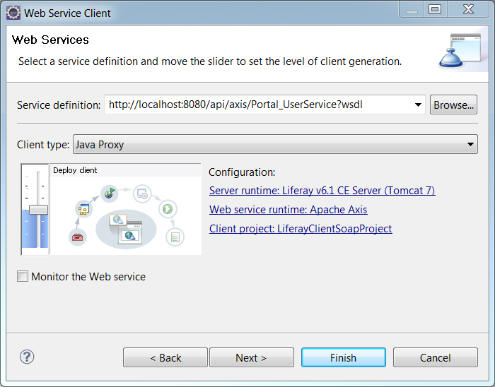

# SOAP Webサービス

[TOC levels=1-4]

LiferayのWebサービスは、HTTP上のSimple Object Access Protocol（SOAP）を介してアクセスできます。パッケージングプロトコルはSOAPで、トランスポートプロトコルはHTTPです。

| ** 注：**それぞれのLiferay Webサービスの| 呼び出しには、認証トークンが必要です。詳細については、| [Service Security Layers](/docs/7-1/tutorials/-/knowledge_base/t/service-security-layers)のチュートリアルを参照してください。

ここでは、例として、Liferayの`Company`、`User`、およびこれらのタスクを実行する`UserGroup`サービスのSOAP Webサービスクライアントの例を取り扱います。

1. *test*というスクリーンネームを持つユーザーが属する各ユーザーグループを一覧表示します。

2. *MyGroup*という名前の新しいユーザーグループを追加します。

3. Liferayインスタンスの管理ユーザーを新しいユーザーグループに追加します。具体的な方法を示すめに、ここでは`test@liferay.com`というメールアドレスを持つ管理ユーザーを使用します。

そして、以下のSOAP関連クラスを使用します。

    import com.liferay.portal.kernel.model.CompanySoap;
    import com.liferay.portal.kernel.model.CompanySoap;
    import com.liferay.portal.kernel.model.UserGroupSoap;
    import com.liferay.portal.kernel.model.UserGroupSoap;
    import com.liferay.portal.service.http.CompanyServiceSoap;
    import com.liferay.portal.service.http.CompanyServiceSoapServiceLocator;
    import com.liferay.portal.service.http.UserGroupServiceSoap;
    import com.liferay.portal.service.http.UserGroupServiceSoapServiceLocator;
    import com.liferay.portal.service.http.UserServiceSoap;
    import com.liferay.portal.service.http.UserServiceSoapServiceLocator;

 これらのクラスは、`-ServiceSoapServiceLocator`、`-ServiceSoap`、あるいは`-Soap`のいずれかを接頭辞として持っています。`-ServiceSoapServiceLocator`クラスは、提供されるサービスのURLを経由して`-ServiceSoap`クラスを探し出します。`-ServiceSoap`クラスは、各サービスのWebサービス記述言語（WSDL）ファイルで指定されたサービスのインタフェースです。`-Soap`クラスは、シリアル化が可能なモデルの実装です。

次に、これらのサービスのURLの決定方法について見ていきます。ブラウザで以下のURLを開くと、Liferayインスタンスにデプロイされているサービスのリストを表示することができます。

    http://[host]:[port]/api/axis

このURLは、ポータルコンテキストのサービスのみをリストすることに注意してください。Liferayインスタンスで他のコンテキストのサービスを見つける方法については、[Creating Remote Services](/docs/7-1/tutorials/-/knowledge_base/t/creating-remote-services)のチュートリアルにある「SOAP」というセクションを参照してください。

SOAPサービスを表示しているコンテキストに関係なく、各Webサービスはその名前、操作、WSDLファイルへのリンクとともにリストされます。たとえば、`UserGroup`にリストされているセキュアWebサービスのリストは以下のとおりです。

- `Portal_UserGroupService` (wsdl)
   - `addGroupUserGroups`
   - `addTeamUserGroups`
   - `addUserGroup`
   - `deleteUserGroup`
   - `fetchUserGroup`
   - `getUserGroup`
   - `getUserGroups`
   - `getUserUserGroups`
   - `unsetGroupUserGroups`
   - `unsetTeamUserGroups`
   - `updateUserGroup`

これらのメソッドの一部は、オーバーロードされていることに注意してください。

LiferayはService Builderを使用して、JSONおよびSOAP Webサービスインターフェイスを自動的に作成します。Service Builderを使用したことがない場合は、この[入門チュートリアル](/docs/7-1/tutorials/-/knowledge_base/t/what-is-service-builder)を参照してください。

WSDLファイルはXMLで記述されており、Webサービスを記述および検索するためのモデルを提供します。以下は、`UserGroup`の`addUserGroup`操作でのWSDLの抜粋部分です。

    <wsdl:operation name="addUserGroup" parameterOrder="name description">
    <wsdl:input message="intf:addUserGroupRequest" name="addUserGroupRequest"/>
    <wsdl:output message="intf:addUserGroupResponse" name="addUserGroupResponse"/>
    </wsdl:operation>

サービスを使用するには、サービスのSOAPサービスロケーターにログイン資格情報とともにWSDL URLを渡します。以下のセクションでは、この例を取り扱います。

## SOAP Javaクライアント

次に、LiferayのSOAP Webサービスを呼び出す方法について説明します。ここでは、例として、EclipseでJava Webサービスクライアントを設定し、SOAP Webサービスを呼び出します。Eclipseの「Webサービスクライアント」ウィザードを使用して、新しいWebサービスクライアントのプロジェクトを作成するか、既存のプロジェクトにクライアントを追加することができます。クライアントコードで使用するサービスごとに、プロジェクトに新しいWebサービスクライアントを追加する必要があります。この例では、Liferayの`Company`、`User`、および`UserGroup`サービスを呼び出すためにWebサービスクライアントを構築します。

Eclipseで新しいWebサービスクライアントのプロジェクトを作成するには、*[ファイル]* → *[新規]* → *[その他...]*とクリックし、[Webサービス]というカテゴリを開きます。*[Webサービスクライアント]*を選択します。

作成するクライアントごとに、目的のサービスのサービス定義（WSDL）を入力するよう求められます。この例でのWebサービスクライアントは、Liferayの`Company`、`User`、および`UserGroup`サービスが必要であるため、以下のWSDLを入力します。

    http://localhost:8080/api/axis/Portal_CompanyService?wsdl
    
    http://localhost:8080/api/axis/Portal_UserService?wsdl
    
    http://localhost:8080/api/axis/Portal_UserGroupService?wsdl

WSDLを指定すると、EclipseはそのWebサービスを使用するために必要な補助ファイルとライブラリを自動的に追加します。上記のいずれかのWSDLを使用してWebサービスクライアントプロジェクトを作成したら、残りのWSDLを使用してプロジェクトに追加のクライアントを作成する必要があります。既存のプロジェクトに追加のクライアントを作成するには、対象のプロジェクトを右クリックして、*[新規]* → *[その他]* → *[Webサービスクライアント]*を選択します。*[次へ]*をクリックしてWSDLを入力し、ウィザードを完了します。

以下のコードは、`MyUserGroup`という名前の新しいユーザーグループを作成し、*test*というスクリーン名のユーザーを追加する操作を見つけて呼び出します。Webサービスのクライアントプロジェクトに`LiferaySoapClient.java`ファイルを作成し、このコードを追加します。このコードで指定されているパッケージ以外のパッケージにこのクラスを作成する場合は、そのパッケージを自分のパッケージに置き換えます。Eclipseからクライアントを実行するには、Liferayサーバーが実行されていることを確認し、`[LiferaySoapClient.java]`クラスを右クリックして、*[Javaアプリケーションとして実行]*を選択します。コンソールをチェックして、サービスコールが成功したことを確認してください。

    package com.liferay.test;
    
    import java.net.URL;
    
    import com.liferay.portal.kernel.model.CompanySoap;
    import com.liferay.portal.kernel.model.UserGroupSoap;
    import com.liferay.portal.service.http.CompanyServiceSoap;
    import com.liferay.portal.service.http.CompanyServiceSoapServiceLocator;
    import com.liferay.portal.service.http.UserGroupServiceSoap;
    import com.liferay.portal.service.http.UserGroupServiceSoapServiceLocator;
    import com.liferay.portal.service.http.UserServiceSoap;
    import com.liferay.portal.service.http.UserServiceSoapServiceLocator;
    
    public class LiferaySoapClient {
    
    public static void main(String[] args) {
    
    try {
    String remoteUser = "test";
    String password = "test";
    String virtualHost = "localhost";
    
    String groupName = "MyUserGroup";
    
    String serviceCompanyName = "Portal_CompanyService";
    String serviceUserName = "Portal_UserService";
    String serviceUserGroupName = "Portal_UserGroupService";
    
    long userId = 0;
    
    // Locate the Company
    CompanyServiceSoapServiceLocator locatorCompany =
    new CompanyServiceSoapServiceLocator();
    
    CompanyServiceSoap soapCompany =
    locatorCompany.getPortal_CompanyService(
    _getURL(remoteUser, password, serviceCompanyName,
    true));
    
    CompanySoap companySoap =
    soapCompany.getCompanyByVirtualHost(virtualHost);
    
    // Locate the User service
    UserServiceSoapServiceLocator locatorUser =
    new UserServiceSoapServiceLocator();
    UserServiceSoap userSoap = locatorUser.getPortal_UserService(
    _getURL(remoteUser, password, serviceUserName, true));
    
    // Get the ID of the remote user
    userId = userSoap.getUserIdByScreenName(
    companySoap.getCompanyId(), remoteUser);
    System.out.println("userId for user named " + remoteUser +
    " is " + userId);
    
    // Locate the UserGroup service
    UserGroupServiceSoapServiceLocator locator =
    new UserGroupServiceSoapServiceLocator();
    UserGroupServiceSoap usergroupsoap =
    locator.getPortal_UserGroupService(
    _getURL(remoteUser, password, serviceUserGroupName,
    true));
    
    // Get the user's user groups
    UserGroupSoap[] usergroups = usergroupsoap.getUserUserGroups(
    userId);
    
    System.out.println("User groups for userId " + userId + " ...");
    for (int i = 0; i < usergroups.length; i++) {
    System.out.println("\t" + usergroups[i].getName());
    }
    
    // Adds the user group if it does not already exist
    String groupDesc = "My new user group";
    UserGroupSoap newUserGroup = null;
    
    boolean userGroupAlreadyExists = false;
    try {
    newUserGroup = usergroupsoap.getUserGroup(groupName);
    if (newUserGroup != null) {
    System.out.println("User with userId " + userId +
    " is already a member of UserGroup " +
    newUserGroup.getName());
    userGroupAlreadyExists = true;
    }
    } catch (Exception e) {
    // Print cause, but continue
    System.out.println(e.getLocalizedMessage());
    }
    
    if (!userGroupAlreadyExists) {
    newUserGroup = usergroupsoap.addUserGroup(
    groupName, groupDesc);
    System.out.println("Added user group named " + groupName);
    
    long users[] = {userId};
    userSoap.addUserGroupUsers(newUserGroup.getUserGroupId(),
    users);
    }
    
    // Get the user's user groups
    usergroups = usergroupsoap.getUserUserGroups(userId);
    
    System.out.println("User groups for userId " + userId + " ...");
    for (int i = 0; i < usergroups.length; i++) {
    System.out.println("\t" + usergroups[i].getName());
    }
    }
    catch (Exception e) {
    e.getLocalizedMessage();
    }
    }
    
    private static URL _getURL(String remoteUser, String password,
    String serviceName, boolean authenticate)
    throws Exception {
    
    // Unauthenticated url
    String url = "http://localhost:8080/api/axis/" + serviceName;
    
    // Authenticated url
    if (authenticate) {
    url = "http://" + remoteUser + ":" + password
    + "@localhost:8080/api/axis/"
    + serviceName;
    }
    
    return new URL(url);
    }
    
    }

このクライアントを実行すると、以下のような出力が作成されます。

    userId for user named test is 10196
    User groups for user 10196 ...
    java.rmi.RemoteException: No UserGroup exists with the key {companyId=10154,
    name=MyUserGroup}
    Added user group named
    Added user to user group named MyUserGroup
    User groups for user 10196 ...
    MyUserGroup

上記の出力は、ユーザーにはグループがなかったことと`MyUserGroup`というユーザーグループに追加されたことを示しています。

 上記の出力を見ると、`java.rmi.RemoteException:`というエラーがスローされていることが分かります。これは、`UserGroup`が作成される前に`UserGroup`が呼び出されるためにスローされます。この出力の次の行には、`Added user group named...`が表示されているため、問題ありません。これで、SOAP Webサービスの呼び出しが機能します。

上記の例では、注意すべき点がいくつかあります。

- 認証はHTTPのBasic認証を使用して行われますが、パスワードは暗号化されていないため、本番環境には適していません。
この例では、便宜上の理由で使用されています。本番環境では、SSLを使用する必要があります。Liferayの[`portal.properties`](@platform-ref@/7.1-latest/propertiesdoc/portal.properties.html)ファイルを参照し、詳細については`company.security.auth.requires.https`および`web.server.protocol`プロパティを参照してください。
- スクリーン名とパスワードは、資格情報としてURLで渡されます。
- サービスの名前（例: `Portal_UserGroupService`）は、URLの最後で指定されます。サービス名はWebサービスのリストに記載されています。

操作の`getCompanyByVirtualHost()`、`getUserIdByScreenName()`、`getUserUserGroups()`、`addUserGroup()`、および`addUserGroupUsers()`は、WSDLファイルにある`-ServiceSOAP`クラスの`CompanyServiceSoap`、`UserServiceSoap`、および`UserGroupServiceSoap`に対して指定されます。パラメータタイプ、パラメータの順序、リクエストタイプ、レスポンスタイプ、および戻り値のタイプに関する情報は、各Liferay WebサービスのWSDLで指定されています。

次に、PHPでWebサービスクライアントを実装する方法について説明します。

## SOAP PHPクライアント

クライアントは、Webサービスの呼び出しをサポートする任意の言語で作成することができます。
以下のコード例は、前と同じ操作を呼び出しますが、Javaの代わりにPHPとPHP SOAPクライアントを使用しています。

    <?php
    $userGroupName = "MyUserGroup2";
    $userName = "test";
    $clientOptions = array('login' => $userName, 'password' => 'test');
    
    // Add user group
    $userGroupClient = new
    SoapClient(
    "http://localhost:8080/api/axis/Portal_UserGroupService?wsdl",
    $clientOptions);
    $userGroup = $userGroupClient->addUserGroup($userGroupName,
    "This user group was created by the PHP client!");
    print ("User group ID is $userGroup->userGroupId ");
    
    // Add user to user group
    $companyClient = new SoapClient(
    "http://localhost:8080/api/axis/Portal_CompanyService?wsdl",
    $clientOptions);
    $company = $companyClient->getCompanyByVirtualHost("localhost");
    $userClient = new SoapClient(
    "http://localhost:8080/api/axis/Portal_UserService?wsdl",
    $clientOptions);
    $userId = $userClient->getUserIdByScreenName($company->companyId,
    $userName);
    print ("User ID for $userName is $userId ");
    $users = array($userId);
    $userClient->addUserGroupUsers($userGroup->userGroupId, $users);
    
    // Print the user groups to which the user belongs
    $userGroups = $userGroupClient->getUserUserGroups($userId);
    print ("User groups for user $userId ... ");
    foreach($userGroups as $ug)
    print ("$ug->name, $ug->userGroupId ")
    ?>

SOAP Webサービスをサポートする任意の言語であれば、Webサービスクライアントを実装できることを覚えておいてください。

## 関連トピック

[Service Security Layers](/docs/7-1/tutorials/-/knowledge_base/t/service-security-layers)

[Creating Remote Services](/docs/7-1/tutorials/-/knowledge_base/t/creating-remote-services)

[Invoking Remote Services](/docs/7-1/tutorials/-/knowledge_base/t/invoking-remote-services)

[What is Service Builder?](/docs/7-1/tutorials/-/knowledge_base/t/what-is-service-builder)
