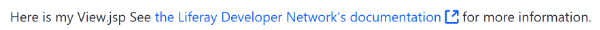

# Liferay Util Bufferの使用

[TOC levels=1-4]

bufferタグは、自己終了タグではありません。このタグの開始と終了の間に配置されたコンテンツはバッファに保存され、その出力はタグの`var`属性で宣言されたJava変数に割り当てられます。出力は文字列として返され、後処理できます。たとえば、これを使用して、[JSPの既存のコンテンツをオーバーライド](/docs/7-1/tutorials/-/knowledge_base/t/jsp-overrides-using-osgi-fragments#provide-the-overridden-jsp)できます 。

以下の例では、リンクの生成されたマークアップをバッファに保存し、返された文字列を`liferay-ui:message`キーの引数として使用します。

    <liferay-util:buffer
    var="linkContent"
    >
    <aui:a
    href="https://portal.liferay.dev/"
    target="_blank">the Liferay Portal project
    </aui:a>
    </liferay-util:buffer>
    
    <liferay-ui:message
    arguments="<%= linkContent %>"
    key="see-x-for-more-information"
    translateArguments="<%= false %>"
    />

これで、`<liferay-util:buffer>`タグを使用してコンテンツをバッファに保存する方法がわかりました。

## 関連トピック

[JSP Overrides Using OSGi Fragments](/docs/7-1/tutorials/-/knowledge_base/t/jsp-overrides-using-osgi-fragments#provide-the-overridden-jsp)

[Using the Liferay Util Param Tag](/docs/7-1/tutorials/-/knowledge_base/t/using-liferay-util-param)

[Using the Liferay Front-End Taglibs](/docs/7-1/tutorials/-/knowledge_base/t/using-liferay-frontend-taglibs-in-your-portlet)
